### 刷题

***[动态规划](https://pic.leetcode-cn.com/1f95da43d1bdeebdd1213bb804034ddc5f906dc61451cd63f2b5ab5d0eb33b33-%E3%80%8C%E5%8A%A8%E6%80%81%E8%A7%84%E5%88%92%E3%80%8D%E9%97%AE%E9%A2%98%E6%80%9D%E8%80%83%E6%96%B9%E5%90%91.png)***

#### `2020/10/07`

> 给出两个 非空 的链表用来表示两个非负的整数。其中，它们各自的位数是按照 逆序 的方式存储的，并且它们的每个节点只能存储 一位 数字。
>
> 如果，我们将这两个数相加起来，则会返回一个新的链表来表示它们的和。
>
> 您可以假设除了数字 0 之外，这两个数都不会以 0 开头。

$$
输入：(2 -> 4 -> 3) + (5 -> 6 -> 4) \\
输出：7 -> 0 -> 8 \\
原因：342 + 465 = 807
$$

```java
class Solution {
    public ListNode addTwoNumbers(ListNode l1, ListNode l2) {
        ListNode head = null, tail = null;
        int carry = 0;
        while (l1 != null || l2 != null) {
            int n1 = l1 != null ? l1.val : 0;
            int n2 = l2 != null ? l2.val : 0;
            int sum = n1 + n2 + carry;
            if (head == null) {
                head = tail = new ListNode(sum % 10);
            } else {
                tail.next = new ListNode(sum % 10);
                tail = tail.next;
            }
            carry = sum / 10;
            if (l1 != null) {
                l1 = l1.next;
            }
            if (l2 != null) {
                l2 = l2.next;
            }
        }
        if (carry > 0) {
            tail.next = new ListNode(carry);
        }
        return head;
    }
}
```

> 给定一个字符串，请你找出其中不含有重复字符的 **最长子串** 的长度。

$$
输入: "abcabcbb" \\
输出: 3 \\
解释: 因为无重复字符的最长子串是 "abc"，所以其长度为 3。
$$

```java
class Solution {
    public int lengthOfLongestSubstring(String s) {
        // 记录字符上一次出现的位置
        int[] last = new int[128];
        for(int i = 0; i < 128; i++) {
            last[i] = -1;
        }
        int n = s.length();

        int res = 0;
        int start = 0; // 窗口开始位置
        for(int i = 0; i < n; i++) {
            int index = s.charAt(i);
            start = Math.max(start, last[index] + 1);
            res   = Math.max(res, i - start + 1);
            last[index] = i;
        }

        return res;
    }
}
```

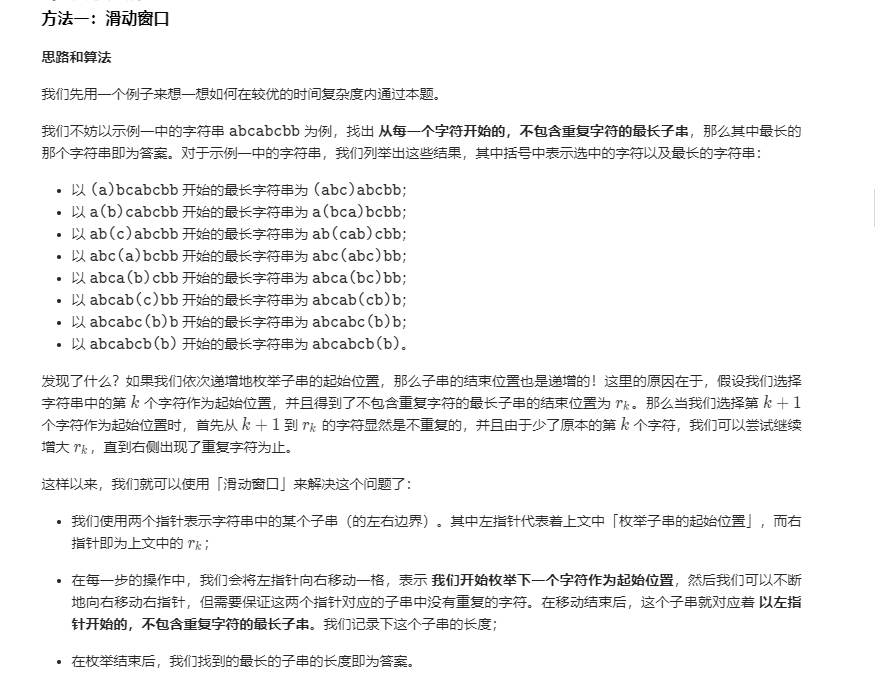

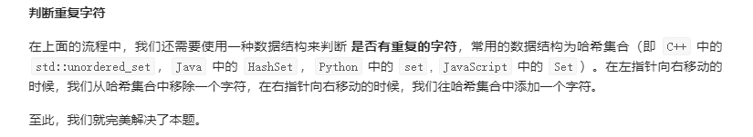

```java
class Solution {
    public int lengthOfLongestSubstring(String s) {
        // 哈希集合，记录每个字符是否出现过
        Set<Character> occ = new HashSet<Character>();
        int n = s.length();
        // 右指针，初始值为 -1，相当于我们在字符串的左边界的左侧，还没有开始移动
        int rk = -1, ans = 0;
        for (int i = 0; i < n; ++i) {
            if (i != 0) {
                // 左指针向右移动一格，移除一个字符
                occ.remove(s.charAt(i - 1));
            }
            while (rk + 1 < n && !occ.contains(s.charAt(rk + 1))) {
                // 不断地移动右指针
                occ.add(s.charAt(rk + 1));
                ++rk;
            }
            // 第 i 到 rk 个字符是一个极长的无重复字符子串
            ans = Math.max(ans, rk - i + 1);
        }
        return ans;
    }
}
```

#### `2020/10/08`

##### 最长回文子串

> 给定一个字符串 `s`，找到 `s` 中最长的回文子串。你可以假设 `s` 的最大长度为 1000。

$$
输入: "babad"\\
输出: "bab" \\
注意: "aba" 也是一个有效答案。
$$

> 暴力法采用双指针两边夹，验证是否是回文子串，时间复杂度比较高，除了枚举字符串的左右边界以外，比较容易想到的是**枚举可能出现的回文子串的“中心位置”，从“中心位置”尝试尽可能扩散出去，得到一个回文串**。
>
> 因此，中心扩散法的思路是：遍历每一个索引，以这个索引为中心，利用“回文串”中心对称的特点，往两边扩散，看最多能扩散多远。
>
> 枚举“中心位置”时间复杂度为 ![img](data:image/png;base64,iVBORw0KGgoAAAANSUhEUgAAAGgAAABCCAYAAAC7K5PxAAAJWUlEQVR4Xu1aZYhWTRQ+aze2YAcm+EMsFMXu7i4M7O7u7u7u7sJOVERRERMLCxVFxMDYj2fgXO6+733vnTt3v2UW5sCyy96JM+c5PRMVHR0dTYa0lUCUAUhbbARjBiC98TEAaY6PAcgApLsENOfPxCADkOYS0Jw9Y0EGIM0loDl7xoIMQJpLQHP2jAUZgDSXgObsGQsyAGkuAc3ZMxZkANJcApqzZyzIAKS5BDRnL1YsCM8aXr16Rffu3aMfP35QokSJKH/+/FSoUCFKkCCB5iLQm71AAD19+pR2795NV69epc+fP4edNF26dNSgQQNq166dAE2Vfv78SXPmzKFv377RtGnTpJeZOXMmPXjwIGx8wYIFadiwYY7rHDt2jHbt2kVJkyalJEmSCL7//ftHv3//pr9//9LAgQOF8oXS3Llz6d27dzRixAjCuWOLlACCwDZt2kSbN28WfMBSateuTcWLF6eUKVMKoezbt4+uXbsmvpcoUYLGjx9PqVOn9s03hIO558+fp7Fjx1KVKlWk1+jXrx+9fv2aPnz4EDZn3bp1lDdv3rD/79ixg5YuXeq4R9asWWn+/PmUJUuWsO937tyhPn36UIECBWjhwoWUPHlyaT7dBvoGCG5sypQp9ObNG7Hu0KFDqVatWmGuDG5vxYoVtG3bNjGuaNGitGjRIoqKivLF+IYNG2jt2rXCEqG9KvTo0SPq2rVrjKkNGzakAQMGOC4HS7l+/ToNHz5cfB88eDBVqlSJUqVK5br91q1bxZnLli1LkydPpoQJE6qwG2OOL4Bu375N0EpQihQpaN68ecJ6IhG0v1OnTvT8+XMxBMCWK1dOmunLly/TyJEjKXfu3OLgyZIlk55rH7hnzx6h1eD5+/fv1qfDhw9HtGrw3KFDB6pTp45QQhnCeQEqPEeLFi2oZ8+eMtNcx0gD9PjxY+rSpYu12LJly6hIkSKeDMCnT58+XYyDoGERMoR4A+GAZs2aRaVKlZKZ5jhm1KhRdOnSJWHBcENMffv2pSZNmjjOYb5Hjx5N1apVk9775cuXIuaCEAZy5swpPddpoBRAf/78oW7duhGSAlD79u2pc+fOUhuHAnv06FERp7yItT5Hjhy0ceNG5WwQ7qpu3bpCOaBUAAjxAoSYsmXLFse1oVQAaefOnY4xx41/JApXrlyh6tWrE5QjCEkBhGRg1apVYh9kKNu3b5d2N+/fv6fmzZtbPK5evdoxC7IfAq6iTZs2Is4NGTJECFiVWEFYqS5cuEBjxoyxlkOmV7p06bDlmzZtSokTJ7ZiqJ/97aFg/fr1lCdPHj/TY4z1BMhuspjZvXt3atWqlfSGofMRPMuXL+86H2k7B+jjx48Hyoj27t1LCxYsoNmzZ1PJkiUJ3gDC57IA4AAkO719+5ZatmypnJggQWrWrJnIHv14GyUXB/+PYMp04MABSps2rTRAt27dov79+1vjkaYWK1bMdT7HDCQgSA6CEGLIxYsXye5aOdvideHmsmfPbm1z8uRJkdD4TevtfGI+1gl6BlcLgqtp3LixpW1IH/0UimA4VBiILRkzZowoc2gfaipkW3CNvXr1UsYnNP7wQrAepNlMofvAoo4cOUJevLoxBkVG8Qo6dOgQpUmTRukcrgCFBnik2ADMDyGGoKYAIc1F4HUjxB12oRMmTKCKFSv62S7GWOa/bdu2YXUQJwE8AXyBP1CQ+MPr2WUHpYZyq5ArQDD9lStXWuuiYMyXL5/0Pl+/fqV69epZ41GsLl682HU+3BHcEihStS/LQGj8sc97+PChyEyZBg0aRPXr1xeJCRTErZCV2R89yZo1a4qhKorNe7gC5KZlMkzasz+MR9FZo0YN16kHDx4UfTcQemKZM2eW2cpxDMeySKl9jx496P79+2Iu0nnULYgbU6dOpaDWC1fN1t+xY0dRsKuQK0Ac6Hhh9MNkCf26Ro0aWZU7BIAi1av9YY9ZsjWTE08cf1AoRko0Tp8+TRMnTrSmI4E5ceKEcMNB4g8viBYYYmkQa3QFiPtg2FAmftgFhcCI1JYJgqhQoYInvnCpcK2gs2fPKheo3H9zij/MBDrUSIc55Ub6j14jem7cCPZk2GUA9sY1DPp4aPiqkCtA586do3Hjxlnrnjp1ShRvXoRaA+0ObqiiJbRkyRIpYWMcqneQH4sN5QlrYK1IhSiPtysh/w+JEPccvc7q9h0NWihKmTJlrHaX3/VcAXr27BnBfzJBu3GX4kZwLZMmTRLaD0LnAd0Dt9Tavp5dYHBBqvdIKHRR8Lo1RLHvx48fw/pxstbuJWxkgyhWq1atGqN74TXP/t2zDoImce/Ky5eGgoONZFo7dob2798vuuQg1foBrgtCwd0Mt6jchAKFgndgwl1W+vTp/cjRcez/HoOwKy68WrdubTGA4gsXc6EEt4Y2DlsOkgIc3G8f6syZMyKDAuEuCQ1NPwRwkMoDaLhW/O2VmCDucEEMvmMj/kBZK1euLFh3i4NeZ/PsxWEBZFMzZsyw1kL9gGofLZ9Pnz7RjRs3RMeZYw40B11jma51KIM3b960LuaWL19OhQsX9jqD+I54hbT87t27McYjuUG7BS7P6SaUB3O8QNLQu3dvqT3dBn358kX08kC4T+KrE78LSwGERXHVEOmOnzcFaCjygtyBAHDuVnDxKHMou5vijoD9cs7LXXL/jZuqMnu6jbErml83b19XGiBMgtkiK8Ft44sXL8QLHoCBH9zvZ8iQIei5xHzcZGKP2LhPiRWGFBaBR1mzZo2YKZv9Om3jCyAFPpWm4NEGHm9kypRJvBqKj8Q9SJUGs7IFxZWg0FzFAUHoLGTLli2uto6VfdBF4ZZWUJeppQXBlcLNoQpHTMMlYXwi7qIEva7HmbUECIzxOzj8HaQnF9fA4g4Nt6hQLjzrst87qfCiLUA4KF4RIXtEjWJ/16By0Liag8cieDSC+ImuiEqpoX0MYgafPHlivR5CVpQrV664krPSPmi64loBv4Ok1vEGIDCKR4Ao9II+XlSSuI9JsHi890aCE+QtQ+iW2ro4O6N8iRfk+a8PWSsNxWUfrCZIWyfe1EFOjKIz/evXr0BvFJQkLzkJ7+2QXqO4jk2KFxYUmweOb2sZgDRHzABkANJcApqzZyzIAKS5BDRnz1iQAUhzCWjOnrEgA5DmEtCcPWNBBiDNJaA5e8aCDECaS0Bz9v4DqpwwhiQh80EAAAAASUVORK5CYII=)，从“中心位置”扩散得到“回文子串”的时间复杂度为 ![img](data:image/png;base64,iVBORw0KGgoAAAANSUhEUgAAAGgAAABCCAYAAAC7K5PxAAAJWUlEQVR4Xu1aZYhWTRQ+aze2YAcm+EMsFMXu7i4M7O7u7u7u7sJOVERRERMLCxVFxMDYj2fgXO6+733vnTt3v2UW5sCyy96JM+c5PRMVHR0dTYa0lUCUAUhbbARjBiC98TEAaY6PAcgApLsENOfPxCADkOYS0Jw9Y0EGIM0loDl7xoIMQJpLQHP2jAUZgDSXgObsGQsyAGkuAc3ZMxZkANJcApqzZyzIAKS5BDRnL1YsCM8aXr16Rffu3aMfP35QokSJKH/+/FSoUCFKkCCB5iLQm71AAD19+pR2795NV69epc+fP4edNF26dNSgQQNq166dAE2Vfv78SXPmzKFv377RtGnTpJeZOXMmPXjwIGx8wYIFadiwYY7rHDt2jHbt2kVJkyalJEmSCL7//ftHv3//pr9//9LAgQOF8oXS3Llz6d27dzRixAjCuWOLlACCwDZt2kSbN28WfMBSateuTcWLF6eUKVMKoezbt4+uXbsmvpcoUYLGjx9PqVOn9s03hIO558+fp7Fjx1KVKlWk1+jXrx+9fv2aPnz4EDZn3bp1lDdv3rD/79ixg5YuXeq4R9asWWn+/PmUJUuWsO937tyhPn36UIECBWjhwoWUPHlyaT7dBvoGCG5sypQp9ObNG7Hu0KFDqVatWmGuDG5vxYoVtG3bNjGuaNGitGjRIoqKivLF+IYNG2jt2rXCEqG9KvTo0SPq2rVrjKkNGzakAQMGOC4HS7l+/ToNHz5cfB88eDBVqlSJUqVK5br91q1bxZnLli1LkydPpoQJE6qwG2OOL4Bu375N0EpQihQpaN68ecJ6IhG0v1OnTvT8+XMxBMCWK1dOmunLly/TyJEjKXfu3OLgyZIlk55rH7hnzx6h1eD5+/fv1qfDhw9HtGrw3KFDB6pTp45QQhnCeQEqPEeLFi2oZ8+eMtNcx0gD9PjxY+rSpYu12LJly6hIkSKeDMCnT58+XYyDoGERMoR4A+GAZs2aRaVKlZKZ5jhm1KhRdOnSJWHBcENMffv2pSZNmjjOYb5Hjx5N1apVk9775cuXIuaCEAZy5swpPddpoBRAf/78oW7duhGSAlD79u2pc+fOUhuHAnv06FERp7yItT5Hjhy0ceNG5WwQ7qpu3bpCOaBUAAjxAoSYsmXLFse1oVQAaefOnY4xx41/JApXrlyh6tWrE5QjCEkBhGRg1apVYh9kKNu3b5d2N+/fv6fmzZtbPK5evdoxC7IfAq6iTZs2Is4NGTJECFiVWEFYqS5cuEBjxoyxlkOmV7p06bDlmzZtSokTJ7ZiqJ/97aFg/fr1lCdPHj/TY4z1BMhuspjZvXt3atWqlfSGofMRPMuXL+86H2k7B+jjx48Hyoj27t1LCxYsoNmzZ1PJkiUJ3gDC57IA4AAkO719+5ZatmypnJggQWrWrJnIHv14GyUXB/+PYMp04MABSps2rTRAt27dov79+1vjkaYWK1bMdT7HDCQgSA6CEGLIxYsXye5aOdvideHmsmfPbm1z8uRJkdD4TevtfGI+1gl6BlcLgqtp3LixpW1IH/0UimA4VBiILRkzZowoc2gfaipkW3CNvXr1UsYnNP7wQrAepNlMofvAoo4cOUJevLoxBkVG8Qo6dOgQpUmTRukcrgCFBnik2ADMDyGGoKYAIc1F4HUjxB12oRMmTKCKFSv62S7GWOa/bdu2YXUQJwE8AXyBP1CQ+MPr2WUHpYZyq5ArQDD9lStXWuuiYMyXL5/0Pl+/fqV69epZ41GsLl682HU+3BHcEihStS/LQGj8sc97+PChyEyZBg0aRPXr1xeJCRTErZCV2R89yZo1a4qhKorNe7gC5KZlMkzasz+MR9FZo0YN16kHDx4UfTcQemKZM2eW2cpxDMeySKl9jx496P79+2Iu0nnULYgbU6dOpaDWC1fN1t+xY0dRsKuQK0Ac6Hhh9MNkCf26Ro0aWZU7BIAi1av9YY9ZsjWTE08cf1AoRko0Tp8+TRMnTrSmI4E5ceKEcMNB4g8viBYYYmkQa3QFiPtg2FAmftgFhcCI1JYJgqhQoYInvnCpcK2gs2fPKheo3H9zij/MBDrUSIc55Ub6j14jem7cCPZk2GUA9sY1DPp4aPiqkCtA586do3Hjxlnrnjp1ShRvXoRaA+0ObqiiJbRkyRIpYWMcqneQH4sN5QlrYK1IhSiPtysh/w+JEPccvc7q9h0NWihKmTJlrHaX3/VcAXr27BnBfzJBu3GX4kZwLZMmTRLaD0LnAd0Dt9Tavp5dYHBBqvdIKHRR8Lo1RLHvx48fw/pxstbuJWxkgyhWq1atGqN74TXP/t2zDoImce/Ky5eGgoONZFo7dob2798vuuQg1foBrgtCwd0Mt6jchAKFgndgwl1W+vTp/cjRcez/HoOwKy68WrdubTGA4gsXc6EEt4Y2DlsOkgIc3G8f6syZMyKDAuEuCQ1NPwRwkMoDaLhW/O2VmCDucEEMvmMj/kBZK1euLFh3i4NeZ/PsxWEBZFMzZsyw1kL9gGofLZ9Pnz7RjRs3RMeZYw40B11jma51KIM3b960LuaWL19OhQsX9jqD+I54hbT87t27McYjuUG7BS7P6SaUB3O8QNLQu3dvqT3dBn358kX08kC4T+KrE78LSwGERXHVEOmOnzcFaCjygtyBAHDuVnDxKHMou5vijoD9cs7LXXL/jZuqMnu6jbErml83b19XGiBMgtkiK8Ft44sXL8QLHoCBH9zvZ8iQIei5xHzcZGKP2LhPiRWGFBaBR1mzZo2YKZv9Om3jCyAFPpWm4NEGHm9kypRJvBqKj8Q9SJUGs7IFxZWg0FzFAUHoLGTLli2uto6VfdBF4ZZWUJeppQXBlcLNoQpHTMMlYXwi7qIEva7HmbUECIzxOzj8HaQnF9fA4g4Nt6hQLjzrst87qfCiLUA4KF4RIXtEjWJ/16By0Liag8cieDSC+ImuiEqpoX0MYgafPHlivR5CVpQrV664krPSPmi64loBv4Ok1vEGIDCKR4Ao9II+XlSSuI9JsHi890aCE+QtQ+iW2ro4O6N8iRfk+a8PWSsNxWUfrCZIWyfe1EFOjKIz/evXr0BvFJQkLzkJ7+2QXqO4jk2KFxYUmweOb2sZgDRHzABkANJcApqzZyzIAKS5BDRnz1iQAUhzCWjOnrEgA5DmEtCcPWNBBiDNJaA5e8aCDECaS0Bz9v4DqpwwhiQh80EAAAAASUVORK5CYII=)，因此时间复杂度可以降到 ![img](data:image/png;base64,iVBORw0KGgoAAAANSUhEUgAAAHoAAABCCAYAAACYcMIkAAAKg0lEQVR4Xu2cdYhVTRTAj91iC3Zggn+IhWJ3d7fY3d3d3d3dHdiJiigqYmIXKgZix8dvYB7X59v77r1v1d3v3gOLu/tmzpyY07NG+fnz50/x4H8vgSieov/3OlYMeop2h549RbtEz56iPUW7RQIu4dOL0Z6iXSIBl7DpWbSnaJdIwCVsehbtKdolEnAJm55Fe4p2iQRcwqZn0Z6iXSKBP8DmixcvhK8UKVJI0qRJJUqUKH/gFHsoPYu2Jy/T1ZcuXZLx48fLkydPfOuSJ08ubdq0kbJly4bjSfZReYq2L7OAO1By165dpXTp0lK1alX58uWLrFq1Svg90K5dO2nQoEE4nWYfjado+zILuAMlfvz4UZYuXSqJEydWa759+ybt27eXmzdvqp9Xrlwp6dKlC6cT7aHxFG1PXgFXv3z5UmrVqqU+y5Url8yaNcu37tChQzJixAj1c+vWraVx48bhcKJ9FOGiaJ6dPXz4UK5evapudfTo0SVLliySPXt2iRo1qn2qItmOt2/fKncNpE2bVrlsDTdu3FAxGqhQoYL069fvn3AXkqLv3LkjmzZtkjNnzsjr169/YwAXVq1aNWnSpIlSvlP49OmTTJ48Wd6/fy9jx461jGbChAly/fr139Zny5ZN+vbtGxDP3r17ZePGjRIrViyJGTOmovvHjx/y9etX+f79u/To0UNdYn84evSonDt3TipXriw5c+b0fXzixAkZNGiQ+rlRo0Y+pYfFxJQpU+TZs2fSv39/XwiwzLDJQkeKRvDEG31zsdyKFStKnjx5JF68eEq4W7dulbNnz6qj8+bNK8OGDZMECRLYphkhs/fYsWMyZMgQKVWqlGUcJEePHz9WpY4/EEszZcr02+/Xr18vc+bMCXhGqlSpZNq0aZIyZUrLNMyYMUM2b96s1qNEZGQGly9fls6dO0vWrFmFvXHixLF8ltlC24rGPY8ePdpXQvTp00e5JH8XjTufP3++rF27Vp1P7Jo5c6btmnL58uWyZMkS5RmwJidAMkR8NEL16tWle/fuAdFhuVindrO9evWSEiVKSPz48W0dT5mlM+38+fPLxIkTLe1fs2aNkl2hQoVk1KhREi1aNEv7wk3RuoQAYdy4cWXq1KkqDocFWGOLFi3k3r17agkXpHDhwpaJPnXqlAwYMEAyZMigGI8dO7blvcaFWBTWAc0fPnzwfbRr164wvQw0N2vWTCpVqiRcZrvARYf206dPK/pJ0Kx6NOTGJcMj1qtXTzp06GD3+N/WW7boW7duSatWrXwI5s6d+0ssCosSYt64cePUxzCMhVoB4jFCBrAELMIpDBw4UE6ePKk8Cm5RQ5cuXXzZsj9uTTfxtUyZMraP1p6IeE0TJWHChLZwPHjwQOU2QHiUZZYUTT1I5kjyBTRt2lRatmxpiXD/C7Jnzx4Vx4OBtkKy2BUrVjjO3nHDJEhcMi4niiYOAsTc1atXB8TN5UTZGzZssBWTwbt//34ZM2aMupyUVk7jLAkZHoGuGpc1FLCkaJKuhQsXqnPIpNetW2fZjT5//lzq1q3ro3HRokUBs1YjE7guMlRiXO/evZWinIK+aPpyHj9+XAYPHuxDR2ZeoECB39DXrl1bYsSI4csxrJ5//vx5IaaTNKIocABcGEpPwoFVMIbKZcuWScaMGa1u/W1dUEUbXQi77bby/PeTXBQpUsSUYMo1nQjt27fPsUVwyJYtW2T69OkyadIkyZcvn+pWoURdDqJklG2Ep0+fSv369W0ngDrpI3Hs1q3bL56CZLBo0aI+d2xFY8T5OnXqqKrBjhcNhDuooomPJC0atm/fLokSJbJCp1pz8eJFxbQGypPcuXOb7tcxlUSPJCwUIMZSyxpDhs5qNV7cd5o0aXzHHDhwQCWOdso5LgftTi5Q27ZtlZJRFKGDhgoWPXz4cClevLgtdqADekKVhamicaE1a9b03X7SfTsNCzjyFyqxN1myZGEyi3CoycmOcfkdO3a0JRjjYv/4rD9DGZRXGvzPwcJ3796t6l8zWvV+XDIWS3fQDKyELf/9GBb1N7Bz507bSZ3GZ6po/0SKBgSKtwPEWGpSgPKGBMcMjLWnEwsw4tb001/2r6N1sqXXQxf0AXbj86NHj1ROEQyMZwRbqz836gAjw9icgKmicWkLFizw4aVxkTlzZsvnvHv3TqpUqeJb79/wD4TI2DIMq3tllQD/+GzcZ+xB8/uePXuqfrW+aGYNFavnh8c6vEX58uUVKieGZsmizW69FSaM2TrraSCUK1fOdOuOHTtUXxug58wrDaegY31YJR0x9dq1awo9ZRz1KvGQ0ihUb+KUZv99hDId15s3b64aUE7A1KJ1IqAR02+2CvTDa9So4etEIUiaCMHaecaYbrXmDkSTjs/Mf8NK6IwjRHCQKFID42Ktxmer8ghlHS1mcpZQvIyponV3ByKtxFcjMyQOlDQaaBwUK1YsKL+ECkIGcOTIEceNEl3qBIrPmggmUpQvutSi7KOXT0/bOGoMSvQfXgAPJHr02xnwOAFTRTN6Gzp0qA/vwYMHfQ0As8OoVWnf6bdTtAFnz55tSWmsoxQB7HgQf3rAAa6wGiJ6vfEy69+RcBIPIwqQSHJxCxYs6Gsn26XNVNF3794V4oIGrI1ZrhngMkeOHKmsEaCTRllhpUxhvVHwuFanc2waLjRezAYXnGd8HWLX+9gVttP1VAE0TXiPZuzq2cEXtI7mZuvecLAY4a9kCLFbO27btk1NxQCndSMuGaEw09WtWzOhcDHxVhqYpSdJksSOHP/o2j8eo6GewX3Dhg19jIQ1PMdd097UlkzyhQDt9mcPHz6sMl6AWTaDBzuAkhkJcmEIGXwfLAEkLuvGjP9TIDtn/4m1GE/JkiUVarN8I9jZQVugICD7ZdSmgUkW3Staoa9evRIa+UyYdEzmBjIlsjKl8ifwwoULvgcG8+bNkxw5cgTjQX1OPKccu3Llyi/rSSJpH+LKzV6G6DhIctapUydLZ/6NRW/evFE9d4C5uB7d2j3bkqJByogyrDdY+lCUz4uKUJ60cnF09003MawwZXS/usNlfGQQLAzo/rYeflg582+sMV58u2HQSJ9lRbMJN0L2x+uL+/fvq7EbSuWL91f8+Ul4AKM8zgiPOWx40PMvceApFy9erEiwWvUEoteWov8WwzzO45Eef87CK1M3g54VOBkoObbovyVwhiAwCNApS5069d86OkKdQ3dRt4xDDSkR0qIJEbhvukHEfB47uBF0dzHU51TILkIqGsL0O26+D6XnHVkvCG8BeFXCZedZsnF+7oSnCKtoGOXVKdk+Na7x3ZkTRiPbHh4F8uaMPIVuoZNSNcLHaE3g7du3fa9NyT7Tp08f2fTliF6GLIwj+TeUkirSKBpCecROoyDUR/yOJP4PNuHJ+LswElI7b9aCkRphXbeRcP0YIZQ/ywkmiIjyOY8fsOJQ2p2Rpo4ORCiTqM+fP9t+RRlRFGiVDt6dU1aF93+FESks2qqQvHVhS8BTtEtuh6doT9EukYBL2PQs2lO0SyTgEjY9i/YU7RIJuIRNz6I9RbtEAi5h07NoT9EukYBL2PQs2lO0SyTgEjb/A5pL24ad+iLQAAAAAElFTkSuQmCC)。
>
> 在这里要注意一个细节：回文串在长度为奇数和偶数的时候，“回文中心”的形式是不一样的。
>
> - 奇数回文串的“中心”是一个具体的字符，例如：回文串 `"bab"` 的中心是字符 `"a"`；
> - 偶数回文串的“中心”是位于中间的两个字符的“空隙”，例如：回文串串 `"baab"` 的中心是两个 `"a"` 中间的那个“空隙”。
>
> 
>
> 我们看一下一个字符串可能的回文子串的中心在哪里？
>
> 
>
> 我们可以设计一个方法，兼容以上两种情况：
>
> 1、如果传入重合的索引编码，进行中心扩散，此时得到的回文子串的长度是奇数；
>
> 2、如果传入相邻的索引编码，进行中心扩散，此时得到的回文子串的长度是偶数。

```java
public class Solution {

    public String longestPalindrome(String s) {
        int len = s.length();
        if (len < 2) {
            return s;
        }
        int maxLen = 1;
        String res = s.substring(0, 1);
        // 中心位置枚举到 len - 2 即可
        for (int i = 0; i < len - 1; i++) {
            String oddStr = centerSpread(s, i, i);
            String evenStr = centerSpread(s, i, i + 1);
            String maxLenStr = oddStr.length() > evenStr.length() ? oddStr : evenStr;
            if (maxLenStr.length() > maxLen) {
                maxLen = maxLenStr.length();
                res = maxLenStr;
            }
        }
        return res;
    }

    private String centerSpread(String s, int left, int right) {
        // left = right 的时候，此时回文中心是一个空隙，回文串的长度是奇数
        // right = left + 1 的时候，此时回文中心是任意一个字符，回文串的长度是偶数
        int len = s.length();
        int i = left;
        int j = right;
        while (i >= 0 && j < len) {
            if (s.charAt(i) == s.charAt(j)) {
                i--;
                j++;
            } else {
                break;
            }
        }
        // 这里要小心，跳出 while 循环时，恰好满足 s.charAt(i) != s.charAt(j)，因此不能取 i，不能取 j
        return s.substring(i + 1, j);
    }
}
```

`2020/10/09`

##### Z字形变换

> 将一个给定字符串根据给定的行数，以从上往下、从左到右进行 Z 字形排列。
>
> 比如输入字符串为 "LEETCODEISHIRING" 
>
> 行数(numRows )为 3 时，排列如下：
>
> | L    |      | C    |      | I    |      | R    |      |
>| ---- | ---- | ---- | ---- | ---- | ---- | ---- | ---- |
> | E    | T    | O    | E    | S    | I    | I    | G    |
> | E    |      | D    |      | H    |      | N    |      |
> 
> 你的输出需要从左往右逐行读取，产生出一个新的字符串，比如：`"LCIRETOESIIGEDHN"`。
>
> 行数(numRows )为4时，排列如下：
>
> | L    |      |      | D    |      |      | R    |
>| ---- | ---- | ---- | ---- | ---- | ---- | ---- |
> | E    |      | O    | E    |      | I    | I    |
> | E    | C    |      | I    | H    |      | N    |
> | T    |      |      | S    |      |      | G    |

`解题思路`

>
>
>第$0$行： $index/(2*(numRows - 1) = 0$
>
>第$k(k\ne 0, k\ne numRows-1)$行：$index/(2*(numRows - 1) = k || 2 * numRows - 1 - k$
>
>第$numRows - 1$行：$index/(2*(numRows - 1)) = numRows - 1 $。

```java
if (numRows < 2)
            return s;

        String res = "";
        int length = s.length();
        int num = 2 * (numRows - 1);

        for (int i=0;i<numRows;i++){
            for (int index=0;index<length;index++){
                if (index % num == i || index % num == num - i)
                    res = res + s.charAt(index);
            }
        }
        return res;
    }
```

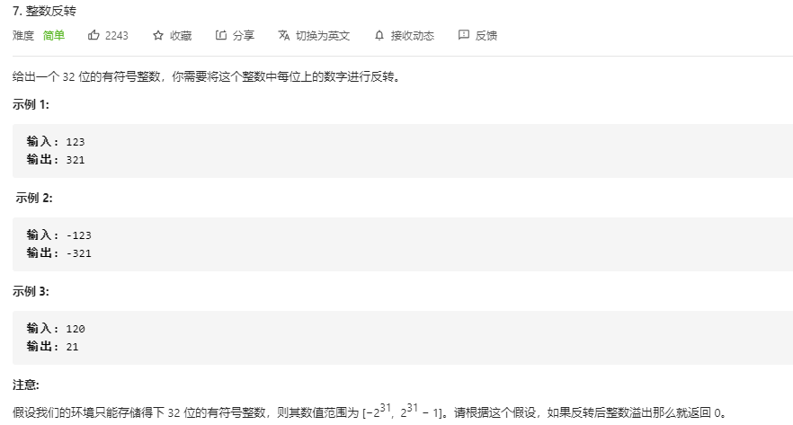

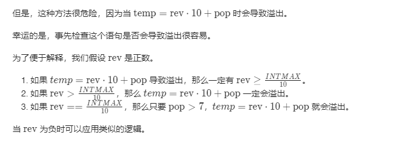

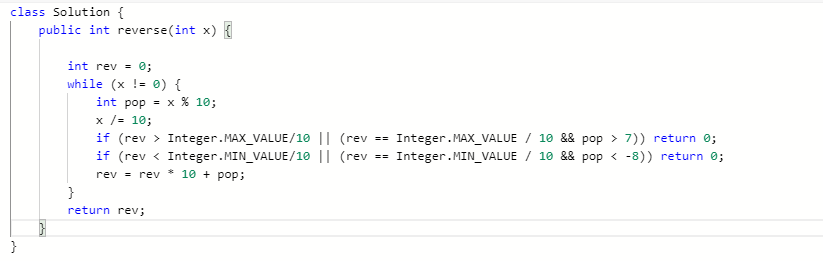

#### `2020/10/14`

##### 整数转罗马数字

```java
public String intToRoman(int num) {
        int[] values = {1000, 900, 500, 400, 100, 90, 50, 40, 10, 9, 5, 4, 1};
        String[] symbols = {"M", "CM", "D", "CD","C", "XC", "L", "XL", "X",
        "IX", "V", "IV", "I"};

        StringBuffer string = new StringBuffer();
        for (int i=0;i<values.length && num>=0;i++){
            while (values[i]<=num){
                num-=values[i];
                string.append(symbols[i]);
            }
        }
        return string.toString();
    }
```

`2020/11/02`

> 给你一个包含 n 个整数的数组 nums，判断 nums 中是否存在三个元素 a，b，c ，使得 a + b + c = 0 ？请你找出所有满足条件且不重复的三元组。
>
> 注意：答案中不可以包含重复的三元组。
>

```java
class Solution {
    public List<List<Integer>> threeSum(int[] nums) {
        int n = nums.length;
        Arrays.sort(nums);
        List<List<Integer>> ans = new ArrayList<>();
        // 枚举 a
        for (int first = 0; first < n; ++first) {
            // 需要和上一次枚举的数不相同
            if (first > 0 && nums[first] == nums[first - 1]) {
                continue;
            }
            // c 对应的指针初始指向数组的最右端
            int third = n - 1;
            int target = -nums[first];
            // 枚举 b
            for (int second = first + 1; second < n; ++second) {
                // 需要和上一次枚举的数不相同
                if (second > first + 1 && nums[second] == nums[second - 1]) {
                    continue;
                }
                // 需要保证 b 的指针在 c 的指针的左侧
                while (second < third && nums[second] + nums[third] > target) {
                    --third;
                }
                // 如果指针重合，随着 b 后续的增加
                // 就不会有满足 a+b+c=0 并且 b<c 的 c 了，可以退出循环
                if (second == third) {
                    break;
                }
                if (nums[second] + nums[third] == target) {
                    List<Integer> list = new ArrayList<>();
                    list.add(nums[first]);
                    list.add(nums[second]);
                    list.add(nums[third]);
                    ans.add(list);
                }
            }
        }
        return ans;
    }
}
```

> 给定一个包括 n 个整数的数组 nums 和 一个目标值 target。找出 nums 中的三个整数，使得它们的和与 target 最接近。返回这三个数的和。假定每组输入只存在唯一答案。

$$
输入：nums = [-1,2,1,-4], target = 1\\
输出：2\\
解释：与 target 最接近的和是 2 (-1 + 2 + 1 = 2) 。
$$

```java
public int threeSum(int[] nums, int target){
        /*
        排序+双指针
         */

        Arrays.sort(nums);
        int ans = nums[0] + nums[1] + nums[2];
        for (int i=0; i<nums.length-2; i++){
            int begin = i+1, end = nums.length-1;

            while (begin <= end){
                int sum = nums[i] + nums[begin] + nums[end];
                if (Math.abs(sum - target) < Math.abs(ans - target)){
                    ans = sum;
                }
                if (sum > target)
                    end--;
                else if (sum < target)
                    begin++;
                else
                    return ans;

            }
        }
        return ans;

    }
```

#### `2020/11/03`

 ##### 电话号码的组合

> 给定一个仅包含数字 2-9 的字符串，返回所有它能表示的字母组合。 给出数字到字母的映射如下（与电话按键相同）。注意 1 不对应任何字母。

```java
public List<String> letterCombinations(String digits) {
        List<String> ans = new ArrayList<>();
        if (digits.length() == 0)
            return ans;
        String pattern = "";
        backtracking(pattern, digits, 0, ans);
        return ans;
    }

    public static void backtracking(String pattern, String digits, int flag, List<String> list){
        String[] alphabet = {"", "", "abc", "def", "ghi", "jkl", "mno", "pqrs", "tuv", "wxyz"};

        if (flag == digits.length()){
            list.add(pattern);
            return;
        }

        //先获得数字对应的字符串，然后遍历它
        String str = alphabet[digits.charAt(flag) - '0'];

        for (int i=0; i<str.length(); i++){
            backtracking(pattern+str.charAt(i), digits, flag+1, list);
        }
    }
```

##### [四数之和](https://leetcode-cn.com/problems/4sum/)

> 给定一个包含 n 个整数的数组 nums 和一个目标值 target，判断 nums 中是否存在四个元素 a，b，c 和 d ，使得 a + b + c + d 的值与 target 相等？找出所有满足条件且不重复的四元组。
>
> ==思想：类似于三数之和，排序加双指针。下面的代码是在此的基础上加了一个循环==

```java
public List<List<Integer>> fourSum(int[] nums, int target) {
        List<Integer> lis = new ArrayList<>();
        List<List<Integer>> res = new ArrayList<>();

        if (nums.length < 4)
            return res;

        Arrays.sort(nums);

        for (int i=0;i<nums.length-3;i++){
            if (i>0 && nums[i] == nums[i-1])
                continue;

            for (int j=i+1;j<nums.length-2;j++){
                if (j>i+1 && nums[j] == nums[j-1])
                    continue;

                int begin = j+1, end = nums.length-1;

                while (begin<end){
                    if (nums[i] + nums[j] + nums[begin] + nums[end] == target){
                        res.add(Arrays.asList(nums[i], nums[j], nums[begin], nums[end]));
                        while (begin<end && nums[begin+1] == nums[begin])
                            begin++;
                        while (begin<end && nums[end-1] == nums[end])
                            end--;
                        begin++;
                        end--;
                    }
                    else if (nums[i] + nums[j] + nums[begin] + nums[end] < target)
                        begin++;
                    else
                        end--;
                }
            }
        }

        return res;
    }
```

#### `2020/11/04`

##### [删除链表的倒数第N个节点](https://leetcode-cn.com/problems/remove-nth-node-from-end-of-list/)

> 给定一个链表，删除链表的倒数第 *n* 个节点，并且返回链表的头结点。
>$$
> 给定一个链表: 1->2->3->4->5, 和 n = 2. \\
> 
> 当删除了倒数第二个节点后，链表变为 1->2->3->5.
> $$

```java
/**
 * Definition for singly-linked list.
 * public class ListNode {
 *     int val;
 *     ListNode next;
 *     ListNode() {}
 *     ListNode(int val) { this.val = val; }
 *     ListNode(int val, ListNode next) { this.val = val; this.next = next; }
 * }
 */
class Solution {
    public ListNode removeNthFromEnd(ListNode head, int n) {
        ListNode dummy = new ListNode(0, head);
        ListNode first = head;
        ListNode second = dummy;
        for (int i = 0; i < n; ++i) {
            first = first.next;
        }
        while (first != null) {
            first = first.next;
            second = second.next;
        }
        second.next = second.next.next;
        ListNode ans = dummy.next;
        return ans;
    }
}
```

##### [有效的括号](https://leetcode-cn.com/problems/valid-parentheses/)

> $$
>给定一个只包括 '('，')'，'{'，'}'，'['，']' 的字符串，判断字符串是否有效。\\
> 
> 有效字符串需满足：\\
> 
> 左括号必须用相同类型的右括号闭合。\\
> 左括号必须以正确的顺序闭合。\\
> 注意空字符串可被认为是有效字符串。\\
> $$
> 
> 思路：==堆或者队列==。

```java
Stack<Character> parent = new Stack<Character>();

        if(s.length() % 2 == 1)
            return false;

        for (int i=0;i<s.length();i++){
            if (s.charAt(i)=='(' || s.charAt(i)=='{' || s.charAt(i)=='[')
                parent.push(s.charAt(i));

            else {
                if (parent.empty()) return false;
                if (s.charAt(i)==')' && parent.peek()!='(') return false;
                if (s.charAt(i)=='}' && parent.peek()!='{') return false;
                if (s.charAt(i)==']' && parent.peek()!='[') return false;
                parent.pop();
            }
        }
        if(parent.empty())
            return true;
        else
            return false;
```

#### `2020/11/05`

##### 合并两个有序链表

> 将两个升序链表合并为一个新的 升序 链表并返回。新链表是通过拼接给定的两个链表的所有节点组成的。
>
> ==最好的方法是递归。==
>$$
> 输入：1->2->4, 1->3->4\\
>  输出：1->1->2->3->4->4
> $$


```java
ListNode head = null;
        if (l1==null)
            return l2;
        if (l2==null)
            return l1;

        if (l1.val <= l2.val){
            head = l1;
            head.next = mergeTwoLists(l1.next, l2);
        }else {
            head = l2;
            head.next = mergeTwoLists(l1, l2.next);
        }

        return head;
```

#### `2020/11/07`

##### 括号生成

> 数字 n 代表生成括号的对数，请你设计一个函数，用于能够生成所有可能的并且 有效的 括号组合。

> 思路：==这道题可以用回溯法解决，**即穷举出所有可能，再按照规则过滤结果。但是更好的办法是在回溯的过程中，就进行规则的判断，进行剪枝操作：**只有在我们知道序列仍然保持有效时才添加$ '('  \ \ $or$ \  \ ')'$，我们可以通过跟踪到目前为止放置的左括号和右括号的数目来做到这一点，如果我们还剩一个位置，我们可以开始放一个左括号。 如果它不超过左括号的数量，我们可以放一个右括号==。

```java
public List<String> generateParenthesis(int n) {
        List<String> result = new ArrayList<>();

        helper(result, "", 0, 0, n);
        return result;
    }

    private void helper(List<String> result, String s, int left, int right, int n) {

        if (left==n && right==n){
            result.add(s);
            return;
        }
        if (left < n)
            helper(result, s + "(", left+1, right, n);

        if (right < left)
            helper(result, s + ")", left, right+1, n);
    }
}
```

#### `2020/11/12`

##### [删除排序数组中的重复项](https://leetcode-cn.com/problems/remove-duplicates-from-sorted-array/)

> 给定一个排序数组，你需要在 原地 删除重复出现的元素，使得每个元素只出现一次，返回移除后数组的新长度。
>
> 不要使用额外的数组空间，你必须在 原地 修改输入数组 并在使用 O(1) 额外空间的条件下完成。
>
> ==思路：数组完成排序后，我们可以放置两个指针$i$ 和 $j$，其中 $i$ 是慢指针，而 $j $是快指针。只要 $nums[i] = sums[j]$，我们就增加 $j$以跳过重复项。当我们遇到 $nums[j] \neq nums[i]$时，跳过重复项的运行已经结束，因此我们必须把它（$nums[j]$）的值复制到 $nums[i + 1]$。然后递增$i$，接着我们将再次重复相同的过程，直到$j $到达数组的末尾为止。==

```java
public int removeDuplicates(int[] nums) {
        Arrays.sort(nums);

        int i = 0;
        for (int j=1;j<nums.length;j++){
            if (nums[j] != nums[i]){
                i++;
                nums[i] = nums[j];
            }
        }
        return i+1;
    }
```

##### [两两交换链表中的节点](https://leetcode-cn.com/problems/swap-nodes-in-pairs/)

> 给定一个链表，两两交换其中相邻的节点，并返回交换后的链表。
>
> **你不能只是单纯的改变节点内部的值**，而是需要实际的进行节点交换。

```java
if(head==null || head.next==null){
            return head;
        }
        ListNode pre = head.next;
        head.next = swapPairs(pre.next);
        pre.next = head;
        return pre;
```

#### `2020/11/06`

##### [两数相除](https://leetcode-cn.com/problems/divide-two-integers/)

> 给定两个整数，被除数 dividend 和除数 divisor。将两数相除，要求不使用乘法、除法和 mod 运算符。
>
> 返回被除数 dividend 除以除数 divisor 得到的商。
>
> 整数除法的结果应当截去（truncate）其小数部分，例如：$truncate(8.345) = 8 $以及 $truncate(-2.7335) = -2$。
>
> ==思路一：减法==
>
> ```java
>if (divisor == 0)
>          return 0;
> 
>         Boolean flag = true;
>      if ((dividend>0 && divisor<0) || (dividend<0 && divisor>0))
>             flag = false;
>    
>         long result = 0;
> 
>         long tempdividend = (long)dividend;
>      long tempdivisor = (long) divisor;
>    
>         if (tempdividend < 0)
>          tempdividend = -tempdividend;
>         if (tempdivisor < 0)
>             tempdivisor = -tempdivisor;
>    
>         System.out.println(tempdividend);
>      System.out.println(tempdivisor);
>         System.out.println(flag);
>    
>         while (tempdividend >= tempdivisor){
>          tempdividend = tempdividend - tempdivisor;
>             result++;
>         }
>    
>         if (flag){
>          if (result > Integer.MAX_VALUE)
>                 result = Integer.MAX_VALUE;
>             else result = (int)result;
>         }
>         if (!flag){
>             if (-result < Integer.MIN_VALUE)
>                 result = Integer.MAX_VALUE;
>             else result = (int)(-result);
>         }
>         return (int) result;
>     }
>    ```
>    
> ==思路二：对减数进行倍增操作。对于dividend，如果dividend - divisor > 0，那么我们下一次减去的数不是divisor，而是divisor + divisor，这样倍增减数的操作可以使我们的时间复杂度到达O(log(dividend / divisor))的级别。而空间复杂度依然保持O(1)的级别。==
>
> ```java
>while (tempdividend >= tempdivisor){
>          long k = 1;
>          long temp = tempdivisor;
>             while (tempdividend >= temp){
>                 tempdividend-=temp;
>                 result+=k;
>                 k+=k;
>                 temp+=temp;
>             }
>         }
>    ```
>    
> ==递归==
>
> 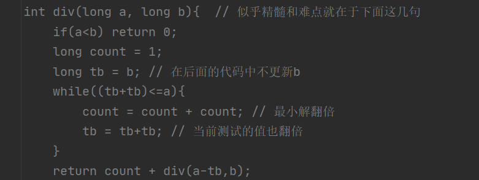
>
> ```java
>public int divide(int dividend, int divisor) {
>      // 当除数为1，直接返回被除数
>      if(dividend == 0) return 0;
>         if(divisor == 1) return dividend;
>         if(divisor == -1){
>             if(dividend>INT_MIN) return -dividend;// 只要不是最小的那个整数，都是直接返回相反数就好啦
>             return INT_MAX;// 是最小的那个，那就返回最大的整数啦
>         }
>         long a = dividend;
>         long b = divisor;
>         int sign = 1; 
>         if((a>0&&b<0) || (a<0&&b>0)){
>             sign = -1;
>         }
>         a = a>0?a:-a;
>         b = b>0?b:-b;
>         long res = div(a,b);
>         if(sign>0)return res>INT_MAX?INT_MAX:res;
>         return -res;
>     }
>     int div(long a, long b){  // 似乎精髓和难点就在于下面这几句
>         if(a<b) return 0;
>         long count = 1;
>         long tb = b; // 在后面的代码中不更新b
>         while((tb+tb)<=a){
>             count = count + count; // 最小解翻倍
>             tb = tb+tb; // 当前测试的值也翻倍
>         }
>         return count + div(a-tb,b);
>     }
>    ```
>    


#### `2020/11/18`

##### 下一个排列

> 实现获取下一个排列的函数，算法需要将给定数字序列重新排列成字典序中下一个更大的排列。
>
> 如果不存在下一个更大的排列，则将数字重新排列成最小的排列（即升序排列）。
>
> 必须 原地 修改，只允许使用额外常数空间。
>
> **思路**：
> $$
> （1）从数组最后一个元素开始扫描，寻找到nums[i] > nums[i - 1]的第一个i值。\\
> 
> （2）如果得到i值大于等于1，说明数组存在下一个排列。\\
> 
> a.我们还是从数组最后一个元素开始扫描，寻找到num[j] > nums[i - 1]的第一个j值。\\由于nums[i] > nums[i - 1]，所以我们的j值一定是大于等于i的。\\
> 
> b.交换索引为i - 1和索引为j的元素的值。\\
> 
> c.此时索引i及之后的排列时一个降序排列，将其变成升序排列即可。\\
> 
> 为什么说此时索引i及之后的排列是一个降序排列呢？\\
> 
> 对于原来的数组，由于我们是从数组最后一个元素开始扫描寻找到的nums[i] > nums[i - 1]的第一个i值，\\我们原数组中i之后的排列一定是一个降序排列。那么我们只需要看交换之后是否依然是一个降序排列呢？\\
> 
> 而寻找索引j，我们还是从数组最后一个元素开始扫描，寻找到num[j] > nums[i - 1]的第一个j值。\\对于索引j之后的值，一定是小于等于nums[i - 1]的。\\而对于索引i到j - 1这部分元素，一定是大于等于num[j]的，自然一定大于nums[i - 1]。\\那么，交换之后，原数组中i之后的排列一定依然是一个降序排列。\\
> （3）如果得到的i值小于1，说明数组不存在下一个排列，倒序输出数组即得升序排列。
> $$
> 
>
> ```java
>     public void nextPermutation(int[] nums) {
> 
>         int length = nums.length;
>         int i = 0;
>         int j = 0;
> 
>         for (i=length-1;i>0;i--)
>             if (nums[i]>nums[i-1])
>                 break;
>         if (i>=1){
>             for (j=length-1;j>=i;j--){
>                 if (nums[j] > nums[i-1]){
>                     swap(i-1, j, nums);
>                     break;
>                 }
>             }
>             reverse(i, length-1, nums);
>         }
>         else reverse(0, length-1, nums);
>     }
>     public void reverse(int start, int end, int[] nums){
>         while (start < end){
>             swap(start, end, nums);
>             start++;
>             end--;
>         }
>     }
> 
>     private void swap(int start, int end, int[] nums) {
>         int temp;
>         temp = nums[start];
>         nums[start] = nums[end];
>         nums[end] = temp;
>     }
> ```

#####  [搜索旋转排序数组](https://leetcode-cn.com/problems/search-in-rotated-sorted-array/)

> 给你一个整数数组 nums ，和一个整数 target 。
>
> 该整数数组原本是按升序排列，但输入时在预先未知的某个点上进行了旋转。（例如，数组$ [0,1,2,4,5,6,7]$ 可能变为 $[4,5,6,7,0,1,2]$ ）。
>
> 请你在数组中搜索 target ，如果数组中存在这个目标值，则返回它的索引，否则返回 $-1$ 。
>
> *思路*
>
> ​		==可以将数组从中间分开成左右两部分的时候，一定有一部分数组是有序的。拿示例来看，我们从$ 6 $这个位置分开以后数组变成了$ [4, 5, 6] $和$ [7, 0, 1, 2] $两个部分，其中左边$ [4, 5, 6]$ 这个部分的数组是有序的，其他也是如此。==
>
> ​		==所以可以在常规二分搜索的时候查看当前 mid 为分割位置分割出来的两个部分$ [l, mid]$ 和$ [mid + 1, r] $哪个部分是有序的，并根据有序的那个部分确定我们该如何改变二分搜索的上下界，因为我们能够根据有序的那部分, 判断出 target 在不在这个部分：==
>
> ​		==如果$ [l, mid] $是有序数组，且 target 的大小满足$ ([nums[l], nums[mid])$，则我们应该将搜索范围缩小至 $[l, mid]$，否则在$ [mid + 1, r]$ 中寻找。如果 $[mid, r] $是有序数组，且 target 的大小满足$ (nums[mid+1], nums[r])$，则我们应该将搜索范围缩小至$ [mid + 1, r]$，否则在$ [l, mid - 1] $中寻找。==
>
> ```java
> public int search(int[] nums, int target) {
>        int length = nums.length;
>         if (length == 0)
>             return -1;
>         if (length == 1){
>             if (nums[length-1] == target)
>                 return 0;
>             else return -1;
>         }
>         int left = 0;
>         int right = length - 1;
>         while (left <= right){
>             int mid = (left + right) / 2;
>             if (nums[mid] == target)
>                 return mid;
>             if (nums[left] == target)
>                 return left;
>             if (nums[right] == target)
>                 return right;
> 
>             if (nums[0] < nums[mid]){ // 左边有序
>                 if (target < nums[mid]){
>                     if (target > nums[0])
>                         right = mid - 1; // target在nums[0]和nums[mid]之间
>                     else left = mid + 1; // target不在nums[0]和nums[mid]之间，换另一部分
>                 } else left = mid + 1; // target不在nums[0]和nums[mid]之间，换另一部分
>             }
>             else { // 右边有序
>                 if (target <nums[right]){
>                     if (target > nums[mid]){
>                         left = mid + 1;
>                     }else right = mid - 1; // target不在nums[mid]和nums[right]之间，换另一部分
>                 } else right = mid - 1;// target不在nums[mid]和nums[right]之间，换另一部分
> 
>             }
>         }
>         return -1;
> }
> ```
>

#### `2020/11/19`

##### [在排序数组中查找元素的第一个和最后一个位置](https://leetcode-cn.com/problems/find-first-and-last-position-of-element-in-sorted-array/)

> 给定一个按照升序排列的整数数组$nums$，和一个目标值$target$。找出给定目标值在数组中的开始位置和结束位置。
>
> 你的算法时间复杂度必须是 $O(log n)$ 级别。
>
> 如果数组中不存在目标值，返回 $[-1, -1]$。
>
> *思路：*
>
> ==①首先根据二分法找到vector中的某个target元素，这个元素是一串target元素中的某一个，记这个元素的索引是med。==
>
> ==②接着从vector的头部开始，到med-1这个位置，根据二分法找到某个元素——元素不是target，但是元素的下一个元素是target。这个元素的下一个元素，也就是一串target元素中的第一个。==
>
> ==③接着从med+1这个位置开始，到vector的尾部结束，根据二分法找到某个元素——元素不是target，但是元素的前一个元素是target。这个元素的前一个元素，也就是一串target元素中的最后一个。总体思路如上，当然其中要有一些边界情况的处理，比如②中找不到这个元素怎么办，vector是[8,8,8,8,8]，target是8，我们根本找不到一个不是8的元素。==
>
> ==还有，不存在target的边界情况，也要特殊处理一下。==
>
> ```java
> int[] reslut = new int[]{-1, -1};
> 
>         int left = 0;
>         int mid = 0;
>         int right = nums.length - 1;
> 
>         while (left <= right){
>             mid = (left + right) / 2;
>             if (nums[mid] == target)
>                 break;
>             else if (nums[mid] < target)
>                 left = mid + 1;
>             else if (nums[mid] > target)
>                 right = mid - 1;
>         }
> 
>         if (left > right)
>             return reslut;
> 
>         int begin = searchRangeLeft(0, mid-1, nums, target);
>         int end = searchRangeRight(mid+1, nums.length-1, nums, target);
> 
>         reslut = new int[]{begin, end};
> 
>         return reslut;
>     }
>     public int searchRangeLeft(int left, int right, int[] nums, int target){
>         while (left <= right){
>             int mid = (left + right) / 2;
>             if (nums[mid] != target && nums[mid+1] == target){
>                 return mid + 1;
>             }
>             else if (nums[mid] < target)
>                 left = mid + 1;
>             else if (nums[mid] == target)
>                 right = mid - 1;
>         }
>         return right+1;
>     }
>     public int searchRangeRight(int left, int right, int[] nums, int target){
>         while (left <= right){
>             int mid = (left + right) / 2;
>             if (nums[mid]!=target && nums[mid-1]==target){
>                 return mid - 1;
>             }
>             else if (nums[mid] > target)
>                 right = mid - 1;
>             else if (nums[mid] == target)
>                 left = mid + 1;
>         }
>         return left-1;
>     }
> ```

#### `2020/11/23`

##### [有效的数独](https://leetcode-cn.com/problems/valid-sudoku/)

> 判断一个 9x9 的数独是否有效。只需要根据以下规则，验证已经填入的数字是否有效即可。
>
> 数字 1-9 在每一行只能出现一次。
> 数字 1-9 在每一列只能出现一次。
> 数字 1-9 在每一个以粗实线分隔的 3x3 宫内只能出现一次。
>
> ==思路==
>
> - 遍历数独。
> - 检查看到每个单元格值是否已经在当前的行 / 列 / 子数独中出现过：
>   - 如果出现重复，返回 `false`。
>   - 如果没有，则保留此值以进行进一步跟踪。

```java
public boolean isValidSudoku(char[][] board) {

        int[][] col = new int[9][9];
        int[][] row = new int[9][9];
        int[][] arr = new int[9][9];

        for (int i=0;i<9;i++){
            for (int j=0;j<9;j++){
                int index = (i/3) * 3 + (j/3);
                if (board[i][j] != '.'){
                    int num = board[i][j] - '1';
                    if (col[i][num] == 1)
                        return false;
                    else col[i][num]=1;

                    if (row[j][num]==1)
                        return false;
                    else row[j][num]=1;

                    if (arr[index][num]==1)
                        return false;
                    else arr[index][num]=1;
                }
            }
        }
        return true;

    }
```

##### [外观数列](https://leetcode-cn.com/problems/count-and-say/)

> $$
> 1.     1
> 2.     11
> 3.     21
> 4.     1211
> 5.     111221
> 第一项是数字 1 
> 描述前一项，这个数是 1 即 “ 一 个 1 ”，记作 "11"
> 描述前一项，这个数是 11 即 “ 二 个 1 ” ，记作 "21"
> 描述前一项，这个数是 21 即 “ 一 个 2 + 一 个 1 ” ，记作 "1211"
> 描述前一项，这个数是 1211 即 “ 一 个 1 + 一 个 2 + 二 个 1 ” ，记作 "111221"

> $$
>
> ```java
>  public String countAndSay(int n) {
> 
>         String result = "1";
>         for (int i=2;i<=n;i++){
>             int count = 1;
>             StringBuilder builder = new StringBuilder();//新建一个string类用于拼接
>             char pre = result.charAt(0);
>             for (int j=1;j<result.length();j++){
>                 if (result.charAt(j) == pre){
>                     count++;
>                 }
>                 else {
>                     builder.append(count).append(pre);
>                     pre = result.charAt(j);
>                     count = 1;
>                 }
>             }
>             builder.append(count).append(pre);//拼接count个pre
>             result = builder.toString();//转换为string
>         }
>         return result;
>  }
> ```
>

#### `2020/11/30`

##### [组合总和](https://leetcode-cn.com/problems/combination-sum/)

> 给定一个无重复元素的数组 candidates 和一个目标数 target ，找出 candidates 中所有可以使数字和为 target 的组合。
>
> candidates 中的数字可以无限制重复被选取。
>
> $$
> 输入：candidates = [2,3,5], target = 8,
> 所求解集为：
> [
>   [2,2,2,2],
>   [2,3,3],
>   [3,5]
> ]
> $$
> 思路：
>
> ==1，首先对数组进行排序，方便操作并且节省开支；
> 2，数组[2,3,6,7],target = 7,定义一个存放临时结果的list，每次需要从start元素开始，比如，先将2存入list，然后target就变成7-2=5，再将2放入list，target就变成5-2=3，再将2放入list，target就是3-2=1，然后再拿start位置元素还是2，但是2比1大，所以不行，那么就将list最后一个元素2去掉，然后将下一个元素也就是3存入list，这时候target变成了0，满足条件，将这个list存入结果集res里面；
> 3，按照第二步所描述的过程，递归迭代这个数组，将符合条件的元素组合全部拿到即可！==
>
> ```java
> public List<List<Integer>> combinationSum(int[] candidates, int target) {
>         Arrays.sort(candidates);
>         List<Integer> list = new ArrayList<>();
>         List<List<Integer>> res = new ArrayList<>();
>         if (candidates == null || candidates.length==0)
>             return res;
>         combine(candidates, 0, target, list, res);
>         return res;
>     }
>     public void combine(int[] candidates, int start, int target, List<Integer> list, List<List<Integer>> res){
>         if (target == 0){
>             res.add(new ArrayList<>(list));
>             return;
>         }
>         for (int i=start;i<candidates.length;i++){
>             if (candidates[i] <= target){
>                 list.add(candidates[i]);
>                 combine(candidates, i, target-candidates[i], list, res);
>                 list.remove(list.size() - 1);
>             }
>         }
>     }
> ```
>
> 

#### `2020/12/03`

##### [字符串相乘](https://leetcode-cn.com/problems/multiply-strings/)

> 给定两个以字符串形式表示的非负整数 `num1` 和 `num2`，返回 `num1` 和 `num2` 的乘积，它们的乘积也表示为字符串形式。
> $$
> 输入: num1 = "123", num2 = "456"
> 输出: "56088"
> $$
> 思路：
>
> - 长为n的数和长为m的数相乘的结果最大长度为m+n;
> - 结果存在数组res中，num1[i]*num2[j]的结果为两位数tmp（0x或者xy），其中第一位位于res[i+j], 第二位位于res[i+j+1]。
>
> 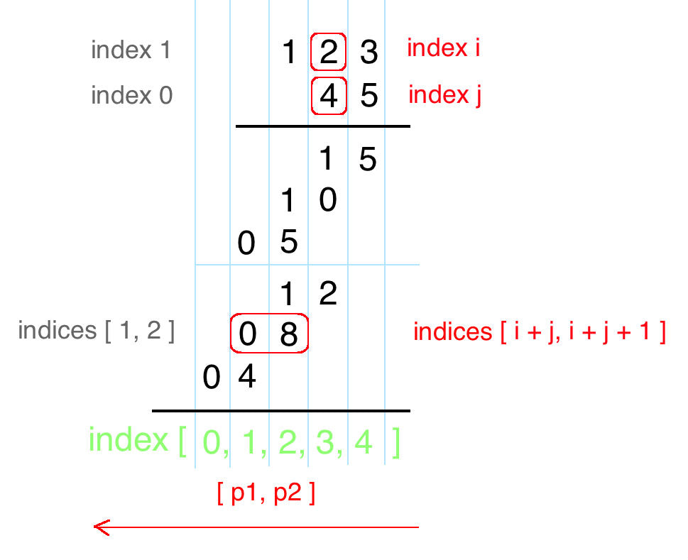

```java
if ((num1.equals("0")) || num2.equals("0"))
            return "0";

        int[] res = new int[(num1.length() + num2.length())];
        for (int i=0;i<num1.length() + num2.length();i++)
            res[i] = 0;

         for (int i=num1.length()-1;i>=0;i--){
            int n1 = num1.charAt(i) - '0';
            for (int j=num2.length()-1;j>=0;j--){
                int n2 = num2.charAt(j) - '0';
                int s = res[i + j + 1] + n1 * n2;
                res[i + j + 1] = s % 10;
                res[i + j] = s / 10;
            }
        }
        String ans = "";
        for (int i=0;i<num1.length() + num2.length();i++){
            if ( res[i]==0) // i==0
                continue;
            ans = ans + res[i];
        }
        return ans;
```

#### `2020/12/07`

##### [全排列](https://leetcode-cn.com/problems/permutations/)

> 给定一个 **没有重复** 数字的序列，返回其所有可能的全排列。
> $$
> 输入: [1,2,3]\\
> 输出:\\
> [\\
>   [1,2,3],\\
>   [1,3,2],\\
>   [2,1,3],\\
>   [2,3,1],\\
>   [3,1,2],\\
>   [3,2,1]\\
> ]
> $$
> 思路：回溯。
>
> ```Java
>     public List<List<Integer>> permute(int[] nums) {
>         List<List<Integer>> ansList = new LinkedList();
>         boolean[] visited = new boolean[nums.length];
>         traceBack(nums, visited, new LinkedList<>(), ansList);
>         return ansList;
>     }
> 
>     private void traceBack(int[] nums, boolean[] visited, LinkedList<Integer> objects, List<List<Integer>> ansList) {
>         if (objects.size() == nums.length){
>             ansList.add(new LinkedList<>(objects));
>             return;
>         }
>         for (int i=0;i<nums.length;i++){
>             if (!visited[i]){
>                 objects.addLast(nums[i]);
>                 visited[i] = true;
>                 traceBack(nums, visited, objects, ansList);
>                 objects.removeLast();
>                 visited[i] = false;
>             }
>         }
>     }
> ```
>
> 

#### `2020/12/21`

##### [ 字母异位词分组](https://leetcode-cn.com/problems/group-anagrams/)

> 给定一个字符串数组，将字母异位词组合在一起。字母异位词指字母相同，但排列不同的字符串
>
> 输入: ["eat", "tea", "tan", "ate", "nat", "bat"]
> 输出:
> [
>   ["ate","eat","tea"],
>   ["nat","tan"],
>   ["bat"]
> ]
>
> 思路：
>
> ==每个字符串进行排序，如果相等，则属于同一个字母异位词==

```java
class Solution {
    public List<List<String>> groupAnagrams(String[] strs) {
        Map<String, List<String>> map = new HashMap<>();
        for (int i=0;i<strs.length;i++){
            char[] chars = strs[i].toCharArray();
            Arrays.sort(chars);
            String key = new String(chars);
            List<String> list = map.getOrDefault(key, new ArrayList<>());
            list.add(strs[i]);
            map.put(key, list);
        }
        return new ArrayList<>(map.values());
    }
}
```

#### '2020/12/22'

##### [最大子序和](https://leetcode-cn.com/problems/maximum-subarray/)

> 给定一个整数数组 `nums` ，找到一个具有最大和的连续子数组（子数组最少包含一个元素），返回其最大和。
>
> ```
> 输入: [-2,1,-3,4,-1,2,1,-5,4]
> 输出: 6
> 解释: 连续子数组 [4,-1,2,1] 的和最大，为 6。
> ```
>
> ==设sum[i]为**以第i个元素结尾且和最大**的连续子数组。假设对于元素i，所有以它前面的元素结尾的子数组的长度都已经求得，那么以第i个元素结尾且和最大的连续子数组实际上，要么是以第i-1个元素结尾且和最大的连续子数组加上这个元素，要么是只包含第i个元素，即sum[i]
> = max(sum[i-1] + a[i], a[i])。可以通过**判断sum[i-1] + a[i]是否大于a[i]来做选择**，而这实际上等价于判断**sum[i-1]是否大于0**。由于每次运算只需要前一次的结果，因此并不需要像普通的动态规划那样保留之前所有的计算结果，只需要保留上一次的即可，因此算法的时间和空间复杂度都很小==

```java
class Solution {
    public int maxSubArray(int[] nums) {
        int current=nums[0];
        int sum=nums[0];
        //我们考虑如果全是负数，那么返回最大的负数，如果最后的和为正，那么就使用扫描法
        for(int i=1;i<nums.length;i++) {
            if(current<0)current=nums[i];//当前数小于0 肯定会舍去（否则将会影响接下来的和），换为下一个数
            else current+=nums[i];//如果当前数不小于0，那么他会对接下来的和有积极影响
            if(current>sum)sum=current;//这里既实现了负数返回最大也实现了扫描法
            //这里其实已经隐式的列举了所有可能，保留了所有可能的最大值
        }
        return sum;
    }
}
```

| i    | sum  | current |
| ---- | ---- | ------- |
| 1    | -2   | -2      |
| 2    | 1    | 1       |
| 3    | 1    | 1-3=-2  |
| 4    | 4    | 4       |
| 5    | 4    | 4-1=3   |
| 6    | 5    | 3+2=5   |
| 7    | 6    | 5+1=6   |
| 8    | 6    | 6-5=1   |
|      | 6    | 1+4=5   |

##### [螺旋矩阵](https://leetcode-cn.com/problems/spiral-matrix/)

> 给定一个包含 $m\times n$个元素的矩阵（$m$ 行, $n$列），请按照顺时针螺旋顺序，返回矩阵中的所有元素。
>
> 输入:
> [
>   [1, 2, 3, 4],
>   [5, 6, 7, 8],
>   [9,10,11,12]
> ]
> 输出: [1,2,3,4,8,12,11,10,9,5,6,7]

```java
public List<Integer> spiralOrder(int[][] matrix) {
         List<Integer> result = new ArrayList<>();
        int length1 = matrix.length, length2 = matrix[0].length;
        int current = 1;
        int L=0, U=0, B=length1-1, R=length2-1;
        int i=0, j=0;

        if (length1 * length2 == 1){
            result.add(matrix[0][0]);
        }
        else
        {
            while (current <= length1 * length2){
                //从左到右
                while (current<=length1*length2 && j<R){
                    result.add(matrix[i][j]);
                    current++;
                    j++;
                }
                //从上到下
                while (current<=length1*length2 && i<B){
                    result.add(matrix[i][j]);
                    current++;
                    i++;
                }
                //从右到左
                while (current<=length1*length2 && j>L){
                    result.add(matrix[i][j]);
                    current++;
                    j--;
                }
                //从下往上
                while (current<=length1*length2 && i>U){
                    result.add(matrix[i][j]);
                    current++;
                    i--;
                }
                L++;
                U++;
                R--;
                B--;
                j++;
                i++;

                if (current==length1*length2 ){
                    result.add(matrix[i][j]);
                    current++;
                }
            }
        }
        return result;
```

#### `2020/12/23`

##### [ 跳跃游戏](https://leetcode-cn.com/problems/jump-game/)

> 给定一个非负整数数组，你最初位于数组的第一个位置。数组中的每个元素代表你在该位置可以跳跃的最大长度。判断你是否能够到达最后一个位置。
>
> ```
> 输入: [2,3,1,1,4]
> 输出: true
> 解释: 我们可以先跳 1 步，从位置 0 到达 位置 1, 然后再从位置 1 跳 3 步到达最后一个位置。
> ```

> 最优解：
>
> ==贪心算法：我们只对最远能到达的位置感兴趣，所以维护一个变量 reach，表示最远能到达的位置，初始化为0。遍历数组中每一个数字，如果当前坐标大于$ reach $或者$ reach $已经抵达最后一个位置则跳出循环，否则就更新$reach $的值为其和$ i + nums[i]$ 中的较大值，其中 $i + nums[i] $表示当前位置能到达的最大位置==
>
> ```java
>     public boolean canJump(int[] nums) {
>         //贪心算法
>         int reach = 0;
>         for (int i=0;i<nums.length;i++){
>             if (reach>=nums.length-1 || i>reach)
>                 break;
>             reach = Math.max(reach, i+nums[i]);
>         }
>         return reach>=(nums.length-1);
>     }
> ```
>
> 

#### `2020/12/24`

##### [合并区间](https://leetcode-cn.com/problems/merge-intervals/)

> 给出一个区间的集合，请合并所有重叠的区间。
>
>  
>
> 示例 1:
>
> 输入: intervals = [[1,3],[2,6],[8,10],[15,18]]
> 输出: [[1,6],[8,10],[15,18]]
> 解释: 区间 [1,3] 和 [2,6] 重叠, 将它们合并为 [1,6].
>
> `思路`
>
> ==贪心算法：所有的区间按照左端点升序排序，然后遍历。==
>
> ==如果当前遍历到的区间的左端点 > 结果集中最后一个区间的右端点，说明它们没有交集，此时把区间添加到结果集；==
>
> ==如果当前遍历到的区间的左端点 <= 结果集中最后一个区间的右端点，说明它们有集，此时产生合并操作，即：对结果集中最后一个区间的右端点更新（取两个区间的最大值）。==

```java
class Solution {
    public int[][] merge(int[][] intervals) {
        if (intervals.length == 0)
            return intervals;
        List<int[]> res = new ArrayList<>();
        Arrays.sort(intervals, Comparator.comparing(o->o[0]));
        res.add(intervals[0]);

        for (int i=1;i<intervals.length;i++){
            int[] curInter = intervals[i];

            int[] peek = res.get(res.size() - 1);

            if (curInter[0] > peek[1]){
                res.add(curInter);
            }
            else {
                peek[1] = Math.max(curInter[1], peek[1]);
            }
        }
        return res.toArray(new int[res.size()][]);
    }
}
```

#### `2020/12/26`

##### [旋转链表](https://leetcode-cn.com/problems/rotate-list/)

> ```
> 给定一个链表，旋转链表，将链表每个节点向右移动 k 个位置，其中 k 是非负数。
> 输入: 1->2->3->4->5->NULL, k = 2
> 输出: 4->5->1->2->3->NULL
> 解释:
> 向右旋转 1 步: 5->1->2->3->4->NULL
> 向右旋转 2 步: 4->5->1->2->3->NULL
> 
> 输入: 0->1->2->NULL, k = 4
> 输出: 2->0->1->NULL
> 解释:
> 向右旋转 1 步: 2->0->1->NULL
> 向右旋转 2 步: 1->2->0->NULL
> 向右旋转 3 步:0->1->2->NULL
> 向右旋转 4 步:2->0->1->NULL
> ```
>
> ==思路==
>
> 算法实现很直接：
>
> ```
> 找到旧的尾部并将其与链表头相连 old_tail.next = head，整个链表闭合成环，同时计算出链表的长度 n。
> 找到新的尾部，第 (n - k % n - 1) 个节点 ，新的链表头是第 (n - k % n) 个节点。
> 断开环 new_tail.next = None，并返回新的链表头 new_head。
> ```
>
> ```java
> public ListNode rotateRight(ListNode head, int k) {
>         if (head == null) return null;
>         if (head.next == null) return head;
> 
>         // close the linked list into the ring
>         ListNode old_tail = head;
>         int n;
>         for(n = 1; old_tail.next != null; n++)
>             old_tail = old_tail.next;
>         old_tail.next = head;
> 
>         // find new tail : (n - k % n - 1)th node
>         // and new head : (n - k % n)th node
>         ListNode new_tail = head;
>         for (int i = 0; i < n - k % n - 1; i++)
>             new_tail = new_tail.next;
>         ListNode new_head = new_tail.next;
> 
>         // break the ring
>         new_tail.next = null;
> 
>         return new_head;
>     }
> ```
>
> 
>

#### `2020/12/28`

##### [不同路径](https://leetcode-cn.com/problems/unique-paths/)

> ```
> 一个机器人位于一个 m x n网格的左上角 （起始点在下图中标记为 “Start” ）。
> 机器人每次只能向下或者向右移动一步。机器人试图达到网格的右下角（在下图中标记为 “Finish” ）。
> 问总共有多少条不同的路径？
> ```

> ==方法一：动态规划==
>
> 我们用 $f(i, j)$ 表示从左上角走到 $(i, j) $的路径数量，其中$i $和 $j$ 的范围分别是 $[0, m)$ 和 $[0, n)$。
>
> 由于我们每一步只能从向下或者向右移动一步，因此要想走到$(i,j)$，如果向下走一步，那么会从 $(i-1, j)$ 走过来；如果向右走一步，那么会从 $(i, j-1)$ 走过来。因此我们可以写出动态规划转移方程：
>
> $$
> f(i, j) = f(i-1, j) + f(i, j-1)
> $$
> 需要注意的是，如果$ i=0$, 那么$f(i−1,j) $并不是一个满足要求的状态，我们需要忽略这一项；同理，如果 $j=0$，那么 $f(i,j−1) $并不是一个满足要求的状态，我们需要忽略这一项。
>
> 初始条件为$ f(0,0)=1$，即从左上角走到左上角有一种方法。
>
> ```java
>         int[][] path = new int[m][n];
>         for (int i=0;i<m;i++)
>             path[i][0] = 1;
>         for (int j=0;j<n;j++)
>             path[0][j] = 1;
> 
>         for (int i=1;i<m;i++){
>             for (int j=1;j<n;j++){
>                 path[i][j] = path[i-1][j] + path[i][j-1];
>             }
>         }
>         return path[m-1][n-1];
> ```
>
> ==方法二：排列组合==
>
> 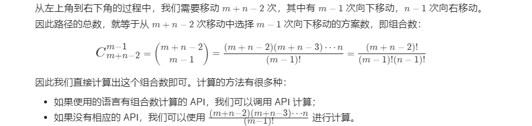
>
> ```java
>         long path = 1;
>         for (int i=n,j=1;j<m;i++,j++)
>             path = path * i / j;
>         return (int) path;
> ```

##### [不同路径 II](https://leetcode-cn.com/problems/unique-paths-ii/)

>```
>    一个机器人位于一个 m x n 网格的左上角 （起始点在下图中标记为“Start” ）。
>机器人每次只能向下或者向右移动一步。机器人试图达到网格的右下角（在下图中标记为“Finish”）
>现在考虑网格中有障碍物。那么从左上角到右下角将会有多少条不同的路径？
>```
>
>这道题是之前那道[ Unique Paths 不同的路径](http://www.cnblogs.com/grandyang/p/4353555.html) 的延伸，在路径中加了一些障碍物，还是用动态规划Dynamic Programming来解，不同的是当遇到为1的点，将该位置的数组中的值清零，其余和之前那道题并没有什么区别。
>
>```java
>    public int uniquePathsWithObstacles(int[][] obstacleGrid) {
>        int m=obstacleGrid.length, n = obstacleGrid[0].length;
>        if (m==0 || n==0 || obstacleGrid[0][0]==1)
>            return 0;
>        int[][] path = new int[m][n];
>        for (int i=0;i<m;i++){
>            if (obstacleGrid[i][0]==1){
>                path[i][0] = 0;
>                break;
>            }
>            else path[i][0] = 1;
>        }
>        for (int j=0;j<n;j++){
>            if (obstacleGrid[0][j]==1){
>                 path[0][j] = 0;
>                 break;
>            }
>            else path[0][j] = 1;
>        }
>        for (int i=1;i<m;i++){
>            for (int j=1;j<n;j++){
>                if (obstacleGrid[i][j] ==1 )
>                    path[i][j] = 0;
>                else path[i][j] = path[i-1][j] + path[i][j-1];
>            }
>        }
>        return path[m-1][n-1];
>    }
>```
>
>

#### `2020/12/29`

##### [二进制求和](https://leetcode-cn.com/problems/add-binary/)

> 给你两个二进制字符串，返回它们的和（用二进制表示）。
>
> 输入为 **非空** 字符串且只包含数字 `1` 和 `0`。
>
> ```
> 输入: a = "11", b = "1"
> 输出: "100"
> ```

```java
StringBuffer ans = new StringBuffer();
        int length = Math.max(a.length(), b.length()), carry = 0;
        for (int i=0;i<length;i++){
            if (i<a.length())
                carry = carry + (a.charAt(a.length() - 1 - i) - '0');
            else carry = carry + 0;
            if (i<b.length())
                carry = carry + (b.charAt(b.length() - 1 - i) - '0');
            else carry = carry + 0;

            ans.append(carry % 2);
            carry = carry / 2;
        }
        if (carry > 0)
            ans.append(1);
        ans.reverse();
        return ans.toString();
```

#### `2020/01/05`

##### [ 简化路径](https://leetcode-cn.com/problems/simplify-path/)

> 例如，
> path = `"/home/"`, => `"/home"`
> path = `"/a/./b/../../c/"`, => `"/c"`
>
> 边界情况:
>
> - - 你是否考虑了 路径 = `"/../"` 的情况？
>     在这种情况下，你需返回 `"/"` 。
>   - 此外，路径中也可能包含多个斜杠 `'/'` ，如 `"/home//foo/"` 。
>     在这种情况下，你可忽略多余的斜杠，返回 `"/home/foo"` 。

```
对于这道题目来说，最为关键的算法就是如何处理".."对于之前路径的“退回”操作。不难发现，每次“退回”的都是当前路径中的最后一个“文件夹”，每次进入的文件夹也都会出现在路径的最后。这样的一个“从一段添加或者删除”的模式恰恰就是栈的定义。

　　当我们知道要使用栈结构以后，还有几个坑需要注意：

""和"."都是不需要处理的
/,//,///,只要是连续的斜线都是/
在根目录是使用".."是无法退后的，这TMD巨坑，结合实际了！　　
　　我们处理的步骤是如下：

如果当前段是..，则看stack中是否有元素，如果有，删除最后一个
如果当前段是.或者，则不做任何处理
否则将当前段加入到stack的末尾
　　这样，在处理完所有段之后，我们就可以确保仍然在stack中的就是最简单的路径字符串了，这个时候，我们只需要使用/将他们拼接成答案即可。
```

```java
    public String simplifyPath(String path) {
        Stack<String> stringStack  = new Stack<>();
        String[] arr = path.split("/");

        for (int i=0;i<arr.length;i++){
            String str = arr[i];

            if ((str.equals("")) || (str.equals(".")))
                continue;
            else if (str.equals("..")){
                if (!stringStack.empty())
                    stringStack.pop();
            }
            else stringStack.push(str);
        }
        String ans = "";
        while (!stringStack.empty())
            ans = "/" + stringStack.pop() + ans;
        if (ans.equals(""))
            return "/";
        return ans;
    }
```

#### `201/01/07`

##### [组合](https://leetcode-cn.com/problems/combinations/)

> 给定两个整数 *n* 和 *k*，返回 1 ... *n* 中所有可能的 *k* 个数的组合。
>
> ```
> 组合 给定两个整数 n 和 k，返回 1 ... n 中所有可能的 k 个数的组合。
> 输入: n = 4, k = 2
> 输出:
> [
>   [2,4],
>   [3,4],
>   [2,3],
>   [1,2],
>   [1,3],
>   [1,4],
> ]
> ```

```java
public List<List<Integer>> combine(int n, int k) {
        List<List<Integer>> res = new ArrayList<>();
        if (k==0 || n<k)
            return res;

        Deque<Integer> path = new ArrayDeque<>();
        dfs(n, k, 1, path, res);
        return res;
    }

    private void dfs(int n, int k, int begin, Deque<Integer> path, List<List<Integer>> res) {
        if (path.size() == k){
            res.add(new ArrayList<>(path));
            return;
        }
        for (int i=begin;i<=n;i++){
            path.addLast(i);
            System.out.println("递归之前 => " + path);
            dfs(n, k, i+1, path, res);
            path.removeLast();
            System.out.println("递归之后 => " + path);
        }
    }
}
```

> n=5, k=3
>
> 递归之前 => [1]
> 递归之前 => [1, 2]
> 递归之前 => [1, 2, 3]
> 递归之后 => [1, 2]
> 递归之前 => [1, 2, 4]
> 递归之后 => [1, 2]
> 递归之前 => [1, 2, 5]
> 递归之后 => [1, 2]
> 递归之后 => [1]
> 递归之前 => [1, 3]
> 递归之前 => [1, 3, 4]
> 递归之后 => [1, 3]
> 递归之前 => [1, 3, 5]
> 递归之后 => [1, 3]
> 递归之后 => [1]
> 递归之前 => [1, 4]
> 递归之前 => [1, 4, 5]
> 递归之后 => [1, 4]
> 递归之后 => [1]
> 递归之前 => [1, 5]
> 递归之后 => [1]
> 递归之后 => []
> 递归之前 => [2]
> 递归之前 => [2, 3]
> 递归之前 => [2, 3, 4]
> 递归之后 => [2, 3]
> 递归之前 => [2, 3, 5]
> 递归之后 => [2, 3]
> 递归之后 => [2]
> 递归之前 => [2, 4]
> 递归之前 => [2, 4, 5]
> 递归之后 => [2, 4]
> 递归之后 => [2]
> 递归之前 => [2, 5]
> 递归之后 => [2]
> 递归之后 => []
> 递归之前 => [3]
> 递归之前 => [3, 4]
> 递归之前 => [3, 4, 5]
> 递归之后 => [3, 4]
> 递归之后 => [3]
> 递归之前 => [3, 5]
> 递归之后 => [3]
> 递归之后 => []
> 递归之前 => [4]
> 递归之前 => [4, 5]
> 递归之后 => [4]
> 递归之后 => []
> 递归之前 => [5]
> 递归之后 => []
> [[1, 2, 3], [1, 2, 4], [1, 2, 5], [1, 3, 4], [1, 3, 5], [1, 4, 5], [2, 3, 4], [2, 3, 5], [2, 4, 5], [3, 4, 5]]

```
优化：分析搜索起点的上界进行剪枝
我们上面的代码，搜索起点遍历到 n，即：递归函数中有下面的代码片段：

// 从当前搜索起点 begin 遍历到 n
for (int i = begin; i <= n; i++) {
    path.addLast(i);
    dfs(n, k, i + 1, path, res);
    path.removeLast();
}
事实上，如果 n = 7, k = 4，从 5 开始搜索就已经没有意义了，这是因为：即使把 5 选上，后面的数只有 6 和 7，一共就 3 个候选数，凑不出 4个数的组合。因此，搜索起点有上界，这个上界是多少，可以举几个例子分析。

分析搜索起点的上界，其实是在深度优先遍历的过程中剪枝，剪枝可以避免不必要的遍历，剪枝剪得好，可以大幅度节约算法的执行时间。

下面的图片绿色部分是剪掉的枝叶，当 n 很大的时候，能少遍历很多结点，节约了时间。
```


```
容易知道：搜索起点和当前还需要选几个数有关，而当前还需要选几个数与已经选了几个数有关，即与 path 的长度相关。我们举几个例子分析：

例如：n = 6 ，k = 4。

path.size() == 1 的时候，接下来要选择 3个数，搜索起点最大是 4，最后一个被选的组合是 [4, 5, 6]；
path.size() == 2 的时候，接下来要选择 2个数，搜索起点最大是 5，最后一个被选的组合是 [5, 6]；
path.size() == 3 的时候，接下来要选择 1个数，搜索起点最大是 6，最后一个被选的组合是 [6]；

再如：n = 15 ，k = 4。
path.size() == 1 的时候，接下来要选择 3个数，搜索起点最大是 13，最后一个被选的是 [13, 14, 15]；
path.size() == 2 的时候，接下来要选择 2个数，搜索起点最大是 14，最后一个被选的是 [14, 15]；
path.size() == 3 的时候，接下来要选择 1个数，搜索起点最大是 15，最后一个被选的是 [15]；

可以归纳出：


搜索起点的上界 + 接下来要选择的元素个数 - 1 = n
其中，接下来要选择的元素个数 = k - path.size()，整理得到：

搜索起点的上界 = n - (k - path.size()) + 1
所以，我们的剪枝过程就是：把 i <= n 改成 i <= n - (k - path.size()) + 1 ：
```

#### '2021/03/10'

##### [单词搜索](https://leetcode-cn.com/problems/word-search/)

> 给定一个二维网格和一个单词，找出该单词是否存在于网格中。
>
> 单词必须按照字母顺序，通过相邻的单元格内的字母构成，其中“相邻”单元格是那些水平相邻或垂直相邻的单元格。同一个单元格内的字母不允许被重复使用。
> $$
> board =\\
> [\\
>   ['A','B','C','E'],\\
>   ['S','F','C','S'],\\
>   ['A','D','E','E']\\
> ]\\
> 给定 word = "ABCCED", 返回 true\\
> 给定 word = "SEE", 返回 true\\
> 给定 word = "ABCB", 返回 false\\
> $$
> ==回溯，碰到过好几次回溯了，自己都不太会==
>
> 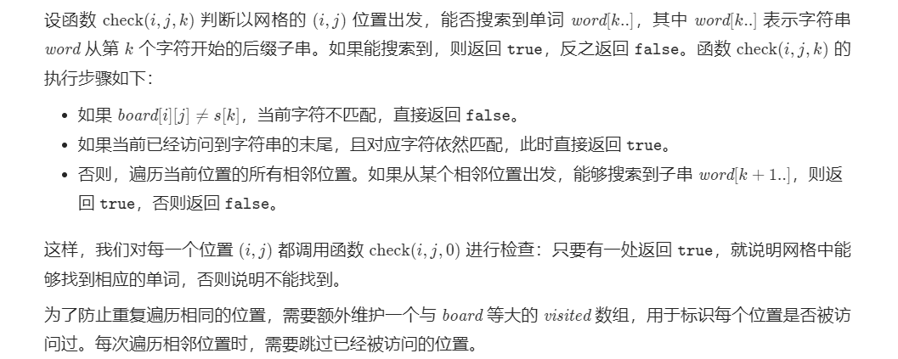

```java
class Solution {
    public boolean exist(char[][] board, String word) {
        int h = board.length, w = board[0].length;
        boolean[][] visited = new boolean[h][w];
        for (int i = 0; i < h; i++) {
            for (int j = 0; j < w; j++) {
                boolean flag = check(board, visited, i, j, word, 0);
                if (flag) {
                    return true;
                }
            }
        }
        return false;
    }

    public boolean check(char[][] board, boolean[][] visited, int i, int j, String s, int k) {
        if (board[i][j] != s.charAt(k)) {
            return false;
        } else if (k == s.length() - 1) {
            return true;
        }
        visited[i][j] = true;
        int[][] directions = {{0, 1}, {0, -1}, {1, 0}, {-1, 0}};
        boolean result = false;
        for (int[] dir : directions) {
            int newi = i + dir[0], newj = j + dir[1];
            if (newi >= 0 && newi < board.length && newj >= 0 && newj < board[0].length) {
                if (!visited[newi][newj]) {
                    boolean flag = check(board, visited, newi, newj, s, k + 1);
                    if (flag) {
                        result = true;
                        break;
                    }
                }
            }
        }
        visited[i][j] = false;
        return result;
    }
}
```

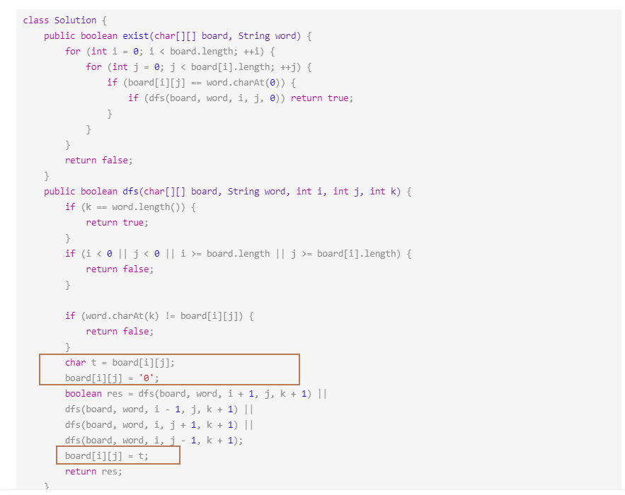

#### ‘2021/03/14’

#### [删除排序链表中的重复元素 II](https://leetcode-cn.com/problems/remove-duplicates-from-sorted-list-ii/)

> 给定一个排序链表，删除所有含有重复数字的节点，只保留原始链表中 没有重复出现 的数字。
>
> 示例 1:
>
> 输入: 1->2->3->3->4->4->5
> 输出: 1->2->5
> 示例 2:
>
> 输入: 1->1->1->2->3
> 输出: 2->3

> - 首先我们要新建一个节点指向head，为的是创建一条头指针为空的链。
> - 因为删除重复元素时有可能需要删除第一个。
> - 接着我们遍历链表来查找重复的数。
> - 我的思路是，prev为前一个指针，cur为当前指针。
> - 如果cur 和 cur.next的val相同，那么cur继续向前移，prev不动。
> - 等到不相同了，再将prev.next指向cur.next，这样就一次性跳过重复的数。
> - 当然有时候还没遇到相同数，而我们又需要更新prev。
> - 所以多加一个判断条件，来判断是要更新prev还是删除相同数。
>
> ```java
> class Solution {
>     public ListNode deleteDuplicates(ListNode head) {
>     if(head == null) return head;
>     ListNode copy = new ListNode(); // 创建一条头指针为空的链
>     copy.next = head;
> 
>     ListNode cur = copy.next;
>     ListNode prev = copy;
>     boolean flag = false;
> 
>     while (cur.next != null) {
>         if (cur.val == cur.next.val) {
>             flag = true;
>         } else {
>             if (flag) {
>                 prev.next = cur.next;
>                 flag = false;
>             }
>             else {
>                 prev = cur;
>             }
>         }
>         cur = cur.next;
>     }
> 
>     if(flag) prev.next = cur.next; // 有可能一直遍历到末尾而未触发删除
>     return copy.next;
>     }
> }
> ```

> ==递归==
>
> 思路：删除所有头部的重复节点，返回不重复的第一个节点。
>
> 1.特殊情况，头节点为null或头节点下一节点为null，直接返回头节点，这时不存在重复节点
> 2.如果头节点与头节点的下一节点值相等，跳过所有相等节点。递归调用函数判断最后一个跳过节点的后一节点。
> 3.如果头节点与头节点的下一节点值不等，递归调用函数判断头节点的后一节点。
>
> ```java
> public ListNode deleteDuplicates(ListNode head) {
>         if (head == null || head.next == null) {
>             return head;
>         }
>         if (head.val == head.next.val) {
>             while (head != null && head.next != null && head.val == head.next.val) {
>                 head = head.next;
>             }
>             return deleteDuplicates(head.next);
>         } else {
>             head.next = deleteDuplicates(head.next);
>             return head;
>         }
>     }
> ```
>
> 

#### ‘2021/03/15’

##### [分隔链表](https://leetcode-cn.com/problems/partition-list/)

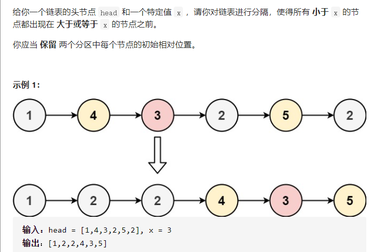

> ==思路==
>
> 我们只需维护两个链表$ \textit{small}$ 和$ \textit{large}$即可，$\textit{small}$链表按顺序存储所有小于$ x$的节点，$\textit{large}$链表按顺序存储所有大于等于 $x$ 的节点。遍历完原链表后，我们只要将$ \textit{small}$链表尾节点指向$ \textit{large}$链表的头节点即能完成对链表的分隔。
>
> 为了实现上述思路，我们设$ \textit{smallHead}$和$ \textit{largeHead}$分别为两个链表的哑节点，即它们的$ \textit{next}$指针指向链表的头节点，这样做的目的是为了更方便地处理头节点为空的边界条件。同时设$ \textit{small}$和$ \textit{large}$节点指向当前链表的末尾节点。开始时 $\textit{smallHead}=\textit{small}$,$\textit{largeHead}=\textit{large}$。随后，从前往后遍历链表，判断当前链表的节点值是否小于 $x$，如果小于就将$ \textit{small}$的$ \textit{next}$指针指向该节点，否则将$ \textit{large}$的$ \textit{next}$指针指向该节点。
>
> 遍历结束后，我们将$ \textit{large}$的 $\textit{next}$指针置空，这是因为当前节点复用的是原链表的节点，而其$ \textit{next}$指针可能指向一个小于 $x$ 的节点，我们需要切断这个引用。同时将 $\textit{small}$的$ \textit{next}$指针指向$ \textit{largeHead}$的$ \textit{next}$指针指向的节点，即真正意义上的 $\textit{large}$链表的头节点。最后返回 $\textit{smallHead}$的$ \textit{next}$指针即为我们要求的答案。
>
> 

##### [子集 II](https://leetcode-cn.com/problems/subsets-ii/)

> 给定一个可能包含重复元素的整数数组 ***nums***，返回该数组所有可能的子集（幂集）。
>
> ```
> 输入: [1,2,2]
> 输出:
> [
>   [2],
>   [1],
>   [1,2,2],
>   [2,2],
>   [1,2],
>   []
> ]
> ```

> # 解法一 回溯法
>
> 这个比较好改，我们只需要判断当前数字和上一个数字是否相同，相同的话跳过即可。当然，要把数字首先进行排序。
>
> ```java
> public List<List<Integer>> subsetsWithDup(int[] nums) {
>     List<List<Integer>> ans = new ArrayList<>();
>     Arrays.sort(nums); //排序
>     getAns(nums, 0, new ArrayList<>(), ans);
>     return ans;
> }
> 
> private void getAns(int[] nums, int start, ArrayList<Integer> temp, List<List<Integer>> ans) {
>     ans.add(new ArrayList<>(temp));
>     for (int i = start; i < nums.length; i++) {
>         //和上个数字相等就跳过
>         if (i > start && nums[i] == nums[i - 1]) {
>             continue;
>         }
>         temp.add(nums[i]);
>         getAns(nums, i + 1, temp, ans);
>         temp.remove(temp.size() - 1);
>     }
> }
> ```

##### [解码方法](https://leetcode-cn.com/problems/decode-ways/)

> 很容易想到递归去解决，将大问题化作小问题。
>
> 比如 232232323232。
>
> 对于第一个字母我们有两种划分方式。
>
> 2|**32232323232** 和 23|**2232323232**
>
> 所以，如果我们分别知道了上边划分的右半部分 32232323232 的解码方式是 ans1 种，2232323232 的解码方式是 ans2 种，那么整体 232232323232 的解码方式就是 ans1 + ans2 种。可能一下子，有些反应不过来，可以看一下下边的类比。
>
> 假如从深圳到北京可以经过**武汉**和**上海**两条路，而从**武汉**到北京有 8 条路，从**上海**到北京有 6 条路。那么从深圳到北京就有 8 + 6 = 14 条路。
>
> ```java
> public int numDecodings(String s) {
>     HashMap<Integer, Integer> memoization = new HashMap<>();
>     return getAns(s, 0, memoization);
> }
> 
> private int getAns(String s, int start, HashMap<Integer, Integer> memoization) {
>     if (start == s.length()) {
>         return 1;
>     }
>     if (s.charAt(start) == '0') {
>         return 0;
>     }
>     //判断之前是否计算过
>     int m = memoization.getOrDefault(start, -1);
>     if (m != -1) {
>         return m;
>     }
>     int ans1 = getAns(s, start + 1, memoization);
>     int ans2 = 0;
>     if (start < s.length() - 1) {
>         int ten = (s.charAt(start) - '0') * 10;
>         int one = s.charAt(start + 1) - '0';
>         if (ten + one <= 26) {
>             ans2 = getAns(s, start + 2, memoization);
>         }
>     }
>     //将结果保存
>     memoization.put(start, ans1 + ans2);
>     return ans1 + ans2;
> }
> 
> ```
>
> # 解法三 [动态规划](https://leetcode.wang/leetcode-91-Decode-Ways.html)
>
> 同样的，递归就是压栈压栈压栈，出栈出栈出栈的过程，我们可以利用动态规划的思想，省略压栈的过程，直接从 bottom 到 top。
>
> 用一个 dp 数组， dp [ i ] 代表字符串 s [ i, s.len-1 ]，也就是 s 从 i 开始到结尾的字符串的解码方式。
>
> 这样和递归完全一样的递推式。
>
> 如果 s [ i ] 和 s [ i + 1 ] 组成的数字小于等于 26，那么
>
> $dp [ i ] = dp[ i + 1 ] + dp [ i + 2 ]$
>
> ```java
> public int numDecodings(String s) {
>     int len = s.length();
>     int[] dp = new int[len + 1];
>     dp[len] = 1; //将递归法的结束条件初始化为 1 
>     //最后一个数字不等于 0 就初始化为 1
>     if (s.charAt(len - 1) != '0') {
>         dp[len - 1] = 1;
>     }
>     for (int i = len - 2; i >= 0; i--) {
>         //当前数字时 0 ，直接跳过，0 不代表任何字母
>         if (s.charAt(i) == '0') {
>             continue;
>         }
>         int ans1 = dp[i + 1];
>         //判断两个字母组成的数字是否小于等于 26
>         int ans2 = 0;
>         int ten = (s.charAt(i) - '0') * 10;
>         int one = s.charAt(i + 1) - '0';
>         if (ten + one <= 26) {
>             ans2 = dp[i + 2];
>         }
>         dp[i] = ans1 + ans2;
> 
>     }
>     return dp[0];
> }
> 
> ```
>
> ==化简后==
>
> ```java
> public int numDecodings5(String s) {
>     int len = s.length();
>     int end = 1;
>     int cur = 0;
>     if (s.charAt(len - 1) != '0') {
>         cur = 1;
>     }
>     for (int i = len - 2; i >= 0; i--) {
>         if (s.charAt(i) == '0') {
>             end = cur;//end 前移
>             cur = 0;
>             continue;
>         }
>         int ans1 = cur;
>         int ans2 = 0;
>         int ten = (s.charAt(i) - '0') * 10;
>         int one = s.charAt(i + 1) - '0';
>         if (ten + one <= 26) {
>             ans2 = end;
>         }
>         end = cur; //end 前移
>         cur = ans1 + ans2;
> 
>     }
>     return cur;
> }
> 
> ```
>

#### '2021/03/16'

##### [不同的二叉搜索树](https://leetcode-cn.com/problems/unique-binary-search-trees/)

> 给定一个整数 *n*，求以 1 ... *n* 为节点组成的二叉搜索树有多少种？
>
> ```
> 输入: 3
> 输出: 5
> 解释:
> 给定 n = 3, 一共有 5 种不同结构的二叉搜索树:
> 
>    1         3     3      2      1
>     \       /     /      / \      \
>      3     2     1      1   3      2
>     /     /       \                 \
>    2     1         2                 3
> ```

> 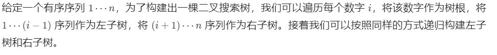
>
> 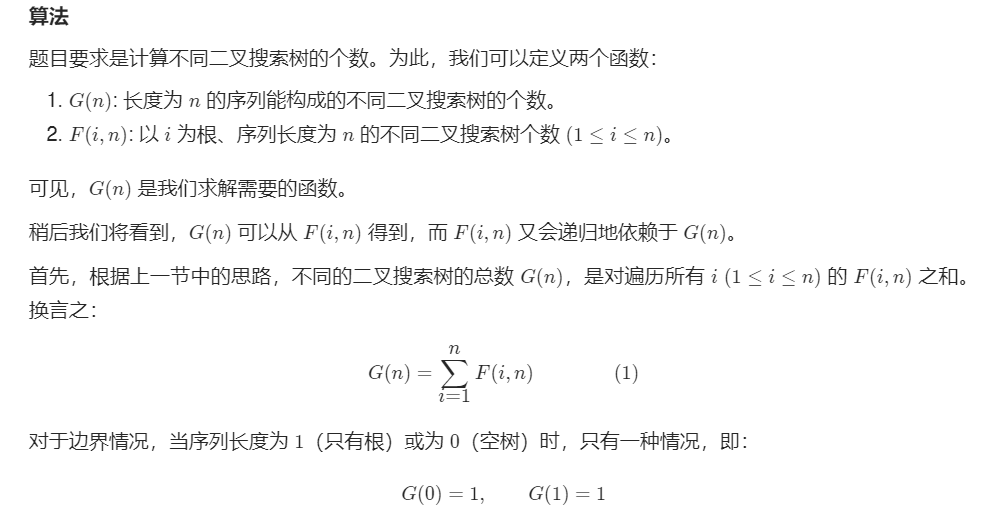
>
> 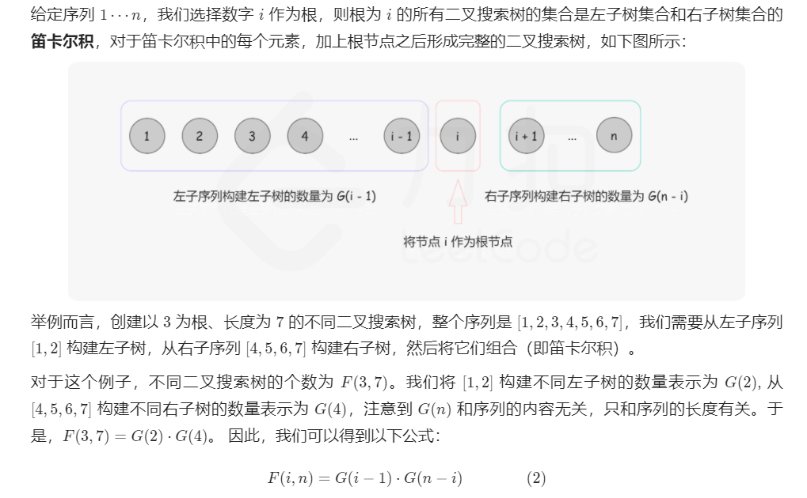
> $$
> G(n)= 
> i=1
> ∑
> n
> ​	
>  G(i−1)⋅G(n−i)
> $$
>
> ```java
> class Solution {
>     public int numTrees(int n) {
>         int[] G = new int[n + 1];
>         G[0] = 1;
>         G[1] = 1;
> 
>         for (int i = 2; i <= n; ++i) {
>             for (int j = 1; j <= i; ++j) {
>                 G[i] += G[j - 1] * G[i - j];
>             }
>         }
>         return G[n];
>     }
> }
> 
> ```

##### [反转链表](https://leetcode-cn.com/problems/reverse-linked-list/)

> 反转一个单链表。
> $$
> 输入: 1->2->3->4->5->NULL  \\
> 输出: 5->4->3->2->1->NULL
> $$

> ==迭代==
>
> 首先看一下原链表。
>
> 
>
> 总共需要添加两个指针，`pre` 和 `next`。
>
> 初始化 `pre` 指向 `NULL` 。
>
> 
>
> 然后就是迭代的步骤，总共四步，顺序一步都不能错。
>
> - `next` 指向 `head` 的 `next` ，防止原链表丢失
>
>   
>
> - `head` 的 `next` 从原来链表脱离，指向 `pre` 。
>
>   
>
> - `pre` 指向 `head`
>
>   
>
> - `head` 指向 `next`
>
>   
>
> 一次迭代就完成了，如果再进行一次迭代就变成下边的样子。
>
> 
>
> ```java
> next = head -> next; //保存 head 的 next , 以防取下 head 后丢失
> head -> next = pre; //将 head 从原链表取下来，添加到新链表上
> pre = head;// pre 右移
> head = next; // head 右移
> ```
>
> ```java
> public ListNode reverseList(ListNode head) {
>     if (head == null)
>         return null;
>     ListNode pre = null;
>     ListNode next;
>     while (head != null) {
>         next = head.next;
>         head.next = pre;
>         pre = head;
>         head = next;
>     }
>     return pre;
> }
> ```

> ==递归==
>
> - 首先假设我们实现了将单链表逆序的函数，`ListNode reverseListRecursion(ListNode head)` ，传入链表头，返回逆序后的链表头。
>
> - 接着我们确定如何把问题一步一步的化小，我们可以这样想。
>
>   把 `head` 结点拿出来，剩下的部分我们调用函数 `reverseListRecursion` ，这样剩下的部分就逆序了，接着我们把 `head` 结点放到新链表的尾部就可以了。这就是整个递归的思想了。
>
> 
>
> - head 结点拿出来
>
>   
>
> - 剩余部分调用逆序函数 `reverseListRecursion` ，并得到了 `newhead`
>
>   
>
> - 将 2 指向 1 ，1 指向 `null`，将 `newhead` 返回即可。
>
>   
>
> - 找到递归出口
>
>   当然就是如果结点的个数是一个，那么逆序的话还是它本身，直接 return 就够了。怎么判断结点个数是不是一个呢？它的 `next` 等于 `null` 就说明是一个了。但如果传进来的本身就是 `null`，那么直接找它的 `next` 会报错，所以先判断传进来的是不是 `null` ，如果是，也是直接返回就可以了。
>
>   ```java
>   public ListNode reverseList(ListNode head) {
>       ListNode newHead;
>       if (head == null || head.next == null) {
>           return head;
>       }
>       newHead = reverseList(head.next); // head.next 作为剩余部分的头指针
>       // head.next 代表新链表的尾，将它的 next 置为 head，就是将 head 加到末尾了。
>       head.next.next = head;
>       head.next = null;
>       return newHead;
>   }
>   
>   ```

#### ‘2021/03/17’

##### [ 反转链表 II](https://leetcode-cn.com/problems/reverse-linked-list-ii/)

> 反转从位置 *m* 到 *n* 的链表。请使用一趟扫描完成反转。
>
> **说明:**
> 1 ≤ *m* ≤ *n* ≤ 链表长度。
>
> **示例:**
> $$
> 输入: 1->2->3->4->5->NULL, m = 2, n = 4\\
> 输出: 1->4->3->2->5->NULL
> $$

> 我们以下图中黄色区域的链表反转为例。
>
> 
>
> 使用「206. 反转链表」的解法，反转 left 到 right 部分以后，再拼接起来。我们还需要记录 left 的前一个节点，和 right 的后一个节点。如图所示：
>
> 
>
> 算法步骤：
>
> 第 1 步：先将待反转的区域反转；
> 第 2 步：把 pre 的 next 指针指向反转以后的链表头节点，把反转以后的链表的尾节点的 next 指针指向 succ。
>
> ```java
> class Solution {
> private:
>     void reverseLinkedList(ListNode *head) {
>         // 也可以使用递归反转一个链表
>         ListNode *pre = nullptr;
>         ListNode *cur = head;
> 
>         while (cur != nullptr) {
>             ListNode *next = cur->next;
>             cur->next = pre;
>             pre = cur;
>             cur = next;
>         }
>     }
> 
> public:
>     ListNode *reverseBetween(ListNode *head, int left, int right) {
>         // 因为头节点有可能发生变化，使用虚拟头节点可以避免复杂的分类讨论
>         ListNode *dummyNode = new ListNode(-1);
>         dummyNode->next = head;
> 
>         ListNode *pre = dummyNode;
>         // 第 1 步：从虚拟头节点走 left - 1 步，来到 left 节点的前一个节点
>         // 建议写在 for 循环里，语义清晰
>         for (int i = 0; i < left - 1; i++) {
>             pre = pre->next;
>         }
> 
>         // 第 2 步：从 pre 再走 right - left + 1 步，来到 right 节点
>         ListNode *rightNode = pre;
>         for (int i = 0; i < right - left + 1; i++) {
>             rightNode = rightNode->next;
>         }
> 
>         // 第 3 步：切断出一个子链表（截取链表）
>         ListNode *leftNode = pre->next;
>         ListNode *curr = rightNode->next;
> 
>         // 注意：切断链接
>         pre->next = nullptr;
>         rightNode->next = nullptr;
> 
>         // 第 4 步：同第 206 题，反转链表的子区间
>         reverseLinkedList(leftNode);
> 
>         // 第 5 步：接回到原来的链表中
>         pre->next = rightNode;
>         leftNode->next = curr;
>         return dummyNode->next;
>     }
> };
> ```

##### [跳跃游戏 II](https://leetcode-cn.com/problems/jump-game-ii/)

> $$
> 输入: [2,3,1,1,4]\\
> 输出: 2\\
> 解释: 跳到最后一个位置的最小跳跃数是 2。\\
>      从下标为 0 跳到下标为 1 的位置，跳 1 步，然后跳 3 步到达数组的最后一个位置.
> $$

> ==这道题是典型的贪心算法，通过局部最优解得到全局最优解。==

- 方法一：反向查找出发位置
  我们的目标是到达数组的最后一个位置，因此我们可以考虑最后一步跳跃前所在的位置，该位置通过跳跃能够到达最后一个位置。

  如果有多个位置通过跳跃都能够到达最后一个位置，那么我们应该如何进行选择呢？直观上来看，我们可以「贪心」地选择距离最后一个位置最远的那个位置，也就是对应下标最小的那个位置。因此，我们可以从左到右遍历数组，选择第一个满足要求的位置。

  找到最后一步跳跃前所在的位置之后，我们继续贪心地寻找倒数第二步跳跃前所在的位置，以此类推，直到找到数组的开始位置。

  ```java
  class Solution {
      public int jump(int[] nums) {
          int position = nums.length - 1;
          int steps = 0;
          while (position > 0) {
              for (int i = 0; i < position; i++) {
                  if (i + nums[i] >= position) {
                      position = i;
                      steps++;
                      break;
                  }
              }
          }
          return steps;
      }
  }
  ```

- 正向查找可到达的最大位置
  方法一虽然直观，但是时间复杂度比较高，有没有办法降低时间复杂度呢？

  如果我们「贪心」地进行正向查找，每次找到可到达的最远位置，就可以在线性时间内得到最少的跳跃次数。

  例如，对于数组 $[2,3,1,2,4,2,3]$，初始位置是下标 0，从下标 0 出发，最远可到达下标 2。下标 0 可到达的位置中，下标 1 的值是 3，从下标 1 出发可以达到更远的位置，因此第一步到达下标 1。

  从下标 1 出发，最远可到达下标 4。下标 1 可到达的位置中，下标 4 的值是 4 ，从下标 4 出发可以达到更远的位置，因此第二步到达下标 4。


> ==在具体的实现中，我们维护当前能够到达的最大下标位置，记为边界。我们从左到右遍历数组，到达边界时，更新边界并将跳跃次数增加 1。==
>
> ==在遍历数组时，我们不访问最后一个元素，这是因为在访问最后一个元素之前，我们的边界一定大于等于最后一个位置，否则就无法跳到最后一个位置了。如果访问最后一个元素，在边界正好为最后一个位置的情况下，我们会增加一次「不必要的跳跃次数」，因此我们不必访问最后一个元素。==
>
> ```java
> class Solution {
>     public int jump(int[] nums) {
>         int length = nums.length;
>         int end = 0;
>         int maxPosition = 0; 
>         int steps = 0;
>         for (int i = 0; i < length - 1; i++) {
>             maxPosition = Math.max(maxPosition, i + nums[i]); 
>             if (i == end) {
>                 end = maxPosition;
>                 steps++;
>             }
>         }
>         return steps;
>     }
> }
> ```

##### [插入区间](https://leetcode-cn.com/problems/insert-interval/)

**题目描述**

> $$
> 输入：intervals = [[1,2],[3,5],[6,7],[8,10],[12,16]], newInterval = [4,8]\\
> 输出：[[1,2],[3,10],[12,16]]\\
> 解释：这是因为新的区间 [4,8] 与 [3,5],[6,7],[8,10] 重叠。\\
> $$

==思路==

> 用指针去扫 intervals，最多可能有三个阶段：
>
> 1. 不重叠的绿区间，在蓝区间的左边
> 2. 有重叠的绿区间
> 3. 不重叠的绿区间，在蓝区间的右边
>
> 
>
> 
>
> 1. 不重叠，需满足：绿区间的右端，位于蓝区间的左端的左边，如[1,2]。
>
>    - 则当前绿区间，推入 res 数组，指针 +1，考察下一个绿区间。
>
>    - 循环结束时，当前绿区间的屁股，就没落在蓝区间之前，有重叠了，如[3,5]。
>
> 2. 现在看重叠的。我们反过来想，==没重叠，就要满足：绿====区间的左端，落在蓝区间的屁股的后面，反之就有重叠：绿区间的左端<= 蓝区间的右端==，极端的例子就是[8,10]。
>
>    ​	和蓝有重叠的区间，会合并成一个区间：左端取蓝绿左端的较小者，右端取蓝绿右端的较大者，不断更新给蓝区间。
>
>    ​	循环结束时，将蓝区间（它是合并后的新区间）推入 res 数组。
>
> 3. 剩下的，都在蓝区间右边，不重叠。不用额外判断，依次推入 res 数组。
>
> ```java
>     public int[][] insert(int[][] intervals, int[] newInterval) {
>         ArrayList<int[]> res = new ArrayList<>();
>         int len = intervals.length;
>         int i = 0;
>         // 判断左边不重合
>         while (i < len && intervals[i][1] < newInterval[0]) {
>             res.add(intervals[i]);
>             i++;
>         }
>         // 判断重合
>         while (i < len && intervals[i][0] <= newInterval[1]) {
>             newInterval[0] = Math.min(intervals[i][0], newInterval[0]);
>             newInterval[1] = Math.max(intervals[i][1], newInterval[1]);
>             i++;
>         }
>         res.add(newInterval);
>         // 判断右边不重合
>         while (i < len && intervals[i][0] > newInterval[1]) {
>             res.add(intervals[i]);
>             i++;
>         }
>         return res.toArray(new int[0][]);
>     }
> ```

