### 剑指Offer

#### [剑指 Offer 03. 数组中重复的数字](https://leetcode-cn.com/problems/shu-zu-zhong-zhong-fu-de-shu-zi-lcof/)

> 找出数组中重复的数字。
>
>
> 在一个长度为$ n $的数组 $nums$ 里的所有数字都在$ 0$到$n-1$ 的范围内。数组中某些数字是重复的，但不知道有几个数字重复了，也不知道每个数字重复了几次。请找出数组中任意一个重复的数字。
>

##### 方法一：排序+查找

> 自己的思路是这样的，先排序，这样的话重复数字肯定相邻。所以顺序遍历，找到相邻数字相等就返回。
>
> > ```java
> > public class Offer03 {
> >     public int findRepeatNumber(int[] nums) {
> >         Arrays.sort(nums);
> >         for (int i=0;i<nums.length-1;i++){
> >             if (nums[i] == nums[i+1])
> >                 return nums[i];
> >         }
> >         return -1;
> >     }
> > }
> > ```

##### 方法二：哈希集合

> 创建一个哈希集合，然后遍历数组。若当前遍历的值不在哈希集合中，添加到集合中；否则。返回该值。
>
> > ```java
> > public int findRepeatNumber2(int[] nums){
> >         Set<Integer> set = new HashSet<>();
> >         for (int i=0;i<nums.length;i++){
> >             if (set.contains(nums[i]))
> >                 return nums[i];
> >             else set.add(nums[i]);
> >         }
> >         return -1;
> >     }
> > ```

#### [剑指 Offer 04. 二维数组中的查找](https://leetcode-cn.com/problems/er-wei-shu-zu-zhong-de-cha-zhao-lcof/)

> 在一个 n * m 的二维数组中，每一行都按照从左到右递增的顺序排序，每一列都按照从上到下递增的顺序排序。请完成一个高效的函数，输入这样的一个二维数组和一个整数，判断数组中是否含有该整数。
>
> 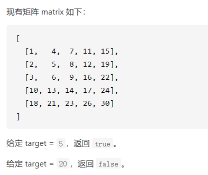

##### 方法一：暴力查找

> 挨个遍历数组的值，判断在不在数组里面就好了。

##### 方法二：右上角开始查找

> 观察这个二维数组，会发现有4个点比较特殊。
>
> - 左上角的点：右边、下面的数字都比它大。
> - 右上角的点：左边的数字比它小，下面的数字比它大。
> - 左下角的点：上面的数字比它小，右边的数字比它大。
> - 右下角的点：左边、上面的数字都比它小。
>
> 可以利用右上角点的特殊性来查找target。比target小，就向下遍历；比target大，就向左遍历。
>
> ```java
> class Solution {
>     public boolean findNumberIn2DArray(int[][] matrix, int target) {
>         
>         if (matrix==null || matrix.length==0 || matrix[0].length==0)
>             return false;
>         int row = matrix.length, col = matrix[0].length;
>         int x=0, y=col-1;
>         while (x<row && y>=0){
>             if (matrix[x][y] == target)
>                 return true;
>             else{
>                 if (matrix[x][y] < target)
>                     x++;
>                 else y--;
>             }
>         }
>         return false;
>     }
> }
> ```

#### [剑指 Offer 05. 替换空格](https://leetcode-cn.com/problems/ti-huan-kong-ge-lcof/)

> 请实现一个函数，把字符串 `s` 中的每个空格替换成"%20"。
>
> ```
> 输入：s = "We are happy."
> 输出："We%20are%20happy."
> ```

##### 方法一：String.replaceAll()

> replaceAll() 方法使用给定的参数 replacement 替换字符串所有匹配给定的正则表达式的子字符串。
>
> ```java
> public String replaceAll(String regex, String replacement)
> ```
>
> - **regex** -- 匹配此字符串的正则表达式。
> - **newChar** -- 用来替换每个匹配项的字符串。
>
> ```
> class Solution {
>     public String replaceSpace(String s) {
>         return s.replaceAll(" ", "%20");
>     }
> }
> ```

##### 方法二：拼接字符串

> 利用StringBuilder apped()方法拼接字符串的快速性
>
> ```java
> class Solution {
>     public String replaceSpace(String s) {
>         if (s==null)
>             return null;
>         StringBuilder ss = new StringBuilder();
>         for (int i=0;i<s.length();i++){
>             if (s.charAt(i) == ' ')
>                 ss.append("%20");
>             else ss.append(s.charAt(i));
>         }
>         return ss.toString();
>     }
> }
> ```

##### 补充知识：拼接字符串的方法

> - +号
> - concat()
> - append()
> - join
>
> ==StringBuilder和StringBuffer基本相似，两个类的构造器和方法也基本相同。不同的是：StringBuffer是线程安全的，而StringBuilder则没有实现线程安全功能，所以性能略高。==

#### [剑指 Offer 06. 从尾到头打印链表](https://leetcode-cn.com/problems/cong-wei-dao-tou-da-yin-lian-biao-lcof/)

> 输入一个链表的头节点，从尾到头反过来返回每个节点的值（用数组返回）。
>
> ```java
> 输入：head = [1,3,2]
> 输出：[2,3,1]
> ```

##### 方法一：哈希表

> 定义一个变量$length$，初始为0，用于记录链表的长度。遍历链表，存储length以及对应节点的$val$值。
>
> ```java
> /**
>  * Definition for singly-linked list.
>  * public class ListNode {
>  *     int val;
>  *     ListNode next;
>  *     ListNode(int x) { val = x; }
>  * }
>  */
> class Solution {
>     public int[] reversePrint(ListNode head) {
>         Map<Integer, Integer> map = new HashMap<>();
>         int length = 0; // 链表长度
>         while (head!=null){
>             map.put(length, head.val);
>             length++;
>             head = head.next;
>         }
>         if (length==0)
>             return new int[]{};
>         int[] ans = new int[length];
>         for (int i=0;i<length;i++)
>             ans[i] = map.get(length-1-i);
>         return ans;
>     }
> }
> ```

##### 方法二：栈

> 利用栈先进后出的性质，先将链表的节点值存储进栈中。这样刚好是一个逆序的顺序。
>
> ```java
> /**
>  * Definition for singly-linked list.
>  * public class ListNode {
>  *     int val;
>  *     ListNode next;
>  *     ListNode(int x) { val = x; }
>  * }
>  */
> class Solution {
>     public int[] reversePrint(ListNode head) {
>         Stack<Integer> stack = new Stack<>();
>         if (head==null)
>             return new int[]{};
>         int length = 0;
>         while (head!=null){
>             length++;
>             stack.add(head.val);
>             head = head.next;
>         }
>         int[] ans = new int[length];
>         for (int i=0;i<length;i++){
>             ans[i] = stack.peek();
>             stack.pop();
>         }
>         return ans;
>     }
> }
> ```

##### 补充知识

> `Java Stack`
>
> 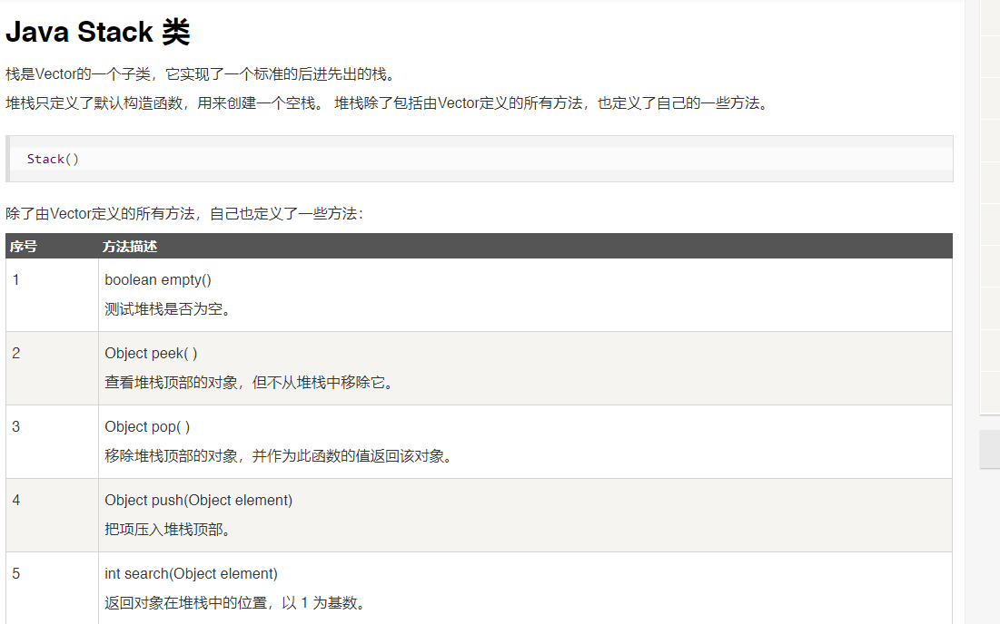
>
> [Java HaseMap](https://www.runoob.com/java/java-hashmap.html)

#### [剑指 Offer 07. 重建二叉树](https://leetcode-cn.com/problems/zhong-jian-er-cha-shu-lcof/)

> 输入某二叉树的前序遍历和中序遍历的结果，请重建该二叉树。假设输入的前序遍历和中序遍历的结果中都不含重复的数字。
>
> ```
> 前序遍历 preorder = [3,9,20,15,7]
> 中序遍历 inorder = [9,3,15,20,7]
> ```

##### 方法一：递归

> 在二叉树的前序遍历中，第一个数字总是树的根结点的值。但在中序遍历序列中，根结点的值在序列的中间，左子树的结点的值位于根结点的值的左边，而右子树的结点的值位于根结点的值的右边。因此我们需要扫描中序遍历序列，才能找到根结点的值。

```java
/**
 * Definition for a binary tree node.
 * public class TreeNode {
 *     int val;
 *     TreeNode left;
 *     TreeNode right;
 *     TreeNode(int x) { val = x; }
 * }
 */
class Solution {
    public TreeNode buildTree(int[] preorder, int[] inorder) {
        if (preorder==null || inorder==null)
            return null;
        TreeNode root = PreInBuildTree(preorder, 0, preorder.length-1, inorder, 0, inorder.length-1);
        return root;
    }

    private TreeNode PreInBuildTree(int[] preorder, int prestart, int prend, int[] inorder, int instart, int inend) {
        if (prestart > prend || instart > inend)
            return null;
        TreeNode root = new TreeNode(preorder[prestart]);
        for (int i=instart;i<=inend;i++){
            if (preorder[prestart] == inorder[i]){
                root.left = PreInBuildTree(preorder, prestart+1, prestart+i-instart, inorder, instart, i-1);
                root.right = PreInBuildTree(preorder, prestart+1+i-instart, prend, inorder, i+1, inend);
            }
        }
        return root;
    }
}
```

###### 举一反三 中序+后序

```java
public static TreeNode rebuildBinaryTree(int[] postorder, int[] inorder) {
	if (postorder == null || inorder == null) {
		return null;
	}
	TreeNode root = rebuildBinaryTreeCore(postorder, 0,
			postorder.length - 1, inorder, 0, inorder.length - 1);
	return root;
}
 
public static TreeNode rebuildBinaryTreeCore(int[] postorder,
		int startPostorder, int endPostorder, int[] inorder,
		int startInorder, int endInorder) {
 
	if (startPostorder > endPostorder || startInorder > endInorder) { // 终止递归的条件
		return null;
	}
	TreeNode root = new TreeNode(postorder[endPostorder]); //  每次迭代的根节点 后序遍历最后的一次
	for (int i = startInorder; i <= endInorder; i++) {
		if (inorder[i] == postorder[endPostorder]) {
			root.left = rebuildBinaryTreeCore(postorder, startPostorder,
					startPostorder - 1 + (i - startInorder), inorder,
					startInorder, i - 1);
			root.right = rebuildBinaryTreeCore(postorder, startPostorder
					+ (i - startInorder), endPostorder - 1, inorder, i + 1,
					endInorder);
		}
	}
	return root;
}
```

##### 方法二：迭代


#### [剑指 Offer 09. 用两个栈实现队列](https://leetcode-cn.com/problems/yong-liang-ge-zhan-shi-xian-dui-lie-lcof/)

> 用两个栈实现一个队列。队列的声明如下，请实现它的两个函数 appendTail 和 deleteHead ，分别完成在队列尾部插入整数和在队列头部删除整数的功能。(若队列中没有元素，deleteHead 操作返回 -1 )
>
> ```java
> 输入：
> ["CQueue","appendTail","deleteHead","deleteHead"]
> [[],[3],[],[]]
> 输出：[null,null,3,-1]
> ```

##### 方法：一个栈用于添加、一个用于删除

***我的想法是，插入操作的时候往stack1插入，删除操作的时候这样删除：如果stack1是空的就返回-1，否则把stack1的元素挨个出栈存到stack2中，然后返回stack2的头元素，再把stack2的元素挨个出栈，插入到stack1中。其实不需要stack2出栈存到stack1中了，因为执行只要执行删除操作的时候先删除stack2中的元素就好了。***

> 维护两个栈，第一个栈支持插入操作，第二个栈支持删除操作。
>
> 根据栈先进后出的特性，我们每次往第一个栈里插入元素后，第一个栈的底部元素是最后插入的元素，第一个栈的顶部元素是下一个待删除的元素。为了维护队列先进先出的特性，我们引入第二个栈，用第二个栈维护待删除的元素，在执行删除操作的时候我们首先看下第二个栈是否为空。如果为空，我们将第一个栈里的元素一个个弹出插入到第二个栈里，这样第二个栈里元素的顺序就是待删除的元素的顺序，要执行删除操作的时候我们直接弹出第二个栈的元素返回即可。
>
> ```java
> class CQueue {
>     Deque<Integer> stack1;
>     Deque<Integer> stack2;
>     
>     public CQueue() {
>         stack1 = new LinkedList<Integer>();
>         stack2 = new LinkedList<Integer>();
>     }
>     
>     public void appendTail(int value) {
>         stack1.push(value);
>     }
>     
>     public int deleteHead() {
>         // 如果第二个栈为空
>         if (stack2.isEmpty()) {
>             while (!stack1.isEmpty()) {
>                 stack2.push(stack1.pop());
>             }
>         } 
>         if (stack2.isEmpty()) {
>             return -1;
>         } else {
>             int deleteItem = stack2.pop();
>             return deleteItem;
>         }
>     }
> }
> ```

#### [剑指 Offer 10- I. 斐波那契数列](https://leetcode-cn.com/problems/fei-bo-na-qi-shu-lie-lcof/)

> 写一个函数，输入 `n` ，求斐波那契（Fibonacci）数列的第 `n` 项（即 `F(N)`）。斐波那契数列的定义如下：
>
> ```java
> F(0) = 0,   F(1) = 1
> F(N) = F(N - 1) + F(N - 2), 其中 N > 1.
> ```

##### 方法一：循环

> ```java
> class Solution {
>     public int fib(int n) {
>         if (n==0)
>             return 0;
>         if (n==1)
>             return 1;
>         int[] num = new int[n+1];
>         for (int i=0;i<=n;i++){
>             if (i==0)
>                 num[i] = 0;
>             if (i==1)
>                 num[i] = 1;
>             if (i>=2)
>                 num[i] = (num[i-1] + num[i-2]) % (1000000007);
>         }
>         return num[n];
>     }
> }
> ```

##### 优化

> 用两个遍历来迭代这个过程
>
> ```java
> class Solution {
>     public int fib(int n) {
>         if (n==0)
>             return 0;
>         if (n==1)
>             return 1;
>         int a = 0, b=1, sum;
>         for (int i=2;i<=n;i++){
>             sum =  ((a + b) % (1000000007));
>             a = b;
>             b = sum;
>         }
>         return b;
>     }
> }
> ```

#### [剑指 Offer 10- II. 青蛙跳台阶问题](https://leetcode-cn.com/problems/qing-wa-tiao-tai-jie-wen-ti-lcof/)

> 一只青蛙一次可以跳上1级台阶，也可以跳上2级台阶。求该青蛙跳上一个 n 级的台阶总共有多少种跳法。
>
> 答案需要取模 1e9+7（1000000007），如计算初始结果为：1000000008，请返回 1。

##### 方法一：动态规划

> 设跳上 $n$ 级台阶有 $f(n)$ 种跳法。在所有跳法中，青蛙的最后一步只有两种情况： 跳上 $1 $级或$2 $级台阶。
> $$
> 当为 1 级台阶： 剩 n−1 个台阶，此情况共有f(n−1) 种跳法；\\
> 当为 2 级台阶： 剩 n-2个台阶，此情况共有 f(n-2) 种跳法。
> $$
>
> ```java
> class Solution {
>     public int numWays(int n) {
>         if(n==0 || n==1)
>             return 1;
>         int dp[] = new int[n+1];
>         dp[0] = 1;
>         dp[1] = 1;
>         for (int i=2;i<=n;i++)
>             dp[i] = (dp[i-1] + dp[i-2]) % (1000000007);
>         return dp[n];
>     }
> }
> ```

##### 优化

> ```java
> class Solution {
>     public int numWays(int n) {
>         if(n==0 || n==1)
>             return 1;
>         int a=1, b=1, sum;
>         for (int i=2;i<=n;i++){
>             sum = (a + b) % (1000000007);
>            a = b;
>            b = sum;
>         }
>         return b;
>     }
> }
> ```

#### [剑指 Offer 11. 旋转数组的最小数字](https://leetcode-cn.com/problems/xuan-zhuan-shu-zu-de-zui-xiao-shu-zi-lcof/)

> 把一个数组最开始的若干个元素搬到数组的末尾，我们称之为数组的旋转。输入一个递增排序的数组的一个旋转，输出旋转数组的最小元素。例如，数组$ [3,4,5,1,2] $为 $[1,2,3,4,5] $的一个旋转，该数组的最小值为$1$。  
>

##### 方法一：顺序遍历

> 按照顺序遍历数组，如数组发生过旋转，那么肯定会出现遍历数组值的时候出现突然减少的情况。这个就是最小值。如果没用发生过旋转，那么数组一个值变为最小值。
>
> ```java
>     public static int minArray(int[] numbers) {
>         if (numbers==null || numbers.length==0)
>             return 0;
>         boolean flag = false;
>         for (int i=0;i<numbers.length-1;i++){
>             if (numbers[i+1] < numbers[i])
>                 flag = true;
>             if (flag)
>                 return numbers[i+1];
>         }
>         return numbers[0];
>     }
> ```

##### 方法二：折半查找

> 一个包含重复元素的升序数组在经过旋转之后，可以得到下面可视化的折线图：
>
> 
>
> 我们考虑**数组中的最后一个元素$ x$：在最小值右侧的元素，它们的值一定都小于等于$ x$；而在最小值左侧的元素，它们的值一定都大于等于 $x$**。因此，我们可以根据这一条性质，通过二分查找的方法找出最小值。
>
> 在二分查找的每一步中，左边界为$ \it low$，右边界为 $\it high$，区间的中点为 $\it pivot$，最小值就在该区间内。我们将中轴元素 $numbers[pivot] $与右边界元素$ \textit{numbers}[\textit{high}]$ 进行比较，可能会有以下的三种情况：
>
> > 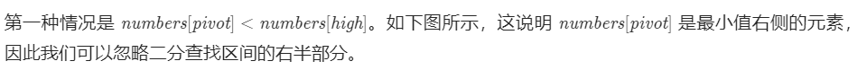
> >
> > 
>
> > 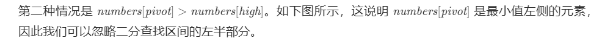
> >
> > 
>
> > 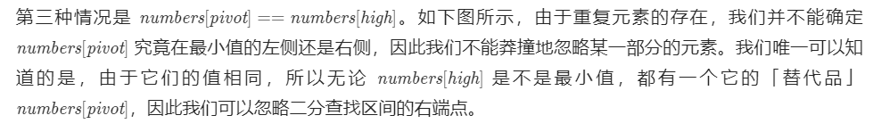
> >
> > 
>
> ```java
> class Solution {
>     public int minArray(int[] numbers) {
>         if (numbers==null || numbers.length==0)
>             return 0;
>         int low=0, high=numbers.length-1;
>         while (low<high){
>             int mid = low + (high - low) / 2;
>             if (numbers[mid] < numbers[high])
>                 high = mid;
>             else if (numbers[mid] > numbers[high])
>                 low = mid + 1;
>             else high--;
>         }
>         return numbers[low];
>     }
> }
> ```

#### [剑指 Offer 12. 矩阵中的路径](https://leetcode-cn.com/problems/ju-zhen-zhong-de-lu-jing-lcof/)

> 请设计一个函数，用来判断在一个矩阵中是否存在一条包含某字符串所有字符的路径。路径可以从矩阵中的任意一格开始，每一步可以在矩阵中向左、右、上、下移动一格。如果一条路径经过了矩阵的某一格，那么该路径不能再次进入该格子。例如，在下面的$3×4$的矩阵中包含一条字符串$“bfce”$的路径（路径中的字母用加粗标出）。
>
> ```
> [["a","b","c","e"],
> ["s","f","c","s"],
> ["a","d","e","e"]]
> ```
>
> 但矩阵中不包含字符串$“abfb”$的路径，因为字符串的第一个字符b占据了矩阵中的第一行第二个格子之后，路径不能再次进入这个格子。

##### 方法：深度优先遍历

> 暴力法遍历矩阵中所有字符串可能性。DFS 通过递归，先朝一个方向搜到底，再回溯至上个节点，沿另一个方向搜索，以此类推。
>
> > '剪枝'
> >
> > 当前遍历位置超出数组边界或者当前位置已被遍历或者数组当前位置与字符串字符不匹配。
>
> ```java
> public class Offer12 {
>     public boolean exist(char[][] board, String word) {
>         if (board==null || word.length()==0)
>             return false;
>         boolean flag = false;
>         int length1 = board.length;
>         int length2 = board[0].length;
>         int[][] visited = new int[length1][length2];
>         for (int i=0;i<length1;i++){
>             for (int j=0;j<length2;j++){
>                 if (board[i][j] == word.charAt(0)){
>                     flag = DFS(board, word, 0, i, j, visited);
>                 }
>                 if (flag)
>                     return true;
>             }
>         }
>         return flag;
>     }
> 
>     private boolean DFS(char[][] board, String word, int len, int x, int y, int[][] visited) {
> 
>         if (len == word.length()-1)
>             return true;
> 
>         if (x<0 || x>=board.length || y<0 ||y>=board[0].length || board[x][y]!=word.charAt(len) || visited[x][y]==1)
>             return false;
> 
>         visited[x][y] = 1;
>         if (DFS(board, word, len+1, x-1, y, visited) || DFS(board, word, len+1, x+1, y, visited)
>         || DFS(board, word, len+1, x, y-1, visited) || DFS(board, word, len+1, x, y+1, visited))
>             return true;
>         visited[x][y] = 0;
>         return false;
>     }
> }
> ```

#### [剑指 Offer 13. 机器人的运动范围](https://leetcode-cn.com/problems/ji-qi-ren-de-yun-dong-fan-wei-lcof/)

> 地上有一个$m$行$n$列的方格，从坐标 $[0,0] $到坐标$ [m-1,n-1] $。一个机器人从坐标$ [0, 0]$ 的格子开始移动，它每次可以向左、右、上、下移动一格（不能移动到方格外），也不能进入行坐标和列坐标的数位之和大于k的格子。例如，当$k$为1$8$时，机器人能够进入方格$ [35, 37] $，因为$3+5+3+7=18$。但它不能进入方格$ [35, 38]，因为3+5+3+8=19$。请问该机器人能够到达多少个格子？
>

##### 方法一：深度优先遍历

> 思路：沿着一个方向遍历，知道不能前进位置。然后返回到上一个位置，重复该过程。
>
> ```java
> class Solution {
>     int count = 0;
>     public int movingCount(int m, int n, int k) {
>         if (m<0 || n<0 || k<0)
>             return 0;
>         int[][] visited = new int[m][n];
>         JudgeMove(0, 0, m, n, k, visited);
>         return count;
>     }
> 
>     private void JudgeMove(int i, int j, int m, int n, int k, int[][] visited) {
>         if (i<0 || i>=m || j<0 || j>=n || getNum(i, j)>k || visited[i][j]==1)
>             return;
> 
>         visited[i][j] = 1;
>         count++;
>         JudgeMove(i-1, j, m, n, k, visited);
>         JudgeMove(i+1, j, m, n, k, visited);
>         JudgeMove(i, j-1, m, n, k, visited);
>         JudgeMove(i, j+1, m, n, k, visited);
> 
>         return;
>     }
>     public int getNum(int r,int c){
>         int sum=0;
>         while(r>=1){
>             sum+=r%10;
>             r=r/10;
>         }
>         while(c>=1){
>             sum+=c%10;
>             c=c/10;
>         }
>         return sum;
>     }
> }
> ```

##### 方法二：广度优先遍历

> 从$[0,0]$位置开始，向右向下两个方向广度遍历。利用队列先进先出的性质，遍历可能的位置。
>
> ```java
> class Solution {
>     public int movingCount(int m, int n, int k) {
>         if (m<0 || n<0 || k<0)
>             return 0;
>         int count = 0;
> 
>         int[][] visited = new int[m][n];
>         Queue<Integer> q = new LinkedList<>();
>         if (0<=k)
>             q.offer(0);
>         while (!q.isEmpty()){
>             int res = q.peek();
>             q.poll();
>             int x = res / n;
>             int y = res % n;
>             if (x>=0 && x<m && y>=0 && y<n && visited[x][y]==0 && GetNum(x, y)<=k){
>                 count++;
>                 visited[x][y] = 1;
>                 q.offer((x+1) * n + y);
>                 q.offer(x * n + y + 1);
>             }
>         }
>         return count;
>     }
> 
>     private int GetNum(int x, int y) {
>         return (x % 10 + x / 10 + y % 10 + y / 10);
>     }
> }
> ```

#### [剑指 Offer 14- I. 剪绳子](https://leetcode-cn.com/problems/jian-sheng-zi-lcof/)

> 给你一根长度为$ n$ 的绳子，请把绳子剪成整数长度的 $m$ 段（$m、n$都是整数，$n>1$并且$m>1$），每段绳子的长度记为 $k[0],k[1]...k[m-1] $。请问 $k[0]*k[1]*...*k[m-1] $可能的最大乘积是多少？例如，当绳子的长度是8时，我们把它剪成长度分别为$2、3、3$的三段，此时得到的最大乘积是18。
>
> ```java
> 输入: 2
> 输出: 1
> 解释: 2 = 1 + 1, 1 × 1 = 1
> 
> 输入: 10
> 输出: 36
> 解释: 10 = 3 + 3 + 4, 3 × 3 × 4 = 36
> ```

##### 方法一：动态规划

> 1. 用一个`dp数组`记录`从0到n`长度的绳子剪掉后的最大乘积，也就是`dp[i]`表示长度为`i`的绳子剪成`m`段后的最大乘积，初始化`dp[2] = 1`
> 2. 我们先把绳子剪掉第一段(`j`表示)。若`j=1`，没有意义，因为这样做乘积不会变大。所以`j`的最小值为`2`。
> 3. 剪掉第一段以后，剩下的绳子可以不剪，此时长度为$j\times (i-j)$。也可以把剩下的$i-j$长度的绳子剪，$i-j$绳子剪的话，最大乘积是$dp[i-j]$。取两者最大值即可：$Max(j\times(i-j), j\times(dp[i-j]))$。
> 4. 第一段长度$j$可以取的区间为$[2,i/2]$，对所有$j$不同的情况取最大值，因此最终$dp[i]$的转移方程为
>    $dp[i] = max(dp[i], max(j * (i - j), j * dp[i - j]))$。
> 5. 返回$dp[n]$。
>
> > ```java
> > class Solution {
> >     public int cuttingRope(int n) {
> >         if (n <=0 )
> >             return 0;
> >         if (n==2)
> >             return 1;
> >         
> >         int[] dp = new int[n+1];
> >         dp[2] = 1;
> >         dp[3] = 2;
> >         for (int i=4;i<=n;i++){
> >             for (int j=2;j<=(i/2);j++){
> >                 dp[i] = Math.max(dp[i], Math.max(j*(i-j), j*dp[i-j]));
> >             }
> >         }
> >         return dp[n];
> >     }
> > }
> > ```

##### 方法二：贪心算法+数学证明

> 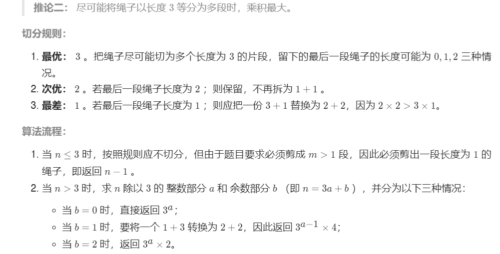
>
> > ```java
> > class Solution {
> >     public int cuttingRope(int n) {
> >         int res = 1;
> >         if (n<4)
> >             return n-1;
> >         while (n>=3){
> >             res*=3;
> >             n-=3;
> >         }
> >         if (n==2)
> >             res = res * 2;
> >         if (n==1)
> >             res = res / 3 * 2 * 2;
> >         return res;
> >         /*
> >         while(n > 4){
> >             res *= 3;
> >             n -= 3;
> >         }
> >         return res * n;
> >         */
> >     }
> > }
> > ```

#### [剑指 Offer 15. 二进制中1的个数](https://leetcode-cn.com/problems/er-jin-zhi-zhong-1de-ge-shu-lcof/)

> 请实现一个函数，输入一个整数（以二进制串形式），输出该数二进制表示中 1 的个数。例如，把 9 表示成二进制是 1001，有 2 位是 1。因此，如果输入 9，则该函数输出 2。
>
> ```java
> 输入：00000000000000000000000000001011
> 输出：3
> 解释：输入的二进制串 00000000000000000000000000001011 中，共有三位为 '1'。
> ```

##### 方法一：十进制转二进制

> 先将输入的十进制数字转为二进制，然后数其中1的个数
>
> > ```java
> > public class Solution {
> >     // you need to treat n as an unsigned value
> >     public int hammingWeight(int n) {
> >         String s = Integer.toBinaryString(n);
> >         int count = 0;
> >         for (int i=0;i<s.length();i++){
> >             if (s.charAt(i) == '1')
> >                 count++;
> >         }
> >         return count;
> >     }
> > }
> > ```

##### 方法二：巧用 *n*&(*n*−1)

> 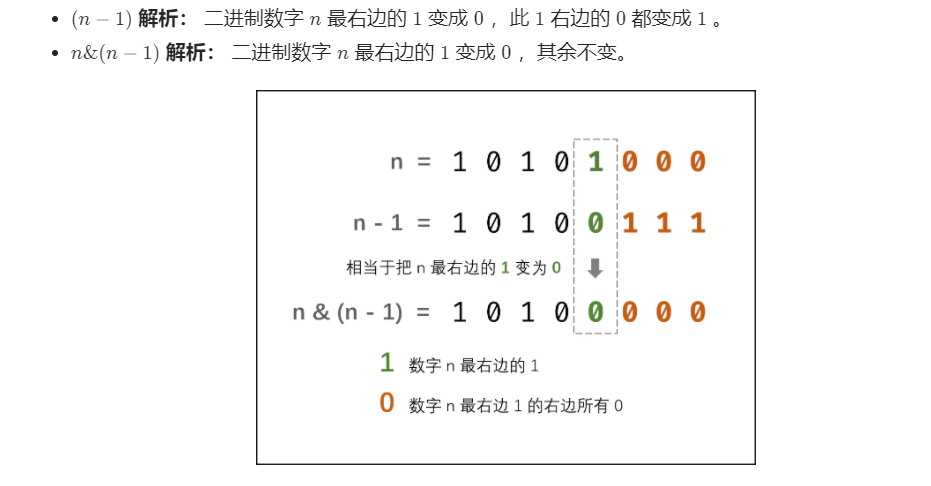
>
> 1. 初始化数量统计变量 res。
> 2. 循环消去最右边的 11 ：当 n = 0 时跳出。
>    - res += 1 ： 统计变量加 1 ；
>    - n &= n - 1 ： 消去数字 n 最右边的 1 。
> 3. 返回统计数量 res 。
>
> > ```java
> > public class Solution {
> >     // you need to treat n as an unsigned value
> >     public int hammingWeight(int n) {
> >         int count = 0;
> >         while (n!=0){
> >             count++;
> >             n = n & (n-1);
> >         }
> >         return count;
> >     }
> > }
> > ```

#### [剑指 Offer 16. 数值的整数次方](https://leetcode-cn.com/problems/shu-zhi-de-zheng-shu-ci-fang-lcof/)

> 实现 [pow(*x*, *n*)](https://www.cplusplus.com/reference/valarray/pow/) ，即计算 x 的 n 次幂函数（即，$x^n$）。不得使用库函数，同时不需要考虑大数问题。

##### 方法：快速幂

> 一开始就简单的判断幂是整数还是复数，然后用循环的方式做来着。但是超时

`幂运算`

> 每一步都把指数分成两半，而相应的底数做平方运算。这样不仅能把非常大的指数给不断变小，所需要执行的循环次数也变小，而最后表示的结果却一直不会变。
>
> 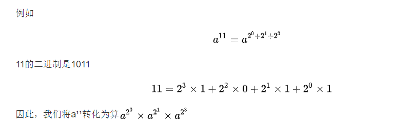

> 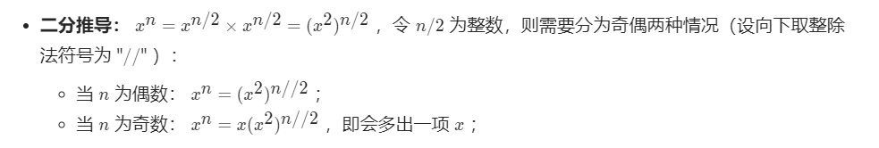
>
> 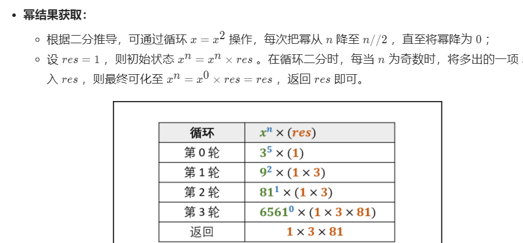
>
> 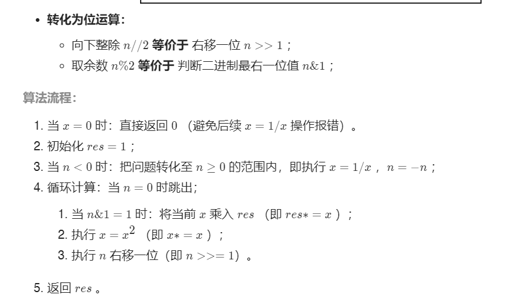
>
> ```java
> class Solution {
>     public double myPow(double x, int n) {
>         if (n == 0)
>             return 1.0;
>         long c = n;
>         double res = 1.0;
>         if (n<0){
>             x = 1 / x;
>             c = -c;
>         }
>         while (c>0){
>             if ((c&1)==1)
>                 res = res * x;
>             x = x * x;
>             c>>=1;
>         }
>         return res;
>     }
> }
> ```

#### [剑指 Offer 17. 打印从1到最大的n位数](https://leetcode-cn.com/problems/da-yin-cong-1dao-zui-da-de-nwei-shu-lcof/)

> 输入数字 `n`，按顺序打印出从 1 到最大的 n 位十进制数。比如输入 3，则打印出 1、2、3 一直到最大的 3 位数 999。

##### 方法一：顺序输出（不推荐、未考虑大数）

> 假设输入的是$n$，那么我们只要定义一个数组，从$1$存储到$10^n-1$就好了。
>
> > ```java
> > public int[] printNumbers(int n) {
> >     if (n<=0)
> >         return new int[]{};
> >     double length = (Math.pow(10, n) - 1);
> >     int[] num = new int[(int) length];
> >     for (int i=0;i<length;i++)
> >         num[i] = i+1;
> >     return num;
> > ```

##### 方法二：大数打印解法

###### 返回字符串

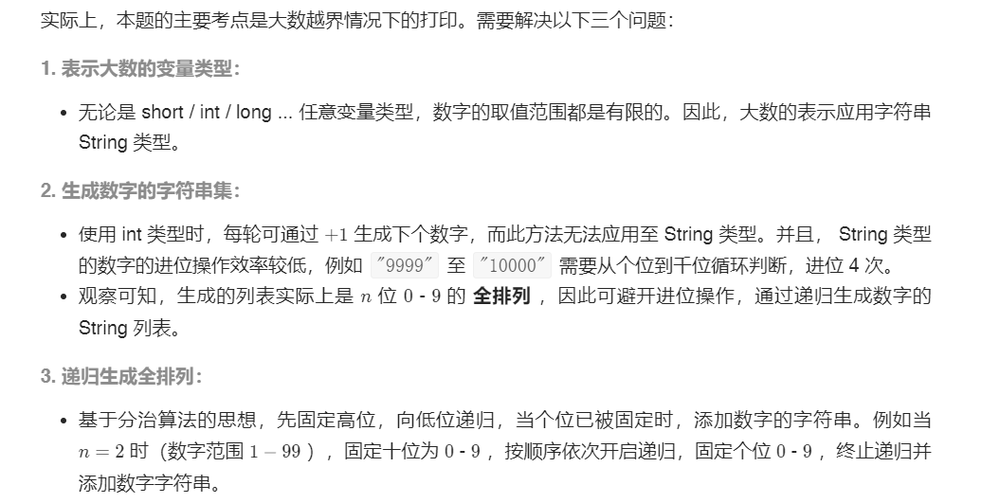

> 注意的是，最高位的数字是不能从$0$开始遍历的。
>
> > ```java
> > char[] num, loop = {'0', '1', '2', '3', '4', '5', '6', '7', '8', '9'};
> >     StringBuffer buffer = new StringBuffer();
> > 
> >     public String printNumbers(int n){
> >         num = new char[n];
> >         for (int i=1;i<=n;i++){
> >             DFS(0, i);
> >         }
> >         String s =  buffer.deleteCharAt(buffer.length()-1).toString();
> >         return s;
> >     }
> > 
> >     private void DFS(int index, int len) {
> >         if (index == len){
> >             buffer.append(new String(num)+ ",");
> >             return;
> >         }
> >         int start;
> >         if (index==0)
> >             start=1;
> >         else start = 0;
> > 
> >         for (int i=start;i<10;i++){
> >             num[index] = loop[i];
> >             DFS(index+1, len);
> >         }
> >     }
> > ```

###### 返回数组

> ```java
> public class Solution {
>     char[] num, loop = {'0', '1', '2', '3', '4', '5', '6', '7', '8', '9'};
>     int[] res;
>     int count;
> 
>     public int[] printNumbers(int n){
>         res = new int[(int)(Math.pow(10, n)-1)];
>         num = new char[n];
>         for (int i=1;i<=n;i++)
>             dfs(0, i);
> 
>         return res;
>     }
> 
>     private void dfs(int index, int len) {
>         if (index==len){
>             String s = new String(num);
>             res[count++] = Integer.parseInt(s.trim()); // trim() 方法用于删除字符串的头尾空白符。
>             return;
>         }
>         int start;
>         if (index==0)          
>         //若从0作为起点：if(index == 0 && len>1)
>         //若从1作为起点
>             start=1;
>         else start=0;
>         for (int i=start;i<10;i++){
>             num[index] = loop[i];
>             dfs(index+1, len);
>         }
>     }
> }
> ```

#### [剑指 Offer 18. 删除链表的节点](https://leetcode-cn.com/problems/shan-chu-lian-biao-de-jie-dian-lcof/)

> 给定单向链表的头指针和一个要删除的节点的值，定义一个函数删除该节点。
>
> 返回删除后的链表的头节点。
>
> ```java
> 输入: head = [4,5,1,9], val = 5
> 输出: [4,1,9]
> 解释: 给定你链表中值为 5 的第二个节点，那么在调用了你的函数之后，该链表应变为 4 -> 1 -> 9.
> ```

##### 方法：指针遍历

> 从头指针开始遍历，若当前指针$curr$的下一节点为要删除的节点，则$curr.next=curr.next.next$。
>
> ==注意：==
>
> > 删除$curr.next$以后，可能有三种情况：
> >
> > 1. 下一个节点可能还需要删除；
> > 2. 下一个节点不需要删除；
> > 3. 下一个节点为空；
> >
> > 所以需要判断是情况1、还是情况2、3；如果是情况1，则继续删除；如果是情况2、3，则$curr=curr.next$。
>
> 特殊情况：头节点是要删除的节点
>
> $hean=head.next$一直到头节点不是要删除的节点。
>
> ```java
> class Solution {
>     public ListNode deleteNode(ListNode head, int val) {
>         if (head==null)
>             return null;
>         while (head.val == val)
>             head = head.next;
>         ListNode curr = head;
>         while (curr!=null && curr.next!=null){
>             if (curr.next.val==val)
>                 curr.next = curr.next.next;
>             if (curr.next==null || curr.next.val != val)
>                 curr = curr.next;
>         }
>         return head;
>     }
> }
> ```

#### [剑指 Offer 19. 正则表达式匹配](https://leetcode-cn.com/problems/zheng-ze-biao-da-shi-pi-pei-lcof/)

> 请实现一个函数用来匹配包含'. '和'*'的正则表达式。模式中的字符'.'表示任意一个字符，而'*'表示它前面的字符可以出现任意次（含0次）。在本题中，匹配是指字符串的所有字符匹配整个模式。例如，字符串"aaa"与模式"a.a"和"ab\*ac\*a"匹配，但与"aa.a"和"ab*a"均不匹配。

##### 方法：动态规划

> 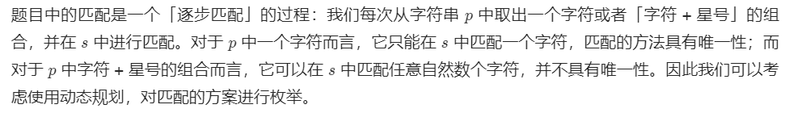
>
> 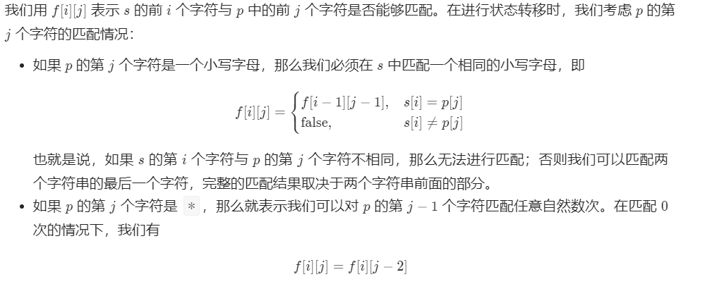
>
> 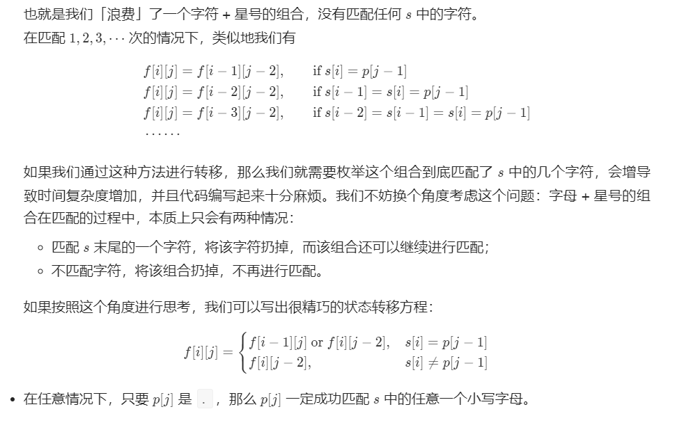
>
> 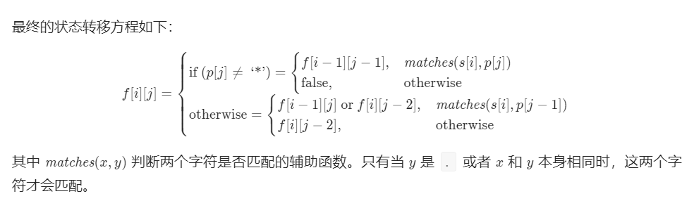
>
> ```java
> class Solution {
>  public boolean isMatch(String s, String p) {
>      int m = s.length();
>      int n = p.length();
>      boolean f[][] = new boolean[m + 1][n + 1];
>      f[0][0] = true;//f[0][0]代表s和p均为空字符串，f[1][1]代表s和p的第一个字符（即在s和p中下标为0的字符）
>      for(int i = 0; i <= m ; ++i) {
>          for(int j = 1; j <= n; ++j) {
>              if(p.charAt(j - 1) == '*') {//p的第j个字符为*
>                  if(matches(s, p, i, j - 1)) {//匹配s的第i个字符和p的第j-1个字符
>                      f[i][j] = f[i - 1][j] || f[i][j - 2];//p中*前面的字符在s中出现多次或者在s中只出现1次
>                  }
>                  else {
>                      f[i][j] = f[i][j - 2];//p中*前面的在s中字符出现0次
>                  }
>              }
>              else {//p的第j个字符不为*
>                 if(matches(s, p, i, j)) {//匹配s的第i个字符和p的第j个字符
>                     f[i][j] = f[i - 1][j - 1];//匹配成功，状态转移；匹配不成功，默认是false
>                 } 
>              }
>          }
>      }
>      return f[m][n];
>  }
> 
>  private boolean matches(String s, String p, int i, int j) {//注意在字符串中的下标变换
>      if(i == 0) {
>          return false;
>      }
>      if(p.charAt(j - 1) == '.') {
>          return true;
>      }
>      return s.charAt(i - 1) == p.charAt(j - 1);
>  }
> }
> ```

#### [剑指 Offer 20. 表示数值的字符串](https://leetcode-cn.com/problems/biao-shi-shu-zhi-de-zi-fu-chuan-lcof/)

> 请实现一个函数用来判断字符串是否表示数值（包括整数和小数）。例如，字符串"+100"、"5e2"、"-123"、"3.1416"、"-1E-16"、"0123"都表示数值，但"12e"、"1a3.14"、"1.2.3"、"+-5"及"12e+5.4"都不是。

##### 方法一：考虑所有情况

> 以下情况都不符合数值的要求：
>
> - `.`之前出现`.`，或者`e/E`。
> - `e/E`出现在字符串的第一个位置或者最后一个位置。
> - `+/-`没有出现在字符串第一个位置，也没有紧挨在`e/E`之后出现；
> - 其他情况，例如出现`a`等字符串
>
> > ```java
> > class Solution {
> >     public boolean isNumber(String s) {
> >         if (s.length()==0 || s==null)
> >             return false;
> >         boolean is_Num=false, is_Dot = false,is_Ee=false;
> >         s = s.trim();
> >         for (int i=0;i<s.length();i++){
> >             if (s.charAt(i)>='0' && s.charAt(i)<='9')
> >                 is_Num=true;
> >             else if (s.charAt(i)=='.'){ //.之前不能有., 也不能有e/E
> >                 if (is_Dot || is_Ee)
> >                     return false;
> >                 is_Dot=true;
> >             }
> >             else if (s.charAt(i)=='e' || s.charAt(i)=='E'){//e或者之前不能没有数字，也不能同时出现两个e或E
> >                 if (!is_Num || is_Ee)
> >                     return false;
> >                 is_Ee = true;
> >                 is_Num = false;
> >             }
> >             else if (s.charAt(i)=='+' || s.charAt(i)=='-'){//+-只能出现在第一个位置或者e/E的后面
> >                 if (i!=0 && s.charAt(i-1)!='e' && s.charAt(i-1)!='E')
> >                     return false;
> >             }
> >             else return false;
> >         }
> >         return is_Num;
> >     }
> > }
> > ```

##### 方法二：有限状态自动机

> **字符类型**：空格 「 」、数字「 0—9 」 、正负号 「 +− 」 、小数点 「 . 」 、幂符号 「 eE 」 。
>
> **状态定义：**
>
> 按照字符串从左到右的顺序，定义以下 9 种状态。
>
> 1. 开始的空格
> 2. 幂符号前的正负号
> 3. 小数点前的数字
> 4. 小数点、小数点后的数字
> 5. 当小数点前为空格时，小数点、小数点后的数字
> 6. 幂符号
> 7. 幂符号后的正负号
> 8. 幂符号后的数字
> 9. 结尾的空格
>
> **结束状态：**
>
> 合法的结束状态有 2, 3, 7, 8 。
>
> **算法流程：**
>
> 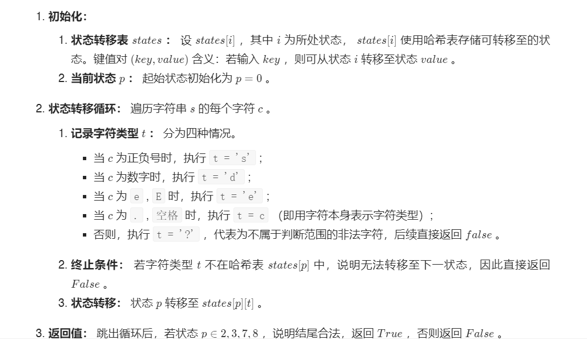
>
> > ```java
> > class Solution {
> >     public boolean isNumber(String s) {
> >         Map[] states = {
> >             new HashMap<>() {{ put(' ', 0); put('s', 1); put('d', 2); put('.', 4); }}, // 0.
> >             new HashMap<>() {{ put('d', 2); put('.', 4); }},                           // 1.
> >             new HashMap<>() {{ put('d', 2); put('.', 3); put('e', 5); put(' ', 8); }}, // 2.
> >             new HashMap<>() {{ put('d', 3); put('e', 5); put(' ', 8); }},              // 3.
> >             new HashMap<>() {{ put('d', 3); }},                                        // 4.
> >             new HashMap<>() {{ put('s', 6); put('d', 7); }},                           // 5.
> >             new HashMap<>() {{ put('d', 7); }},                                        // 6.
> >             new HashMap<>() {{ put('d', 7); put(' ', 8); }},                           // 7.
> >             new HashMap<>() {{ put(' ', 8); }}                                         // 8.
> >         };
> >         int p = 0;
> >         char t;
> >         for(char c : s.toCharArray()) {
> >             if(c >= '0' && c <= '9') t = 'd';
> >             else if(c == '+' || c == '-') t = 's';
> >             else if(c == 'e' || c == 'E') t = 'e';
> >             else if(c == '.' || c == ' ') t = c;
> >             else t = '?';
> >             if(!states[p].containsKey(t)) return false;
> >             p = (int)states[p].get(t);
> >         }
> >         return p == 2 || p == 3 || p == 7 || p == 8;
> >     }
> > }
> > ```

#### [剑指 Offer 21. 调整数组顺序使奇数位于偶数前面](https://leetcode-cn.com/problems/diao-zheng-shu-zu-shun-xu-shi-qi-shu-wei-yu-ou-shu-qian-mian-lcof/)

> 输入一个整数数组，实现一个函数来调整该数组中数字的顺序，使得所有奇数位于数组的前半部分，所有偶数位于数组的后半部分
>
> ```java
> 输入：nums = [1,2,3,4]
> 输出：[1,3,2,4] 
> 注：[3,1,2,4] 也是正确的答案之一。
> ```

##### 方法：双指针

> 定义一个头指针，从$0$开始向后遍历，一个尾指针从$length-1$开始向前遍历。若头指针找到偶数，尾指针找到奇数，交换。
>
> ```java
> class Solution {
>     public int[] exchange(int[] nums) {
>         if (nums.length<=1)
>             return nums;
>         int begin=0, end=nums.length-1;
>         while (begin<end){
>             while (begin<end && nums[begin]%2==1)
>                 begin++;
>             while (begin<end && nums[end]%2==0)
>                 end--;
>             int temp = nums[end];
>             nums[end] = nums[begin];
>             nums[begin] = temp;
>         }
>         return nums;
>     }
> }
> ```

#### [剑指 Offer 22. 链表中倒数第k个节点](https://leetcode-cn.com/problems/lian-biao-zhong-dao-shu-di-kge-jie-dian-lcof/)

> 输入一个链表，输出该链表中倒数第k个节点。为了符合大多数人的习惯，本题从1开始计数，即链表的尾节点是倒数第1个节点。
>
> 例如，一个链表有 6 个节点，从头节点开始，它们的值依次是 1、2、3、4、5、6。这个链表的倒数第 3 个节点是值为 4 的节点。
>

##### 方法：双指针

> 定义一个快指针`fast`和一个慢指针`slow`，先让`fast`走$k-1$步，然后`fast`、`slow`同时向后移动。当`fast`指向最后一个节点的时候，`slow`刚好指向最后第$k$个节点。
>
> > ```java
> > class Solution {
> >     public ListNode getKthFromEnd(ListNode head, int k) {
> >         if (k==0)
> >             return null;
> >         ListNode fast = head, slow=head;
> >         for (int i=0;i<k-1 && fast!=null;i++)
> >             fast = fast.next;
> >         if (fast == null)
> >             return head;
> >         while (fast.next!=null){
> >             fast = fast.next;
> >             slow = slow.next;
> >         }
> >         return slow;
> >     }
> > }
> > ```

#### [剑指 Offer 24. 反转链表](https://leetcode-cn.com/problems/fan-zhuan-lian-biao-lcof/)

> 定义一个函数，输入一个链表的头节点，反转该链表并输出反转后链表的头节点。
> $$
> 输入: 1->2->3->4->5->NULL\\
> 输出: 5->4->3->2->1->NULL
> $$
> 

##### 方法一：循环

> 这个我差不多已经记住代码了
>
> > ```java
> > /**
> >  * Definition for singly-linked list.
> >  * public class ListNode {
> >  *     int val;
> >  *     ListNode next;
> >  *     ListNode(int x) { val = x; }
> >  * }
> >  */
> > class Solution {
> >     public ListNode reverseList(ListNode head) {
> >         if (head==null)
> >             return null;
> >         ListNode prev = null;
> >         while (head!=null){
> >             ListNode next = head.next;
> >             head.next = prev;
> >             prev = head;
> >             head = next;
> >         }
> >         return prev;
> >     }
> > }
> > ```

##### 方法二：递归

> 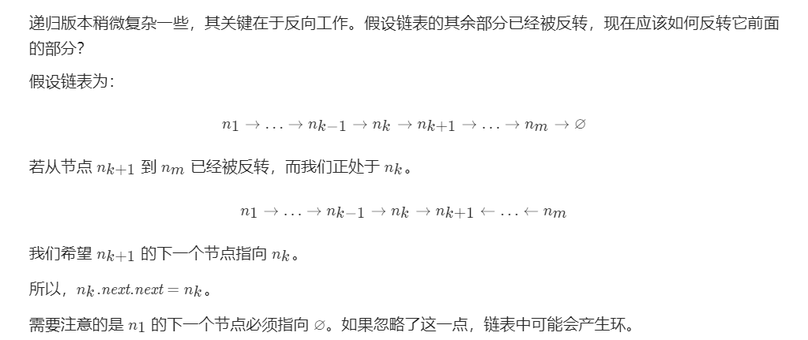
>
> ```java
> class Solution {
>     public ListNode reverseList(ListNode head) {
>         if (head == null || head.next == null) {
>             return head;
>         }
>         ListNode newHead = reverseList(head.next);
>         head.next.next = head;
>         head.next = null;
>         return newHead;
>     }
> }
> ```

#### [剑指 Offer 25. 合并两个排序的链表](https://leetcode-cn.com/problems/he-bing-liang-ge-pai-xu-de-lian-biao-lcof/)

> 输入两个递增排序的链表，合并这两个链表并使新链表中的节点仍然是递增排序的。

##### 方法：跟合并排序数组差不多

> 感觉思路跟合并两个有序数组差不多
>
> > ```java
> > /**
> >  * Definition for singly-linked list.
> >  * public class ListNode {
> >  *     int val;
> >  *     ListNode next;
> >  *     ListNode(int x) { val = x; }
> >  * }
> >  */
> > class Solution {
> >     public ListNode mergeTwoLists(ListNode l1, ListNode l2) {
> >         ListNode dummyHead = new ListNode(-1);
> >         ListNode curNode = dummyHead;
> >         while(l1 != null && l2 != null) {
> >             if(l1.val < l2.val) {
> >                 curNode.next = l1;
> >                 curNode = curNode.next;
> >                 l1 = l1.next;
> >             }else {
> >                 curNode.next = l2;
> >                 curNode = curNode.next;
> >                 l2 = l2.next;
> >             }
> >         }
> >         if(l1 != null) {
> >             curNode.next = l1;
> >         }
> >         if(l2 != null) {
> >             curNode.next = l2;
> >         }
> >         return dummyHead.next;
> >     }
> > }
> > ```

#### [剑指 Offer 26. 树的子结构](https://leetcode-cn.com/problems/shu-de-zi-jie-gou-lcof/)

> 输入两棵二叉树A和B，判断B是不是A的子结构。(约定空树不是任意一个树的子结构)
>
> B是A的子结构， 即 A中有出现和B相同的结构和节点值。

##### 方法：递归+先序遍历

> 若树$B$是树 $A $的子结构，则子结构的根节点可能为树 $A$ 的任意一个节点。因此，判断树$ B $是否是树$ A $的子结构，需完成以下两步工作：
>
> 1. 先序遍历树 $A$ 中的每个节点 $n_A$；（对应函数 `isSubStructure(A, B)`）
> 2. 判断树 $A$ 中 以 $n_A$为根节点的子树 是否包含树 $B$ 。（对应函数 `recur(A, B)`）
>
> 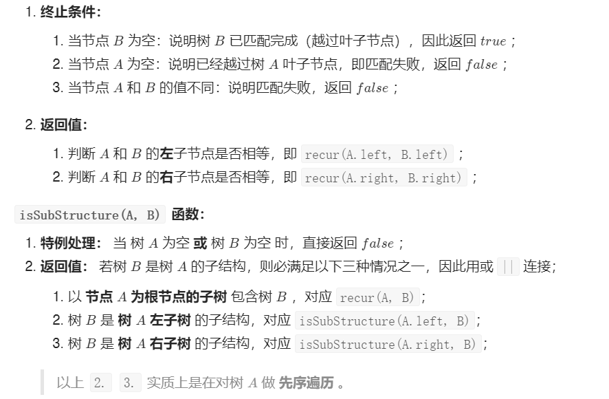
>
> > ```java
> >     public boolean isSubStructure(TreeNode A, TreeNode B) {
> >         if (A==null || B==null)
> >             return false;
> > 
> >         return recurr(A, B) || isSubStructure(A.left, B) || isSubStructure(A.right, B);
> >     }
> > 
> >     private boolean recurr(TreeNode A, TreeNode B) {
> >         if (B==null)
> >             return false;
> >         if (A==null || A.val!=B.val)
> >             return false;
> >         return recurr(A.left, B.left) && recurr(A.right, B.right);
> >     }
> > ```

#### [剑指 Offer 27. 二叉树的镜像](https://leetcode-cn.com/problems/er-cha-shu-de-jing-xiang-lcof/)

> 请完成一个函数，输入一个二叉树，该函数输出它的镜像
>
> 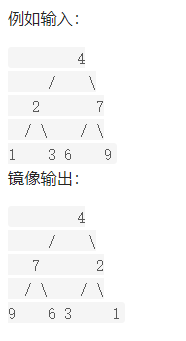

##### 方法一：递归

> 根据二叉树镜像的定义，考虑递归遍历（dfs）二叉树，交换每个节点的左 / 右子节点，即可生成二叉树的镜像。
>
> ```java
> /**
>  * Definition for a binary tree node.
>  * public class TreeNode {
>  *     int val;
>  *     TreeNode left;
>  *     TreeNode right;
>  *     TreeNode(int x) { val = x; }
>  * }
>  */
> class Solution {
>     public TreeNode mirrorTree(TreeNode root) {
>         if (root==null)
>             return null;
>         TreeNode temp = root.left;
>         root.left = mirrorTree(root.right);
>         root.right = mirrorTree(temp);
>         return root;
>     }
> }
> ```

##### 方法二：辅助栈

>  这个方法就类似于树的前序遍历，每次将头节点入栈。然后出栈，将栈的左右孩子入栈，然后将左右孩子交换。
>
> ```java
> /**
>  * Definition for a binary tree node.
>  * public class TreeNode {
>  *     int val;
>  *     TreeNode left;
>  *     TreeNode right;
>  *     TreeNode(int x) { val = x; }
>  * }
>  */
> class Solution {
>     public TreeNode mirrorTree(TreeNode root) {
>         if (root==null)
>             return null;
>         Stack<TreeNode> stack = new Stack<>();
>         stack.add(root);
>         while (!stack.isEmpty()){
>             TreeNode node = stack.pop();
>             if (node.left!=null) stack.add(node.left);
>             if (node.right!=null) stack.add(node.right);
>             TreeNode temp = node.left;
>             node.left = node.right;
>             node.right = temp;
>         }
>         return root;
>     }
> }
> ```

##### 总结

> 感觉上面两种方法刚好是一个顺序相反的思路，递归是从下往上，辅助栈是从上往下；
>
> 递归是从叶子节点开始交换的，然后慢慢上面的上面节点开始交互。
>
> 辅助栈是从根节点的左右孩子节点开始交换，然后慢慢下面的节点交换。

#### [剑指 Offer 28. 对称的二叉树](https://leetcode-cn.com/problems/dui-cheng-de-er-cha-shu-lcof/)

> 请实现一个函数，用来判断一棵二叉树是不是对称的。如果一棵二叉树和它的镜像一样，那么它是对称的。

##### 方法：递归

> 对称二叉树定义：对于树中**任意两个对称节点**$L$和$R$，一定有：
>
> - $L.val=R.val：$即此两个对称节点值相等。
> - $L.left.val=R.right.val：$即$L$的左子节点和$R$的右子节点对称；
> - $L.right.val=R.left.val：$即$L$的右子节点和$R$的左子节点对称；
>
> 
>
> `isSymmetric(root) `：
>
> **特例处理：** 若根节点 `root `为空，则直接返回 `true` 。
> **返回值：** 即` recur(root.left, root.right) `;
> `recur(L, R) ：`
>
> - **终止条件：**
>   当 L 和 R 同时越过叶节点： 此树从顶至底的节点都对称，因此返回 true ；
> - 当 L或 R 中只有一个越过叶节点： 此树不对称，因此返回 false ；
> - 当节点 L 值不等于节点 R 值： 此树不对称，因此返回 false ；
>
> ```java
> /**
>  * Definition for a binary tree node.
>  * public class TreeNode {
>  *     int val;
>  *     TreeNode left;
>  *     TreeNode right;
>  *     TreeNode(int x) { val = x; }
>  * }
>  */
> class Solution {
>     public boolean isSymmetric(TreeNode root) {
>         if (root==null)
>             return true;
>         return curr(root.left, root.right);
>     }
> 
>     private boolean curr(TreeNode left, TreeNode right) {
>         if (left==null && right==null)
>             return true;
>         if (left==null || right==null || left.val!=right.val)
>             return false;
>         return curr(left.left, right.right) && curr(left.right, right.left);
>     }
> }
> ```

#### [剑指 Offer 29. 顺时针打印矩阵](https://leetcode-cn.com/problems/shun-shi-zhen-da-yin-ju-zhen-lcof/)

> 输入一个矩阵，按照从外向里以顺时针的顺序依次打印出每一个数字。
>
> ```
> 输入：matrix = [[1,2,3],[4,5,6],[7,8,9]]
> 输出：[1,2,3,6,9,8,7,4,5]
> ```

##### 方法：顺序遍历数组

> 如果数组为$null$或者数组长度为$0$，则直接返回空数组；
>
> 分为四个步骤：从左到右，从上到下，从右到左，从下到上。
>
> `这是自己写的代码，但是提交的时候显示时间超出限制`
>
> > ```java
> > package ForOffer;
> > 
> > /**
> >  * @author LYJ
> >  * @create 2021-04-07 21:48
> >  */
> > public class Offer29 {
> >     public int[] spiralOrder(int[][] matrix) {
> >         if (matrix.length==0)
> >             return new int[]{};
> >         int row=matrix.length, col=matrix[0].length;
> >         int MaxNum = row * col; // 总共的个数
> >         int count = 0;  //已遍历的个数
> >         int minX=0, maxX=row-1, minY=0, maxY=col-1;// 行列的边界
> >         int x=0, y=0;  // 当前遍历位置
> >         int[] result = new int[MaxNum];
> > 
> >         while (count < MaxNum){
> > 
> >             while (count<MaxNum && y<maxY){
> >                 result[count++] = matrix[x][y++];
> >             }
> >             // x++;
> >             minX++;
> > 
> >             while (count<MaxNum && x<maxX){
> >                 result[count++] = matrix[x++][y];
> >             }
> >             // y--;
> >             maxY--;
> > 
> >             while (count<MaxNum && y>minY){
> >                 result[count++] = matrix[x][y--];
> >             }
> >             // x--;
> >             maxX--;
> > 
> >             while (count<MaxNum && x>minX){
> >                 result[count++] = matrix[x--][y];
> >             }
> >             // y++;
> >             minY++;
> >         }
> >         return result;
> >     }
> > }
> > ```
> >
> > `官方代码`
> >
> > > ```java
> > > class Solution {
> > >     public int[] spiralOrder(int[][] matrix) {
> > >         if (matrix == null || matrix.length == 0 || matrix[0].length == 0) {
> > >             return new int[0];
> > >         }
> > >         int rows = matrix.length, columns = matrix[0].length;
> > >         int[] order = new int[rows * columns];
> > >         int index = 0;
> > >         int left = 0, right = columns - 1, top = 0, bottom = rows - 1;
> > >         while (left <= right && top <= bottom) {
> > >             for (int column = left; column <= right; column++) {
> > >                 order[index++] = matrix[top][column];
> > >             }
> > >             for (int row = top + 1; row <= bottom; row++) {
> > >                 order[index++] = matrix[row][right];
> > >             }
> > >             if (left < right && top < bottom) {
> > >                 for (int column = right - 1; column > left; column--) {
> > >                     order[index++] = matrix[bottom][column];
> > >                 }
> > >                 for (int row = bottom; row > top; row--) {
> > >                     order[index++] = matrix[row][left];
> > >                 }
> > >             }
> > >             left++;
> > >             right--;
> > >             top++;
> > >             bottom--;
> > >         }
> > >         return order;
> > >     }
> > > }
> > > ```

#### [剑指 Offer 31. 栈的压入、弹出序列](https://leetcode-cn.com/problems/zhan-de-ya-ru-dan-chu-xu-lie-lcof/)

> 输入两个整数序列，第一个序列表示栈的压入顺序，请判断第二个序列是否为该栈的弹出顺序。假设压入栈的所有数字均不相等。例如，序列$ {1,2,3,4,5} $是某栈的压栈序列，序列 ${4,5,3,2,1} $是该压栈序列对应的一个弹出序列，但$ {4,3,5,1,2} $就不可能是该压栈序列的弹出序列。
>

##### 方法：辅助栈

> 考虑借用一个辅助栈$ stack$ ，模拟 压入 / 弹出操作的排列。根据是否模拟成功，即可得到结果。
>
> - 入栈操作： 按照压栈序列的顺序执行。
>
> - 出栈操作： 每次入栈后，循环判断 “栈顶元素 == 弹出序列的当前元素” 是否成立，将符合弹出序列顺序的栈顶元素全部弹出。
>
>   > 由于题目规定 `栈的所有数字均不相等` ，因此在循环入栈中，每个元素出栈的位置的可能性是唯一的（若有重复数字，则具有多个可出栈的位置）。因而，在遇到 “栈顶元素 == 弹出序列的当前元素” 就应立即执行出栈。
>
> 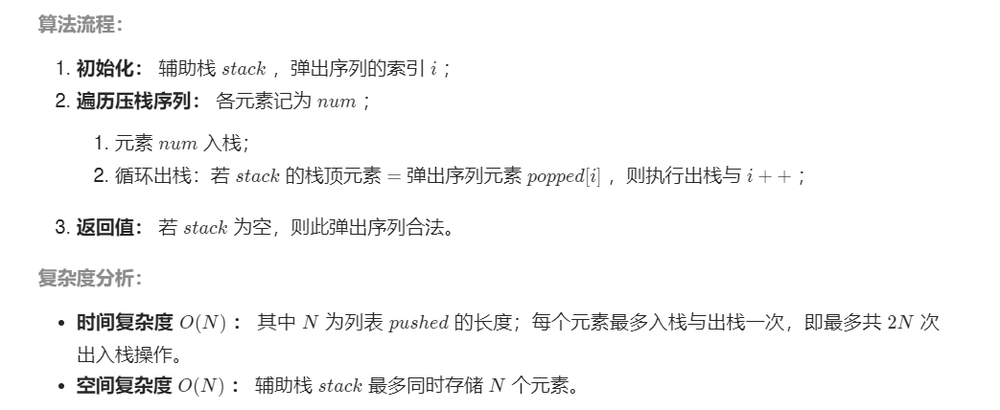
>
> ```java
> class Solution {
>     public boolean validateStackSequences(int[] pushed, int[] popped) {
>         if (pushed==null || pushed.length==0)
>             return true;
>         Stack<Integer> stack = new Stack<>();
>         int i=0;
>         for (int j=0;j<pushed.length;j++){
>             stack.add(pushed[j]);
>             while (!stack.isEmpty() && stack.peek()==popped[i])
>             {
>                 stack.pop();
>                 i++;
>             }
>         }
>         return stack.empty();
>     }
> }
> ```

#### [剑指 Offer 32 - I. 从上到下打印二叉树](https://leetcode-cn.com/problems/cong-shang-dao-xia-da-yin-er-cha-shu-lcof/)

> 从上到下打印出二叉树的每个节点，同一层的节点按照从左到右的顺序打印。
>
> 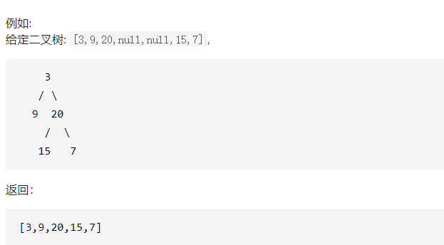

##### 方法：广度优先遍历

**思路**

> 从上到下打印，又称为二叉树的广度优先遍历
>
> 借助**队列**先入先出的特性实现

**流程**

> 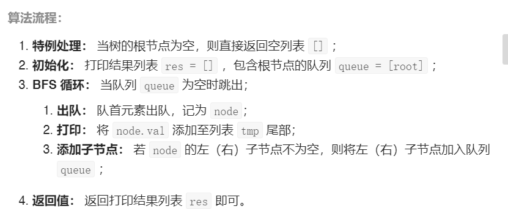
>
> > ```java
> > /**
> >  * Definition for a binary tree node.
> >  * public class TreeNode {
> >  *     int val;
> >  *     TreeNode left;
> >  *     TreeNode right;
> >  *     TreeNode(int x) { val = x; }
> >  * }
> >  */
> > class Solution {
> >     public int[] levelOrder(TreeNode root) {
> >         if (root==null)
> >             return new int[]{};
> >         List<Integer> list = new ArrayList<>();
> >         Deque<TreeNode> deque = new LinkedList<>();
> >         deque.offer(root);
> >         while (!deque.isEmpty()){
> >             TreeNode node = deque.pop();
> >             list.add(node.val);
> >             if (node.left!=null)
> >                 deque.offer(node.left);
> >             if (node.right!=null)
> >                 deque.offer(node.right);
> >         }
> >         int[] res = new int[list.size()];
> >         int i=0;
> >         for (Integer s:list)
> >             res[i++] = s;
> >         return res;
> >     }
> > }
> > ```

#### [剑指 Offer 32 - II. 从上到下打印二叉树 II](https://leetcode-cn.com/problems/cong-shang-dao-xia-da-yin-er-cha-shu-ii-lcof/)

> 从上到下按层打印二叉树，同一层的节点按从左到右的顺序打印，每一层打印到一行。
>
> 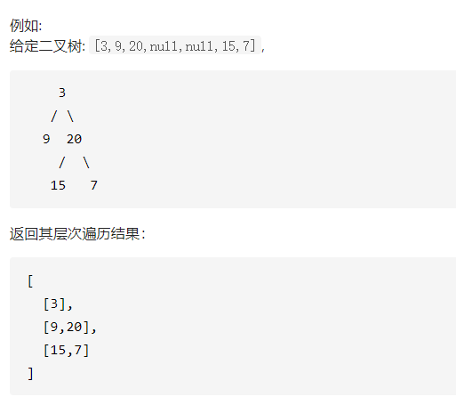

##### 方法：广度优先遍历

> I. 按层打印： 题目要求的二叉树的 **从上至下** 打印（即按层打印），又称为二叉树的 **广度优先搜索（BFS**）。BFS 通常借助 **队列** 的先入先出特性来实现。
>
> II. 每层打印到一行： **将本层全部节点打印到一行，并将下一层全部节点加入队列**，以此类推，即可分为多行打印。
>
> 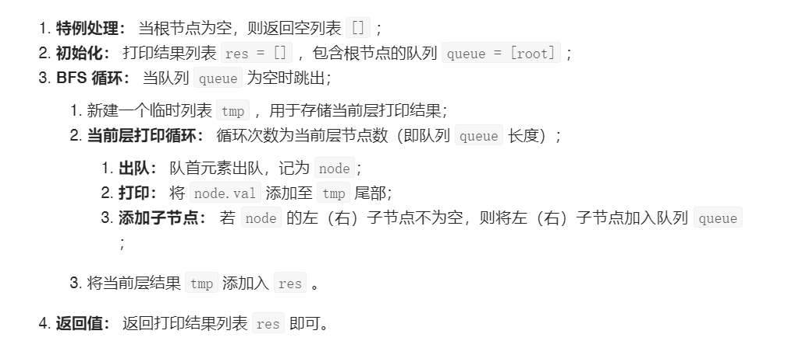
>
> > ```java
> > class Solution {
> >     public List<List<Integer>> levelOrder(TreeNode root) {
> >         Queue<TreeNode> queue = new LinkedList<>();
> >         List<List<Integer>> res = new ArrayList<>();
> >         if(root != null) queue.add(root);
> >         while(!queue.isEmpty()) {
> >             List<Integer> tmp = new ArrayList<>();
> >             for(int i = queue.size(); i > 0; i--) { //必须是int i=queue.size(), 不然的话后面queue.size()会变
> >                 TreeNode node = queue.poll();
> >                 tmp.add(node.val);
> >                 if(node.left != null) queue.add(node.left);
> >                 if(node.right != null) queue.add(node.right);
> >             }
> >             res.add(tmp);
> >         }
> >         return res;
> >     }
> > }
> > ```

#### [剑指 Offer 32 - III. 从上到下打印二叉树 III](https://leetcode-cn.com/problems/cong-shang-dao-xia-da-yin-er-cha-shu-iii-lcof/)

> 请实现一个函数按照之字形顺序打印二叉树，即第一行按照从左到右的顺序打印，第二层按照从右到左的顺序打印，第三行再按照从左到右的顺序打印，其他行以此类推。
>
> 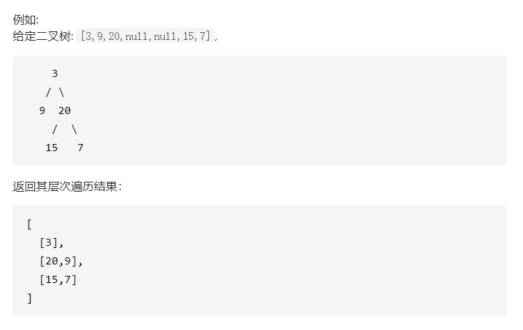

##### 方法一：层序遍历+倒序‘

> - **偶数层倒序：** 若 `res` 的长度为 **奇数** ，说明当前是偶数层，则对 `tmp` 执行 **倒序** 操作。
>
> ```java
> /**
>  * Definition for a binary tree node.
>  * public class TreeNode {
>  *     int val;
>  *     TreeNode left;
>  *     TreeNode right;
>  *     TreeNode(int x) { val = x; }
>  * }
>  */
> class Solution {
>         public List<List<Integer>> levelOrder(TreeNode root) {
>         Deque<TreeNode> deque = new LinkedList<>();
>         List<List<Integer>> res = new ArrayList<>();
>         if (root!=null)
>             deque.offer(root);
>         while (!deque.isEmpty()){
>             List<Integer> list = new ArrayList<>();
>             for (int i=deque.size();i>0;i--){
>                 TreeNode node = deque.poll();
>                 list.add(node.val);
>                 if (node.left!=null) deque.add(node.left);
>                 if (node.right!=null) deque.add(node.right);
>             }
>             if (res.size()%2==0) {
>             }
>             else {
>                 list = ReverseList(list); // 也可以使用 Collections.reverse(tmp);
>             }
>             res.add(list);
>         }
>         return res;
>     }
> 
>     private List<Integer> ReverseList(List<Integer> list) {
>         List<Integer> res = new ArrayList<>();
> 
>         for (int i=0;i<list.size();i++)
>             res.add(list.get(list.size()-1-i));
>         
>         return res;
>     }
> }
> ```

##### 方法二：层序遍历+双端队列

> 利用双端队列的两端皆可添加元素的特性，设打印列表（双端队列） `tmp` ，并规定：
>
> - 奇数层 则添加至 `tmp` **尾部** ，
> - 偶数层 则添加至 `tmp` **头部** 。
>
> > ```java
> > class Solution {
> >     public List<List<Integer>> levelOrder(TreeNode root) {
> >         Queue<TreeNode> queue = new LinkedList<>();
> >         List<List<Integer>> res = new ArrayList<>();
> >         if(root != null) queue.add(root);
> >         while(!queue.isEmpty()) {
> >             LinkedList<Integer> tmp = new LinkedList<>();
> >             for(int i = queue.size(); i > 0; i--) {
> >                 TreeNode node = queue.poll();
> >                 if(res.size() % 2 == 0) tmp.addLast(node.val); // 偶数层 -> 队列头部
> >                 else tmp.addFirst(node.val); // 奇数层 -> 队列尾部
> >                 if(node.left != null) queue.add(node.left);
> >                 if(node.right != null) queue.add(node.right);
> >             }
> >             res.add(tmp);
> >         }
> >         return res;
> >     }
> > }
> > ```

#### [剑指 Offer 30. 包含min函数的栈](https://leetcode-cn.com/problems/bao-han-minhan-shu-de-zhan-lcof/)

> 定义栈的数据结构，请在该类型中实现一个能够得到栈的最小元素的 min 函数在该栈中，调用 min、push 及 pop 的时间复杂度都是 O(1)。
>
> ```
> MinStack minStack = new MinStack();
> minStack.push(-2);
> minStack.push(0);
> minStack.push(-3);
> minStack.min();   --> 返回 -3.
> minStack.pop();
> minStack.top();      --> 返回 0.
> minStack.min();   --> 返回 -2.
> ```

##### 方法：辅助栈

> 思路：若辅助栈为空，或者栈顶元素不大于入栈$A$，则入辅助栈。
>
> 
>
> ```java
> class MinStack {
> 
>     Stack<Integer> stack1, stack2;
>     /** initialize your data structure here. */
>     public MinStack() {
>         stack1 = new Stack<>();
>         stack2 = new Stack<>();
>     }
> 
>     public void push(int x) {
>         stack1.push(x);
>         if (stack2.isEmpty() || stack2.peek()>=x)
>             stack2.push(x);
>     }
> 
>     public void pop() {
>         int x = stack1.pop();
>         if (x==stack2.peek())
>             stack2.pop();
>     }
> 
>     public int top() {
>         return stack1.peek();
>     }
> 
>     public int min() {
>         return stack2.peek();
>     }
> }
> ```

#### [剑指 Offer 33. 二叉搜索树的后序遍历序列](https://leetcode-cn.com/problems/er-cha-sou-suo-shu-de-hou-xu-bian-li-xu-lie-lcof/)

> 输入一个整数数组，判断该数组是不是某二叉搜索树的后序遍历结果。如果是则返回 `true`，否则返回 `false`。假设输入的数组的任意两个数字都互不相同。

- **后序遍历：** `[ 左子树 | 右子树 | 根节点 ]` ，即遍历顺序为 “左、右、根” 。
- **二叉搜索树：**左子树中所有节点的值 < 根节点的值；右子树中所有节点的值 > 根节点的值；其左、右子树也分别为二叉搜索树。

##### 方法一：递归

> ​		后续遍历得到的序列中最后一个元素一定是树的根节点的值。数组中前面的数字可以分为两部分：左子树的值序列和右子树的值序列。左子树值都小于根节点值，右子树值都大于根节点值。
>
> ​		确定了左子树值和右子树值的序列，还是按上面的方法确定对应的子树的结构，这是一个递归的过程。如果递归过程中发现其右子序列中有值小于根值，那么这不是一个后序序列。
>
> > ```java
> > class Solution {
> >     public boolean verifyPostorder(int[] postorder) {
> >         if (postorder==null || postorder.length==0 || postorder.length==1)
> >             return true;
> >         return JudgePostOrder(postorder, 0, postorder.length-1);
> >     }
> > 
> >     private boolean JudgePostOrder(int[] postorder, int start, int end) {
> >         if (start>=end)
> >             return true;
> >         int i=start;
> >         while (postorder[i]<postorder[end])
> >             i++;
> >         for (int j=i;j<=end;j++)
> >             if (postorder[j]<postorder[end])
> >                 return false;
> >             
> >         return JudgePostOrder(postorder, start, i-1) && JudgePostOrder(postorder, i, end-1);
> >     }
> > }
> > ```

##### 方法二：循环

> 非递归也是一个基于递归的思想：
>
> ​		左子树一定比右子树小，因此去掉根后，数字分为left，right两部分，right部分的最后一个数字是右子树的根，它比左子树所有值大，因此我们可以每次只看右子树是否符合条件即可。即使到达了左子树，左子树也可以看出由左右子树组成的树还像右子树那样处理。对于右子树，左子树的所有值都比右子树的根小可以暂时把他看出右子树的左子树，只需看看右子树的右子树是否符合要求即可。
>
> > ```java
> > class Solution {
> >     public boolean verifyPostorder(int[] postorder) {
> >         if (postorder==null || postorder.length==0 || postorder.length==1)
> >             return true;
> >         int begin=0;
> >         int end = postorder.length-1;
> >         while (end>1){
> >             while (postorder[begin]<postorder[end])
> >                 begin++;
> >             while (postorder[begin]>postorder[end])
> >                 begin++;
> >             if (begin<end)
> >                 return false;
> >             
> >             begin=0;
> >             end--;
> >         }
> >         return true;
> >     }
> > }
> > ```

##### 方法三：辅助栈

> 后序遍历倒序：` [ 根节点 | 右子树 | 左子树 ] `。类似 先序遍历的镜像 ，即先序遍历为 “根、左、右” 的顺序，而后序遍历的倒序为 “根、右、左” 顺序。
>
> 
>
> 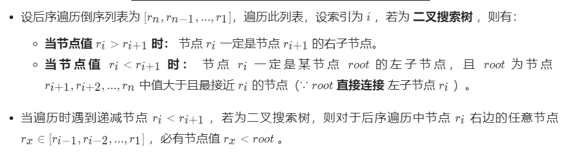
>
> 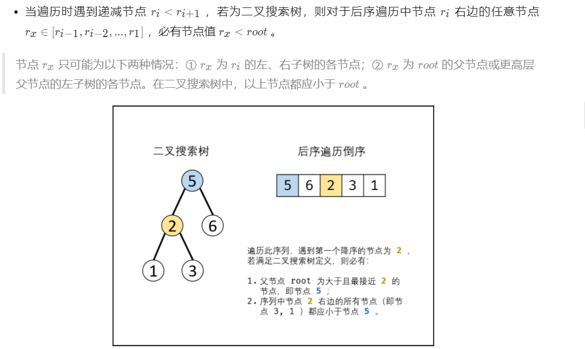
>
> 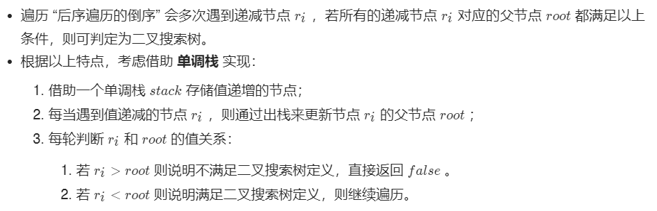
>
> > ```java
> > class Solution {
> >     public boolean verifyPostorder(int[] postorder) {
> >         Stack<Integer> stack = new Stack<>();
> >         int root = Integer.MAX_VALUE;
> >         for(int i = postorder.length - 1; i >= 0; i--) {
> >             if(postorder[i] > root) return false;
> >             while(!stack.isEmpty() && stack.peek() > postorder[i])
> >             	root = stack.pop();
> >             stack.add(postorder[i]);
> >         }
> >         return true;
> >     }
> > }
> > ```

#### [剑指 Offer 34. 二叉树中和为某一值的路径](https://leetcode-cn.com/problems/er-cha-shu-zhong-he-wei-mou-yi-zhi-de-lu-jing-lcof/)

> 输入一棵二叉树和一个整数，打印出二叉树中节点值的和为输入整数的所有路径。从树的根节点开始往下一直到叶节点所经过的节点形成一条路径。
>
> 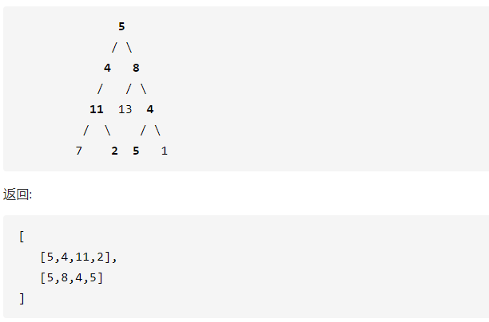

##### 方法：DFS

> 先序遍历： 按照 “根、左、右” 的顺序，遍历树的所有节点。
> 路径记录： 在先序遍历中，记录从根节点到当前节点的路径。当路径为 ① 根节点到叶节点形成的路径 且 ② 各节点值的和等于目标值 sum 时，将此路径加入结果列表。
>
> **注意：**因为不知道二叉树中有没有负数，所以必须遍历到叶子节点。
>
> > ```java
> > /**
> >  * Definition for a binary tree node.
> >  * public class TreeNode {
> >  *     int val;
> >  *     TreeNode left;
> >  *     TreeNode right;
> >  *     TreeNode() {}
> >  *     TreeNode(int val) { this.val = val; }
> >  *     TreeNode(int val, TreeNode left, TreeNode right) {
> >  *         this.val = val;
> >  *         this.left = left;
> >  *         this.right = right;
> >  *     }
> >  * }
> >  */
> > class Solution {
> >     List<List<Integer>> res = new ArrayList<>();
> >     List<Integer> list = new ArrayList<>();
> > 
> >     public List<List<Integer>> pathSum(TreeNode root, int target) {
> >         if (root==null)
> >             return res;
> >         FinePath(root, target);
> >         return res;
> >     }
> > 
> >     private void FinePath(TreeNode root, int target) {
> >         list.add(root.val);
> >         if (root.left==null && root.right==null && target==root.val)
> >             res.add(new ArrayList(list));
> >         if (root.left!=null)
> >             FinePath(root.left, target-root.val);
> >         if (root.right!=null)
> >             FinePath(root.right, target-root.val);
> >         list.remove(list.size()-1);
> >         return;
> >     }
> > }
> > ```

#### [剑指 Offer 35. 复杂链表的复制](https://leetcode-cn.com/problems/fu-za-lian-biao-de-fu-zhi-lcof/)

> 请实现 `copyRandomList` 函数，复制一个复杂链表。在复杂链表中，每个节点除了有一个` next` 指针指向下一个节点，还有一个 `random `指针指向链表中的任意节点或者 `null`。
>
> 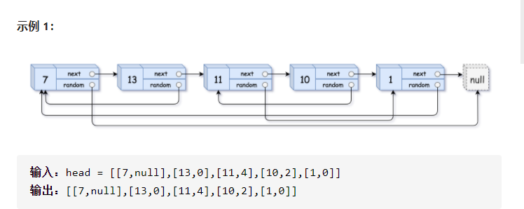

##### 方法一：深度优先遍历

> 因为是一个链表，我们先遍历链表的所有节点，同时创建一个value值和他一样的新节点，注意这个新节点的next和random都是空的。
>
> 等把所有的节点都创建完成的时候，再把他们的next和random进行赋值。
>
> > ```java
> > /*
> > // Definition for a Node.
> > class Node {
> >     int val;
> >     Node next;
> >     Node random;
> > 
> >     public Node(int val) {
> >         this.val = val;
> >         this.next = null;
> >         this.random = null;
> >     }
> > }
> > */
> > class Solution {
> >     public Node copyRandomList(Node head) {
> >         if (head==null)
> >             return null;
> >         Map<Node, Node> map = new HashMap<>();
> >         Node node = head;
> >         while (node!=null){
> >             map.put(node, new Node(node.val));
> >             node = node.next;
> >         }
> >         Node curr = head;
> >         while (curr!=null){
> >             map.get(curr).next = map.get(curr.next);
> >             map.get(curr).random = map.get(curr.random);
> >             curr = curr.next;
> >         }
> >         return map.get(head);
> >     }
> > }
> > ```

##### 方法二：递归

> 类似于dfs，创建一个节点之后，接着通过递归的方式创建他的next节点……
>
> > ```java
> > /*
> > // Definition for a Node.
> > class Node {
> >     int val;
> >     Node next;
> >     Node random;
> > 
> >     public Node(int val) {
> >         this.val = val;
> >         this.next = null;
> >         this.random = null;
> >     }
> > }
> > */
> > class Solution {
> >     public Node copyRandomList(Node head) {
> >         Map<Node, Node> map = new HashMap<>();
> >         return curr(head, map);
> >     }
> > 
> >     private Node curr(Node head, Map<Node, Node> map) {
> >         if (head == null)
> >             return null;
> >         if (map.containsKey(head))
> >             return map.get(head);
> >         Node res = new Node(head.val);
> >         map.put(head, res);
> >         res.next = curr(head.next, map);
> >         res.random = curr(head.random, map);
> >         return res;
> >     }
> > }
> > ```

#### [剑指 Offer 36. 二叉搜索树与双向链表](https://leetcode-cn.com/problems/er-cha-sou-suo-shu-yu-shuang-xiang-lian-biao-lcof/)

> 输入一棵二叉搜索树，将该二叉搜索树转换成一个排序的循环双向链表。要求不能创建任何新的节点，只能调整树中节点指针的指向。
>
> 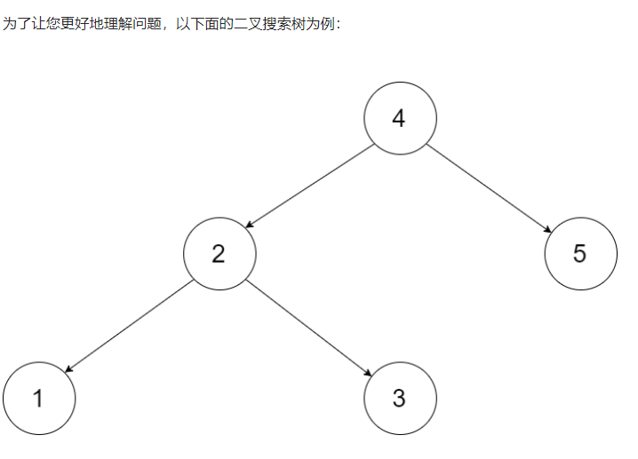
>
> 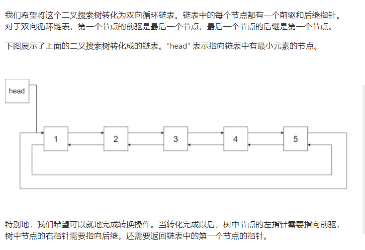

##### 方法一：中序遍历+按顺序读取

> 自己的思路是，按照中序便利的顺序读取每一个节点，然后将节点值保存在一个list中。
>
> 然后遍历该list，每次遍历新建一个节点
>
> > ```java
> > /*
> > // Definition for a Node.
> > class Node {
> >     public int val;
> >     public Node left;
> >     public Node right;
> > 
> >     public Node() {}
> > 
> >     public Node(int _val) {
> >         val = _val;
> >     }
> > 
> >     public Node(int _val,Node _left,Node _right) {
> >         val = _val;
> >         left = _left;
> >         right = _right;
> >     }
> > };
> > */
> > class Solution {
> >      List<Integer> list = new ArrayList<>();
> >     public Node treeToDoublyList(Node root) {
> >         if (root == null)
> >             return null;
> > 
> >         DFS(root, list);
> >         int first = list.get(0);
> >         Node head = new Node(-1);
> >         Node one = new Node(first);
> >         head.right = one;
> >         Node curr = one;
> >         for (int i=1;i<list.size();i++){
> >             Node node = new Node(list.get(i));
> >             curr.right = node;
> >             node.left = curr;
> >             curr = curr.right;
> >         }
> >         curr.right = head.right;
> >         head.right.left = curr;
> >         return head.right;
> >     }
> >         private void DFS(Node root, List<Integer> list) {
> >         if (root.left!=null)
> >             DFS(root.left, list);
> >         list.add(root.val);
> >         if (root.right!=null)
> >             DFS(root.right, list);
> >         
> >         return;
> >     }
> > }
> > ```

##### 方法二：中序遍历同时构造链表

> 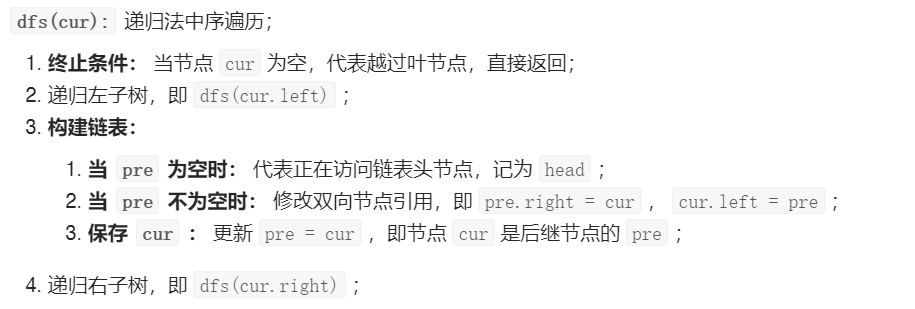
>
> 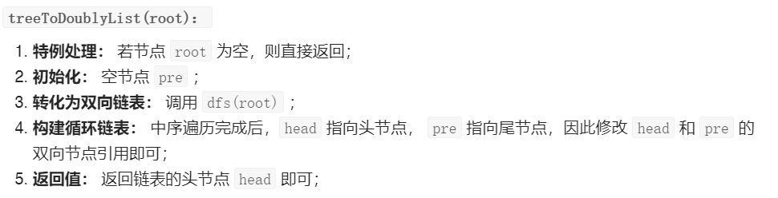

```java
/*
// Definition for a Node.
class Node {
    public int val;
    public Node left;
    public Node right;

    public Node() {}

    public Node(int _val) {
        val = _val;
    }

    public Node(int _val,Node _left,Node _right) {
        val = _val;
        left = _left;
        right = _right;
    }
};
*/
class Solution {
    Node head, prev;
    public Node treeToDoublyList(Node root) {
        if (root==null)
        	return null;
        DFS(root);
        //进行头节点和尾节点的相互指向，这两句的顺序也是可以颠倒的
        head.left = prev;
        prev.right = head;
        return head;
    }
    public void DFS(Node root){
    	if (root==null)
    		return;
		DFS(root.left);
         //pre用于记录双向链表中位于cur左侧的节点，即上一次迭代中的cur,当pre==null时，cur左侧没有节点,即此时cur为双向链表中的头节点
        //反之，pre!=null时，cur左侧存在节点pre，需要进行pre.right=cur的操作。 root;
		if (prev == null)
			head = root;
		else 
			prev.right 
		root.left = prev;
		prev = root;
		DFS(root.right);
    }
}
```

#### [剑指 Offer 37. 序列化二叉树](https://leetcode-cn.com/problems/xu-lie-hua-er-cha-shu-lcof/)

> 请实现两个函数，分别用来序列化和反序列化二叉树。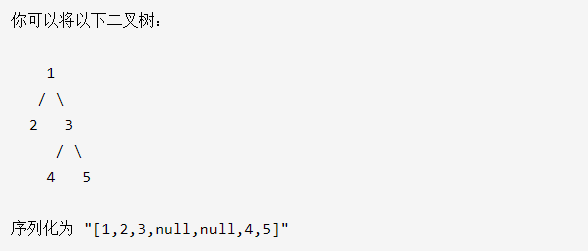

##### 方法：层次遍历二叉树

> 层次遍历二叉树，不过这次遍历需要将null值也添加进队列。
>
> ***不过我有个问题，就是这样序列化以后，每个叶子节点带上两个null，好像与题目给出的答案不符合。***

```java
/**
 * Definition for a binary tree node.
 * public class TreeNode {
 *     int val;
 *     TreeNode left;
 *     TreeNode right;
 *     TreeNode(int x) { val = x; }
 * }
 */
public class Codec {

    // Encodes a tree to a single string.
    public String serialize(TreeNode root) {
        if(root == null) return "[]";
        StringBuilder res = new StringBuilder("[");
        Queue<TreeNode> queue = new LinkedList<>() {{ add(root); }};
        while(!queue.isEmpty()) {
            TreeNode node = queue.poll();
            if(node != null) {
                res.append(node.val + ",");
                queue.add(node.left);
                queue.add(node.right);
            }
            else res.append("null,");
        }
        res.deleteCharAt(res.length() - 1);
        res.append("]");
        return res.toString();
    }

    public TreeNode deserialize(String data) {
        if(data.equals("[]")) return null;
        String[] vals = data.substring(1, data.length() - 1).split(",");
        TreeNode root = new TreeNode(Integer.parseInt(vals[0]));
        Queue<TreeNode> queue = new LinkedList<>() {{ add(root); }};
        int i = 1;
        while(!queue.isEmpty()) {
            TreeNode node = queue.poll();
            if(!vals[i].equals("null")) {
                node.left = new TreeNode(Integer.parseInt(vals[i]));
                queue.add(node.left);
            }
            i++;
            if(!vals[i].equals("null")) {
                node.right = new TreeNode(Integer.parseInt(vals[i]));
                queue.add(node.right);
            }
            i++;
        }
        return root;
    }
}

// Your Codec object will be instantiated and called as such:
// Codec codec = new Codec();
// codec.deserialize(codec.serialize(root));
```


