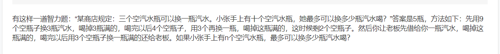
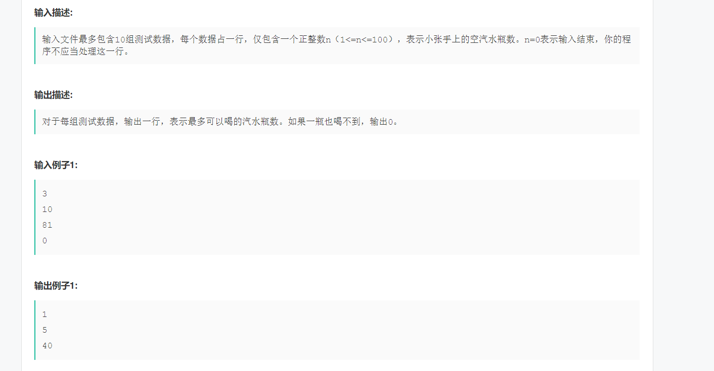
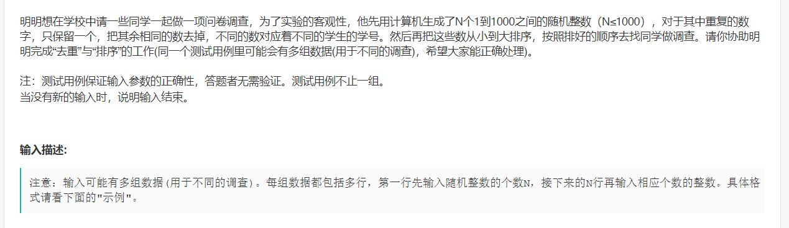
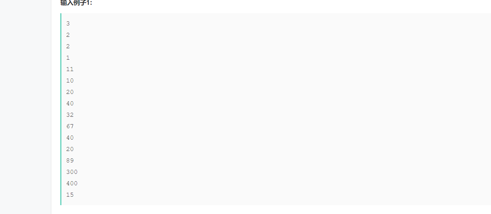
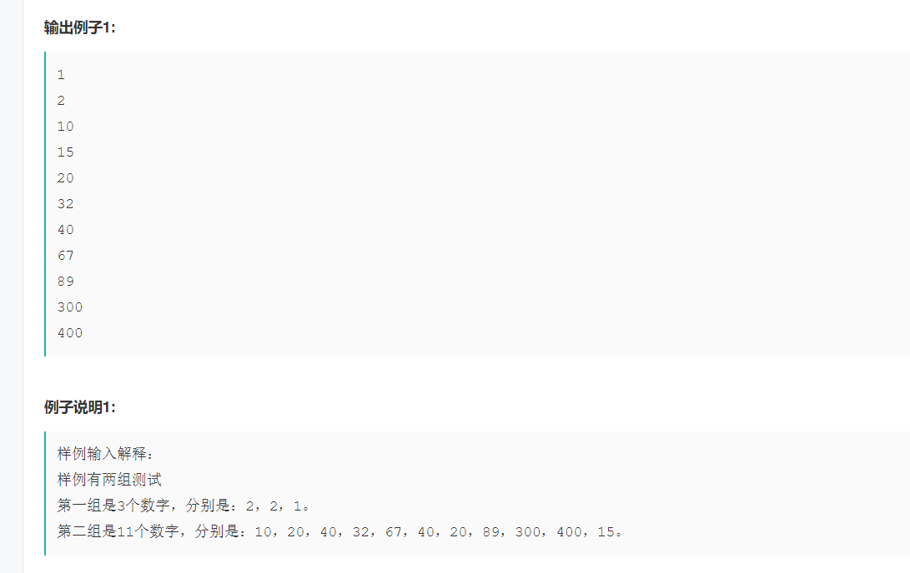
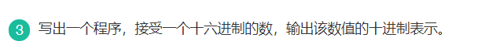

### 华为

#### 空瓶子换饮料

> 
>
> 

##### 思路：

> 我是这么想的：反正是三个空瓶子换一个，那就一直除以三就好了。要是有余数的，例如10，剩下的瓶子数就是除数加余数
> $$
> 10/3+10\%3=3+1=4
> $$
> 一直除到$0，1，2$未知。
>
> ```java
> package Learn;
> 
> import java.util.Scanner;
> 
> public class test1 {
>     public static void main(String[] args){
>         Scanner sc = new Scanner(System.in);
>         int number = 0;
>         while (sc.hasNext()){
>             number = sc.nextInt(); // 空瓶子一开始的数量
>             if (number == 0)
>                 break;
>             CountBottle(number);
>         }
> 
>     }
> 
>     private static void CountBottle(int number) {
>         if (number < 3){
>             System.out.println(0);
>             return;
>         }
> 
>         int total = 0;
>         while (number / 3 > 0){
>             total = total + number / 3;
>             number = number / 3 + number % 3;
>         }
>         if (number == 2)
>             total++;
>         System.out.println(total);
>     }
> }
> ```

#### 找学生

> 
>
> 
>
> 

##### 思路

> 我的思路是排序然后输出
>
> ```java
> package Learn;
> 
> import java.util.Arrays;
> import java.util.Scanner;
> 
> public class test2 {
>     public static void main(String[] args){
>         Scanner sc = new Scanner(System.in);
>         int num = 0; // num个数字
> 
>         while (sc.hasNext()){
>             num = sc.nextInt();
>             int[] arr = new int[num];
>             for (int i=0;i<num;i++)
>                 arr[i] = sc.nextInt();
> 
>             SortPrint(arr, num);
>         }
>     }
> 
>     private static void SortPrint(int[] arr, int num) {
>         Arrays.sort(arr);
>         System.out.println(arr[0]);
>         for (int j=1;j<num;j++){
>             if (arr[j] != arr[j-1])
>                 System.out.println(arr[j]);
>         }
>     }
> }
> ```

#### 十六进制转十进制

> 

##### 思路

> 我是哈希表存储，直接做了。

```java
package Learn;

import java.util.HashMap;
import java.util.Map;
import java.util.Scanner;

public class test3 {
    public static void main(String[] args){
        Scanner sc = new Scanner(System.in);
        String str;
        int length = 0;
        while (sc.hasNext()){
            str = sc.nextLine();
            length = str.length();
            Character[] arr = new Character[length];
            for (int i=0, j=0;i<length;i++, j++){
                arr[i] = str.charAt(j);
            }
            InvertToTen(arr, length);
        }
    }

    private static void InvertToTen(Character[] arr, int len) {
        int res = 0;
        Map<Character, Integer> map = new HashMap<>(){{
            put('0', 0);
            put('1', 1);
            put('2', 2);
            put('3', 3);
            put('4', 4);
            put('5', 5);
            put('6', 6);
            put('7', 7);
            put('8', 8);
            put('9', 9);
            put('A', 10);
            put('B', 11);
            put('C', 12);
            put('D', 13);
            put('E', 14);
            put('F', 15);
           }
        };
        for (int i=len-1;i>=2;i--){
            if (arr[i] == 'x')
                break;
            else {
                Character c = arr[i];
                int num = map.get(c);
                res += num * Math.pow(16, len-1-i);
            }
        }
        System.out.println(res);
    }
}

```

