###  [LeetCode 热题 HOT 100](https://leetcode-cn.com/problemset/leetcode-hot-100/)

***********

#### [两数之和](https://leetcode-cn.com/problems/two-sum/)

> 给定一个整数数组 nums 和一个整数目标值 target，请你在该数组中找出 和为目标值 的那 两个 整数，并返回它们的数组下标。
>
> 你可以假设每种输入只会对应一个答案。但是，数组中同一个元素在答案里不能重复出现。
>
> 你可以按任意顺序返回答案。

##### 方法一：暴力破解

> 双层循环求解就好啦。
>
> ```python
> class Solution(object):
>     def twoSum(self, nums, target):
>         result = []
>         for i in range(len(nums)):
>             for j in range(i+1, len(nums)):
>                 if nums[i] + nums[j] == target:
>                     result.append(i)
>                     result.append(j)
>                     return result
>         """
>         :type nums: List[int]
>         :type target: int
>         :rtype: List[int]
>         """
> ```

##### 方法二：哈希表

> 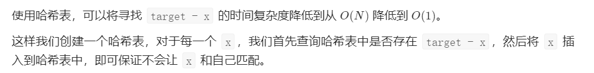
>
> ```java
>     public int[] twoSum(int[] nums, int target) {
>         Map<Integer, Integer> ans = new HashMap<>();
>         int[] res = new int[2];
> 
>         for (int i=0;i<nums.length;i++){
>             if (ans.containsKey(target - nums[i])){
>                 res[0] = ans.get(target - nums[i]);
>                 res[1] = i;
>                 break;
>             }
>             ans.put(nums[i], i);
>         }
>         return res;
>     }
> ```

#### 两数相加

> 给你两个 非空 的链表，表示两个非负的整数。它们每位数字都是按照 逆序 的方式存储的，并且每个节点只能存储 一位 数字。
>
> 请你将两个数相加，并以相同形式返回一个表示和的链表。
>
> 可以假设除了数字 0 之外，这两个数都不会以 0 开头。

##### 方法：同时遍历两个链表

> 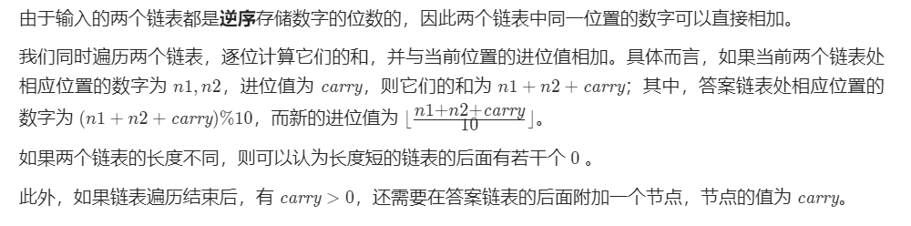
>
> ```java
> /**
>  * Definition for singly-linked list.
>  * public class ListNode {
>  *     int val;
>  *     ListNode next;
>  *     ListNode() {}
>  *     ListNode(int val) { this.val = val; }
>  *     ListNode(int val, ListNode next) { this.val = val; this.next = next; }
>  * }
>  */
> class Solution {
>     public ListNode addTwoNumbers(ListNode l1, ListNode l2) {
>         ListNode node1=l1, node2=l2;
>         
>         ListNode head=null, tail=null;
> 
>         int x=0, y=0, carry=0;
> 
>         while (node1!=null || node2!=null){
>             if (node1!=null)
>                 x = node1.val;
>             else x = 0;
> 
>             if (node2!=null)
>                 y = node2.val;
>             else y = 0;
> 
>             if (head == null)
>                 head = tail = new ListNode((x + y  + carry) % 10);
>             else {
>                 tail.next  = new ListNode((x + y  +carry) % 10);;
>                 tail = tail.next;
>             }
>             
>             carry = (x + y + carry) / 10;
> 
>             if (node1!=null)
>                 node1 = node1.next;
> 
>             if (node2!=null)
>                 node2 = node2.next;
>         }
>         if (carry > 0)
>             tail.next = new ListNode(carry);
>         return head;
>     }
> }
> ```

#### [无重复字符的最长子串](https://leetcode-cn.com/problems/longest-substring-without-repeating-characters/)

> 给定一个字符串，请你找出其中不含有重复字符的 **最长子串** 的长度。
>
> ```
> 输入: s = "abcabcbb"
> 输出: 3 
> 解释: 因为无重复字符的最长子串是 "abc"，所以其长度为 3。
> ```
>
> ```
> 输入: s = "pwwkew"
> 输出: 3
> 解释: 因为无重复字符的最长子串是 "wke"，所以其长度为 3。
>      请注意，你的答案必须是 子串 的长度，"pwke" 是一个子序列，不是子串。
> ```

##### 方法：滑动窗口

> 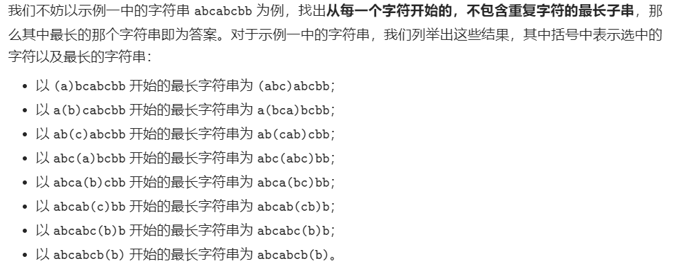
>
> 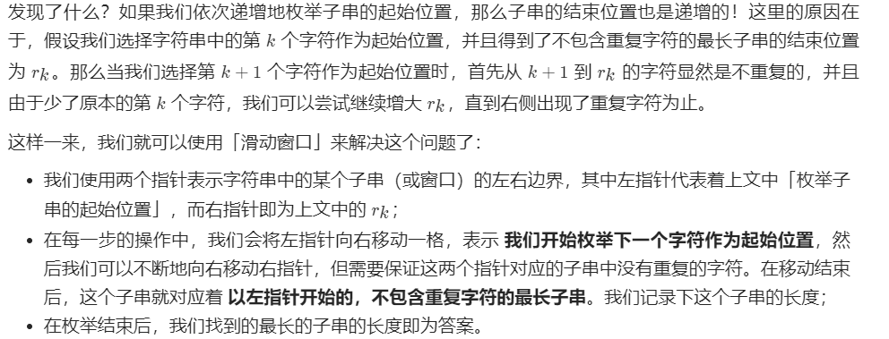
>
> ```java
>     public int lengthOfLongestSubstring(String s) {
> 
>         int length = s.length();
>         Set<Character> ans = new HashSet<>();
>         int max = 0;
> 
>         int end=0, begin=0;
>         while (end<length && begin<length){
>             if (!ans.contains(s.charAt(end))){
>                 ans.add(s.charAt(end++));
>                 max = Math.max(max, end-begin);
>             }
>             else ans.remove(s.charAt(begin++));
>         }
>         return max;
>     }
> ```

##### 方法二：优化的滑动窗口

> 用哈希表存储每个字符。
>
> ```java
>     public int lengthOfLongestSubstring(String s) {
>         int n = s.length(), ans = 0;
>         Map<Character, Integer> map = new HashMap<>();
>         for (int end = 0, start = 0; end < n; end++) {
>             if (map.containsKey(s.charAt(end))) {
>                 start = Math.max(map.get(s.charAt(end)), start);
>             }
>             ans = Math.max(ans, end - start + 1);
>             //end-start+1是因为此时i,end索引仍处于不重复的位置，end还没有向后移动，取的[start,end]长度,+1因为索引从1开始
>             map.put(s.charAt(end), end + 1); // 加 1 表示从字符位置后一个才开始不重复,不然就把最后一个数给替换了
>         }
>         return ans;
> ```

#### [寻找两个正序数组的中位数](https://leetcode-cn.com/problems/median-of-two-sorted-arrays/)

> 给定两个大小分别为 `m` 和 `n` 的正序（从小到大）数组 `nums1` 和 `nums2`。请你找出并返回这两个正序数组的 **中位数** 。
>
> ```
> 输入：nums1 = [1,3], nums2 = [2]
> 输出：2.00000
> 解释：合并数组 = [1,2,3] ，中位数 2
> ```

##### 方法：合并数组

> 将两个数组按顺序合并成为有序数组，再求中位数。
>
> ```java
> class Solution {
>     public double findMedianSortedArrays(int[] nums1, int[] nums2) {
>         int length1 = nums1.length, length2 = nums2.length;
>         int[] ans = new int[length1+length2];
> 
>         int l1 = 0, l2 = 0;
>         int k = 0;
>         while (l1<length1 && l2<length2){
>             if (nums1[l1] <= nums2[l2])
>                 ans[k++] = nums1[l1++];
>             else ans[k++] = nums2[l2++];
>         }
>         while (l1<length1)
>             ans[k++] = nums1[l1++];
>         while (l2<length2)
>             ans[k++] = nums2[l2++];
>         
>         if ((length1 + length2) % 2 == 1)
>             return ans[(length1+length2-1)/2];
>         else return (ans[(length1+length2)/2] + ans[(length1+length2-2)/2]) / 2.0;
>     }
> }
> ```

#### [ 最长回文子串](https://leetcode-cn.com/problems/longest-palindromic-substring/)

> 给你一个字符串 `s`，找到 `s` 中最长的回文子串。
>
> ```
> 输入：s = "babad"
> 输出："bab"
> 解释："aba" 同样是符合题意的答案。
> ```

##### 方法一：动态规划

***代码没怎么看明白***

> 我们用$ P(i,j)$表示字符串$ s$ 的第$ i$到$ j$个字母组成的串（下文表示成$ s[i:j]$）是否为回文串：
>
> 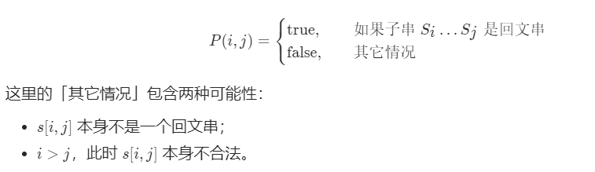
>
> 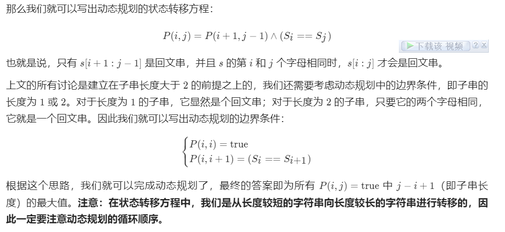
>
> ```java
> class Solution {
>     public String longestPalindrome(String s) {
>         int n = s.length();
>         boolean[][] dp = new boolean[n][n];
>         String ans = "";
>         for (int l = 0; l < n; ++l) {
>             for (int i = 0; i + l < n; ++i) {
>                 int j = i + l;
>                 if (l == 0) {
>                     dp[i][j] = true;
>                 } else if (l == 1) {
>                     dp[i][j] = (s.charAt(i) == s.charAt(j));
>                 } else {
>                     dp[i][j] = (s.charAt(i) == s.charAt(j) && dp[i + 1][j - 1]);
>                 }
>                 if (dp[i][j] && l + 1 > ans.length()) {
>                     ans = s.substring(i, i + l + 1);
>                 }
>             }
>         }
>         return ans;
>     }
> }
> ```

##### 方法二：中心扩散

> 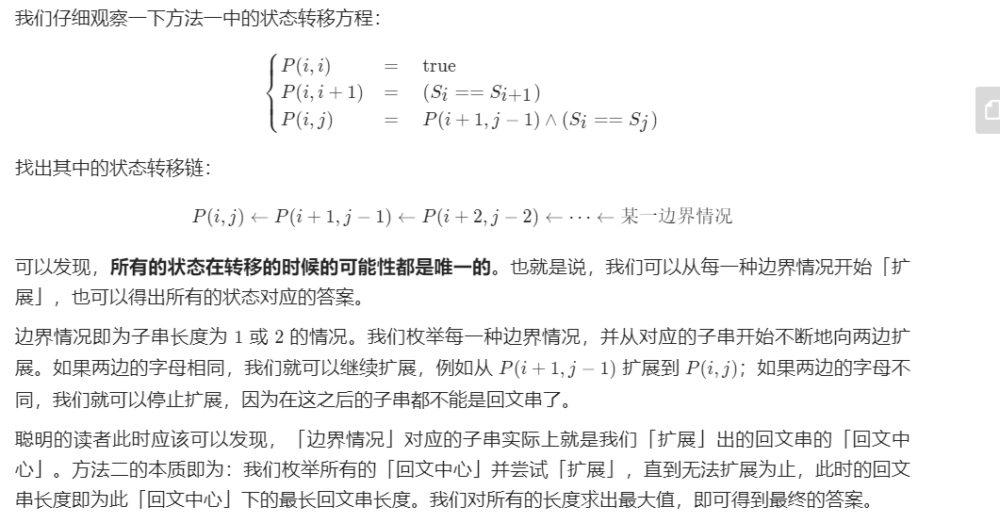
>
> ```java
>     public String longestPalindrome(String s) {
>         int length = s.length();
>         int max = 1;
> 
>         String res = s.substring(0, 1);
>         for (int i=0;i<length-1;i++){
>             String str1 = SerachPailndrome(s, i, i);
>             String str2 = SerachPailndrome(s, i, i+1);
>             String longstr;
>             if (str1.length() >= str2.length())
>                 longstr = str1;
>             else longstr = str2; // longstr = str1.length()>str2.length()?str1:str2;
> 
>             if (longstr.length() > max){
>                 max = longstr.length();
>                 res = longstr;
>             }
>         }
>         return res;
>     }
> 
>     private String SerachPailndrome(String s, int forward, int back) {
>         while (forward>=0 && back<s.length()){
>             if (s.charAt(forward) == s.charAt(back)){
>                 forward--;
>                 back++;
>             }
>             else break;
>         }
>         return s.substring(forward+1, back);
>     }
> ```

#### [正则表达式匹配](https://leetcode-cn.com/problems/regular-expression-matching/)

> 给你一个字符串 s 和一个字符规律 p，请你来实现一个支持 '.' 和 '*' 的正则表达式匹配。
>
> '.' 匹配任意单个字符
> '*' 匹配零个或多个前面的那一个元素
> 所谓匹配，是要涵盖 整个 字符串 s的，而不是部分字符串。
>
> ```
> 输入：s = "aa" p = "a"
> 输出：false
> 解释："a" 无法匹配 "aa" 整个字符串。
> 
> 输入：s = "aa" p = "a*"
> 输出：true
> 解释：因为 '*' 代表可以匹配零个或多个前面的那一个元素, 在这里前面的元素就是 'a'。因此，字符串 "aa" 可被视为 'a' 重复了一次。
> ```

##### 方法：动态规划

>  [题解](https://leetcode-cn.com/problems/regular-expression-matching/solution/zheng-ze-biao-da-shi-pi-pei-by-leetcode-solution/)
>
> 
>
> 
>
> 
>
> 
>
> ```java
> class Solution {
>     public boolean isMatch(String s, String p) {
>         int m = s.length();
>         int n = p.length();
>         boolean f[][] = new boolean[m + 1][n + 1];
>         f[0][0] = true;//f[0][0]代表s和p均为空字符串，f[1][1]代表s和p的第一个字符（即在s和p中下标为0的字符）
>         for(int i = 0; i <= m ; ++i) {
>             for(int j = 1; j <= n; ++j) {
>                 if(p.charAt(j - 1) == '*') {//p的第j个字符为*
>                     if(matches(s, p, i, j - 1)) {//匹配s的第i个字符和p的第j-1个字符
>                         f[i][j] = f[i - 1][j] || f[i][j - 2];//p中*前面的字符在s中出现多次或者在s中只出现1次
>                     }
>                     else {
>                         f[i][j] = f[i][j - 2];//p中*前面的在s中字符出现0次
>                     }
>                 }
>                 else {//p的第j个字符不为*
>                    if(matches(s, p, i, j)) {//匹配s的第i个字符和p的第j个字符
>                        f[i][j] = f[i - 1][j - 1];//匹配成功，状态转移；匹配不成功，默认是false
>                    } 
>                 }
>             }
>         }
>         return f[m][n];
>     }
> 
>     private boolean matches(String s, String p, int i, int j) {//注意在字符串中的下标变换
>         if(i == 0) {
>             return false;
>         }
>         if(p.charAt(j - 1) == '.') {
>             return true;
>         }
>         return s.charAt(i - 1) == p.charAt(j - 1);
>     }
> }
> ```

##### 再理解

> 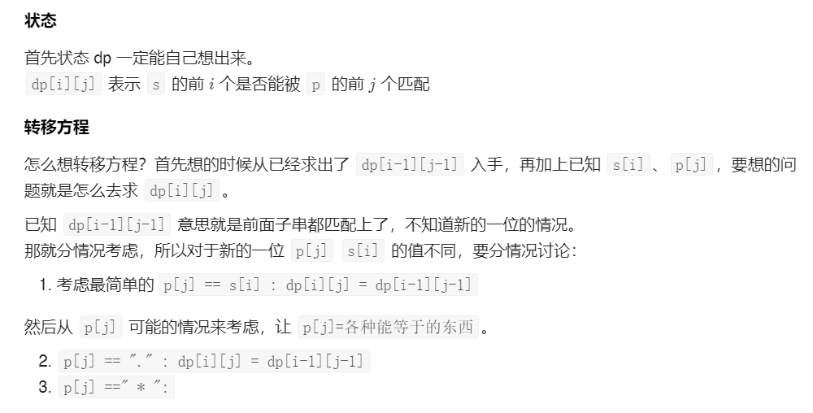
>
> 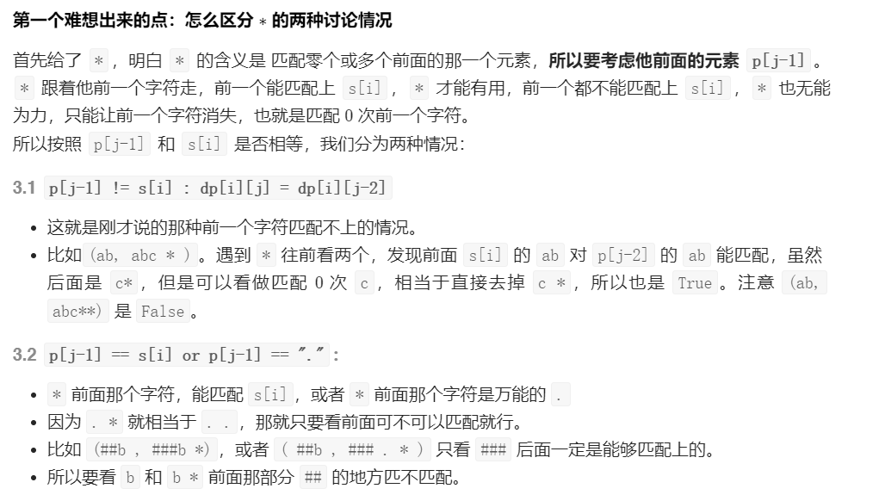
>
> 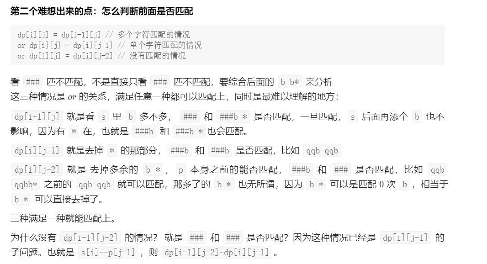

#### [盛最多水的容器](https://leetcode-cn.com/problems/container-with-most-water/)

> 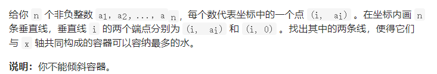
>
> 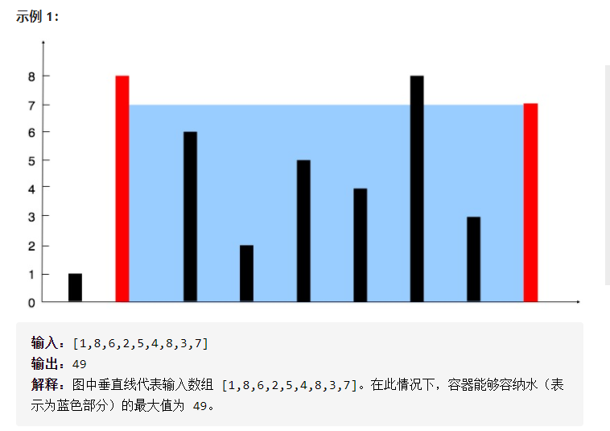

##### 方法一：双循环暴力破解

> 遍历所有可能的情况，求出最大解。
>
> ```java
> class Solution {
>     public int maxArea(int[] height) {
>         int volume = 0;
>         int length = height.length;
>         for (int i=0;i<length-1;i++){
>             for (int j=i+1;j<length;j++){
>                 if (volume < Math.min(height[i], height[j])*(j-i)){
>                     volume = Math.min(height[i], height[j])*(j-i);
>                 }
>             }
>         }
>         return volume;
>     }
> }
> ```

##### 方法二：双指针

> ```java
> class Solution {
>     public int maxArea(int[] height) {
>         int low=0, high = height.length-1;
>         int volume = 0;
> 
>         while (low < high){
>             int temp = Math.min(height[low], height[high]) * (high - low);
>             volume = Math.max(volume, temp);
> 
>             if (height[low] < height[high])
>                 low++;
>             else high--;
>         }
>         return volume;
>     }
> }
> ```

#### [三数之和](https://leetcode-cn.com/problems/3sum/)

> 给你一个包含 n 个整数的数组 $nums$，判断 $nums $中是否存在三个元素 $a，b，c $，使得$ a + b + c = 0 ？$请你找出所有和为 $0 $且不重复的三元组。
>
> 注意：答案中不可以包含重复的三元组。
>
> ```
> 输入：nums = [-1,0,1,2,-1,-4]
> 输出：[[-1,-1,2],[-1,0,1]]
> ```

##### 方法：先排序，再双指针

>  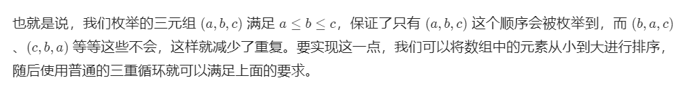
>
> ```java
> class Solution {
>     public List<List<Integer>> threeSum(int[] nums) {
>         int n = nums.length;
>         Arrays.sort(nums);
>         List<List<Integer>> ans = new ArrayList<List<Integer>>();
>         // 枚举 a
>         for (int first = 0; first < n; ++first) {
>             // 需要和上一次枚举的数不相同
>             if (first > 0 && nums[first] == nums[first - 1]) {
>                 continue;
>             }
>             // c 对应的指针初始指向数组的最右端
>             int third = n - 1;
>             int target = -nums[first];
>             // 枚举 b
>             for (int second = first + 1; second < n; ++second) {
>                 // 需要和上一次枚举的数不相同
>                 if (second > first + 1 && nums[second] == nums[second - 1]) {
>                     continue;
>                 }
>                 // 需要保证 b 的指针在 c 的指针的左侧
>                 while (second < third && nums[second] + nums[third] > target) {
>                     --third;
>                 }
>                 // 如果指针重合，随着 b 后续的增加
>                 // 就不会有满足 a+b+c=0 并且 b<c 的 c 了，可以退出循环
>                 if (second == third) {
>                     break;
>                 }
>                 if (nums[second] + nums[third] == target) {
>                     List<Integer> list = new ArrayList<Integer>();
>                     list.add(nums[first]);
>                     list.add(nums[second]);
>                     list.add(nums[third]);
>                     ans.add(list);
>                 }
>             }
>         }
>         return ans;
>     }
> }
> ```

#### [电话号码的字母组合](https://leetcode-cn.com/problems/letter-combinations-of-a-phone-number/)

> 给定一个仅包含数字$ 2~9$ 的字符串，返回所有它能表示的字母组合。答案可以按 任意顺序 返回。
>
> 给出数字到字母的映射如下（与电话按键相同）。注意 $1 $不对应任何字母。
>
> > 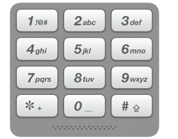
>
> ```java
> 输入：digits = "23"
> 输出：["ad","ae","af","bd","be","bf","cd","ce","cf"]
> ```

##### 方法：回溯

> 回溯算法用于寻找所有的可行解，如果发现一个解不可行，则会舍弃不可行的解。在这道题中，由于每个数字对应的每个字母都可能进入字母组合，因此不存在不可行的解，直接穷举所有的解即可。
>
> ```java
> class Solution {
>     public List<String> letterCombinations(String digits) {
>         List<String> ans = new ArrayList<>();
>         if (digits.length() == 0)
>             return ans;
>         String pattern = "";
>         backtracking(pattern, digits, 0, ans);
>         return ans;
>     }
> 
>     public static void backtracking(String pattern, String digits, int flag, List<String> list){
>         String[] alphabet = {"", "", "abc", "def", "ghi", "jkl", "mno", "pqrs", "tuv", "wxyz"};
> 
>         if (flag == digits.length()){
>             list.add(pattern);
>             return;
>         }
> 
>         //先获得数字对应的字符串，然后遍历它
>         String str = alphabet[digits.charAt(flag) - '0'];
> 
>         for (int i=0; i<str.length(); i++){
>             backtracking(pattern+str.charAt(i), digits, flag+1, list);
>         }
>     }
> }
> ```

#### [删除链表的倒数第 N 个结点](https://leetcode-cn.com/problems/remove-nth-node-from-end-of-list/)

> 给你一个链表，删除链表的倒数第 `n` 个结点，并且返回链表的头结点。
>
> > 使用一趟循环
>
> > 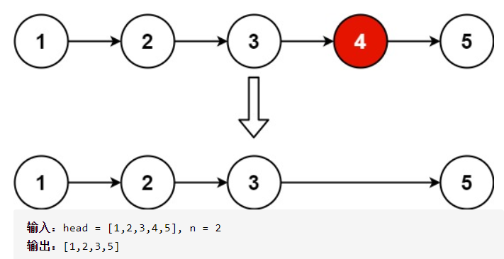

##### 方法：双指针

> 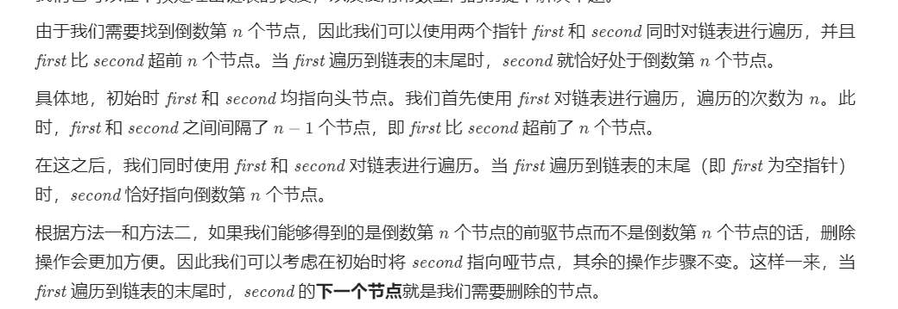
>
> ```java
> public class test019 {
>     /*
>     删除链表的倒数第 N 个结点
>      */
>     public ListNode removeNthFromEnd(ListNode head, int n) {
>         ListNode dummy = new ListNode(0);
>         dummy.next = head;
>         ListNode first=head, second=dummy;
> 
>         for (int i=0;i<n;i++)
>             first = first.next;
> 
>         while (first!=null){
>             first = first.next;
>             second = second.next;
>         }
>         second.next = second.next.next;
>         return dummy.next;
>     }
> }
> ```

#### [有效的括号](https://leetcode-cn.com/problems/valid-parentheses/)

> 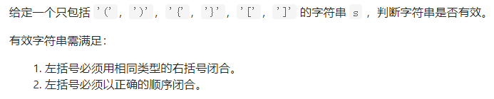
>
> ```
> 输入：s = "()"
> 输出：true
> 
> 输入：s = "([)]"
> 输出：false
> ```

##### 方法：栈

> 可以利用栈先进后出的特性，每次遇到一个左括号，就将其放入栈，每次遇到一个右括号，就将其与栈顶的左括号匹配。
>
> > ```java
> >     public boolean isValid(String s) {
> >         Stack<Character> stack = new Stack<>();
> >         int length = s.length();
> >         if (length % 2 ==1)
> >             return false;
> > 
> >         for (int i=0;i<length;i++){
> >             if (s.charAt(i)=='(' || s.charAt(i)=='[' || s.charAt(i)=='{')
> >                 stack.push(s.charAt(i));
> >             else {
> >                 if (stack.empty())
> >                     return false;
> >                 if (s.charAt(i)==']' && stack.peek()!='[')
> >                     return false;
> >                 if (s.charAt(i)==')' && stack.peek()!='(')
> >                     return false;
> >                 if (s.charAt(i)=='}' && stack.peek()!='{')
> >                     return false;
> >                 stack.pop();
> >             }
> >         }
> >         if (stack.empty())
> >             return true;
> >         else return false;
> >     }
> > ```

###### 补充知识：[Java Stack](#https://www.runoob.com/java/java-stack-class.html)

> 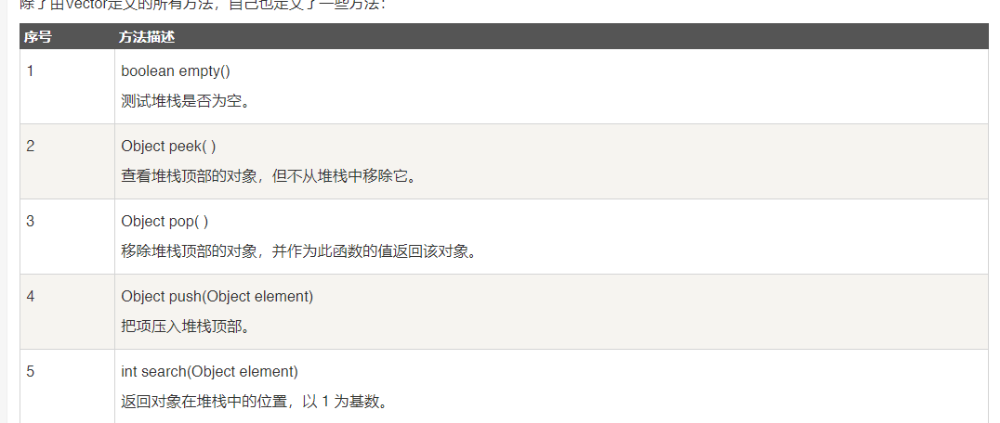

#### [合并两个有序链表](https://leetcode-cn.com/problems/merge-two-sorted-lists/)

> 将两个升序链表合并为一个新的 **升序** 链表并返回。新链表是通过拼接给定的两个链表的所有节点组成的。 
>
> 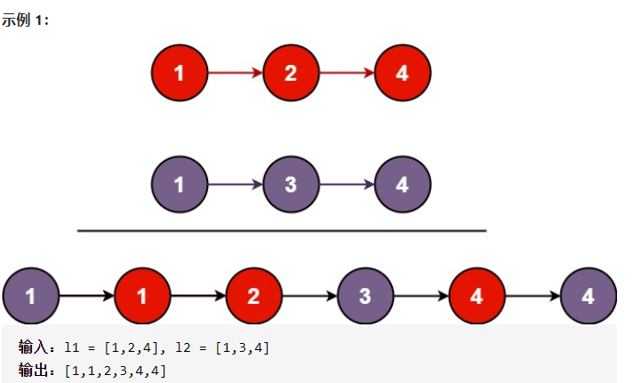

##### 方法一：递归

> 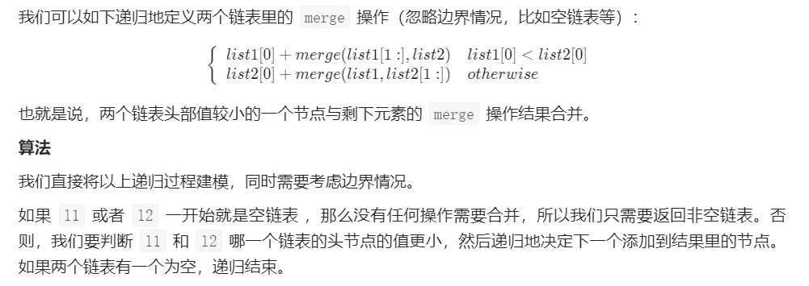
>
> ```java
> class Solution {
>     public ListNode mergeTwoLists(ListNode l1, ListNode l2) {
>         ListNode head = null;
>         if (l1==null)
>             return l2;
>         if (l2==null)
>             return l1;
> 
>         if (l1.val <= l2.val){
>             head = l1;
>             head.next = mergeTwoLists(l1.next, l2);
>         }else {
>             head = l2;
>             head.next = mergeTwoLists(l1, l2.next);
>         }
>         
>         return head;
>     }
> }
> ```

##### 方法二：迭代

> 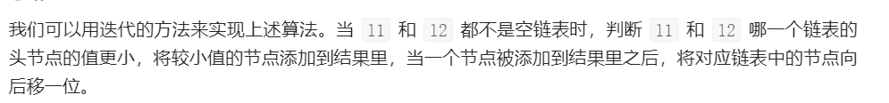
>
> ```java
>     public ListNode mergeTwoLists(ListNode l1, ListNode l2) {
>         ListNode dummy = new ListNode(0);
>         ListNode head;
>         if (l1==null)
>             return l2;
>         if (l2==null)
>             return l1;
>         if (l1.val < l2.val){
>             dummy.next = head = l1;
>             l1 = l1.next;
>         }
>         else {
>             dummy.next = head = l2;
>             l2 = l2.next;
>         }
>         while (l1!=null && l2!=null){
>             if (l1.val < l2.val){
>                 head.next = l1;
>                 l1 = l1.next;
>             }
>             else {
>                 head.next = l2;
>                 l2 = l2.next;
>             }
>             head = head.next;
>         }
>         if (l1!=null)
>             head.next = l1;
>         if (l2!=null)
>             head.next = l2;
>         return dummy.next;
>     }
> ```


#### [环形链表 II](https://leetcode-cn.com/problems/linked-list-cycle-ii/)

> 给定一个链表，返回链表开始入环的第一个节点。 如果链表无环，则返回 null。
>
> 为了表示给定链表中的环，我们使用整数 pos 来表示链表尾连接到链表中的位置（索引从 0 开始）。 如果 pos 是 -1，则在该链表中没有环。注意，pos 仅仅是用于标识环的情况，并不会作为参数传递到函数中。
>
> 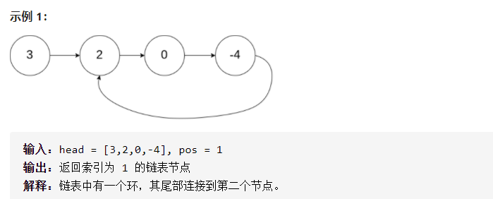

##### 方法一 双指针

> 我们使用两个指针，$\textit{fast}$与$ \textit{slow}$。它们起始都位于链表的头部。随后，$\textit{slow}$指针每次向后移动一个位置，而 $\textit{fast}$指针向后移动两个位置。如果链表中存在环，则 $\textit{fast}$指针最终将再次与$ \textit{slow}$指针在环中相遇。
>
> 如下图所示，设链表中环外部分的长度为 $a$。$\textit{slow}$指针进入环后，又走了$b$ 的距离与 $\textit{fast}$相遇。
>
> 显然，当$fast$与$slow$相遇的时候，$fast$走过的长度和刚好是$slow$的两倍。
>
> 我们不妨假设$2（a+b） = a+b+c$，可得到$a=c$。也就是说，$slow$再运动到环的起点的时候，刚好与$head$走到起点的距离是一样的。
>
> 因此，当发现 $\textit{slow}$与 $\textit{fast}$相遇时，我们再额外使用一个指针$ \textit{ptr}$。起始，它指向链表头部；随后，它和 $\textit{slow}$每次向后移动一个位置。最终，它们会在入环点相遇。
>
> 
>
> ```java
> public ListNode detectCycle(ListNode head) {
>         if (head==null || head.next==null)
>             return null;
>         ListNode fast = head;
>         ListNode slow = head;
> 
>         while (fast!=null && fast.next != null){
>             fast = fast.next.next; //先移动的原因是刚开始fast与slow同时指向head
>             slow = slow.next; 
>             if (fast == slow)
>                 break;
>         }
>         if (fast==null || fast.next==null)
>             return null;
>         ListNode curr = head;
>         while (curr != slow){
>             curr = curr.next;
>             slow = slow.next;
>         }
>         return curr;
>     }
> ```

##### 方法二 哈希表

> 一个非常直观的思路是：我们遍历链表中的每个节点，并将它记录下来；一旦遇到了此前遍历过的节点，就可以判定链表中存在环。借助哈希表可以很方便地实现。
>
> ```java
>         ListNode curr = head;
>         HashSet<ListNode> set = new HashSet<>();
>         while (curr!=null){
>             if (set.contains(curr)){
>                 return curr;
>             }
>             else set.add(curr);
>         }
>         return null;
> ```

> HashSet 基于 HashMap 来实现的，是一个不允许有重复元素的集合。
>
> HashSet 允许有 null 值。
>
> HashSet 是无序的，即不会记录插入的顺序。
>
> HashSet 不是线程安全的， 如果多个线程尝试同时修改 HashSet，则最终结果是不确定的。 您必须在多线程访问时显式同步对 HashSet 的并发访问。
>
> HashSet 实现了 Set 接口。
> 添加元素可以使用 add() 方法:
>
> - 可以使用 contains() 方法来判断元素是否存在于集合当中
> - 以使用 remove() 方法来删除集合中的元素
> - 删除集合中所有元素可以使用 clear 方法
> - 要计算 HashSet 中的元素数量可以使用 size() 方法

#### [LRU 缓存机制](https://leetcode-cn.com/problems/lru-cache/)

> 运用你所掌握的数据结构，设计和实现一个  LRU (最近最少使用) 缓存机制 。
> 实现 `LRUCache `类：
>
> - `LRUCache(int capacity) `以正整数作为容量 capacity 初始化 LRU 缓存
> - `int get(int key) `如果关键字 key 存在于缓存中，则返回关键字的值，否则返回 -1 
> - `void put(int key, int value)` 如果关键字已经存在，则变更其数据值；如果关键字不存在，则插入该组「关键字-值」。当缓存容量达到上限时，它应该在写入新数据之前删除最久未使用的数据值，从而为新的数据值留出空间。
>
> $$
> 输入\\
> ["LRUCache", "put", "put", "get", "put", "get", "put", "get", "get", "get"]\\
> [[2], [1, 1], [2, 2], [1], [3, 3], [2], [4, 4], [1], [3], [4]]\\
> 输出\\
> [null, null, null, 1, null, -1, null, -1, 3, 4]\\
> 
> 解释\\
> LRUCache lRUCache = new LRUCache(2);\\
> lRUCache.put(1, 1); // 缓存是 {1=1}\\
> lRUCache.put(2, 2); // 缓存是 {1=1, 2=2}\\
> lRUCache.get(1);    // 返回 1\\
> lRUCache.put(3, 3); // 该操作会使得关键字 2 作废，缓存是 {1=1, 3=3}\\
> lRUCache.get(2);    // 返回 -1 (未找到)\\
> lRUCache.put(4, 4); // 该操作会使得关键字 1 作废，缓存是 {4=4, 3=3}\\
> lRUCache.get(1);    // 返回 -1 (未找到)\\
> lRUCache.get(3);    // 返回 3\\
> lRUCache.get(4);    // 返回 4\\
> $$

##### 方法 哈希表 + 双向链表

> LRU 缓存机制可以通过哈希表辅以双向链表实现，我们用一个哈希表和一个双向链表维护所有在缓存中的键值对。
>
> - 双向链表按照被使用的顺序存储了这些键值对，靠近头部的键值对是最近使用的，而靠近尾部的键值对是最久未使用的。
>
> - 哈希表即为普通的哈希映射（HashMap），通过缓存数据的键映射到其在双向链表中的位置。
>
>
> 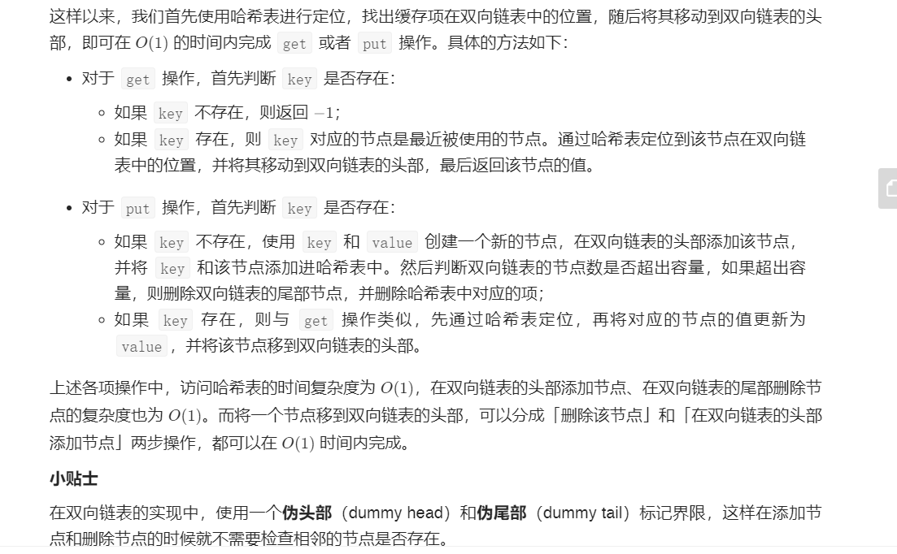
>
> ```java
> public class LRUCache {
>     class DLinkedNode {
>         int key;
>         int value;
>         DLinkedNode prev;
>         DLinkedNode next;
>         public DLinkedNode() {}
>         public DLinkedNode(int _key, int _value) {key = _key; value = _value;}
>     }
> 
>     private Map<Integer, DLinkedNode> cache = new HashMap<Integer, DLinkedNode>();
>     private int size;
>     private int capacity;
>     private DLinkedNode head, tail;
> 
>     public LRUCache(int capacity) {
>         this.size = 0;
>         this.capacity = capacity;
>         // 使用伪头部和伪尾部节点
>         head = new DLinkedNode();
>         tail = new DLinkedNode();
>         head.next = tail;
>         tail.prev = head;
>     }
> 
>     public int get(int key) {
>         DLinkedNode node = cache.get(key);
>         if (node == null) {
>             return -1;
>         }
>         // 如果 key 存在，先通过哈希表定位，再移到头部
>         moveToHead(node);
>         return node.value;
>     }
> 
>     public void put(int key, int value) {
>         DLinkedNode node = cache.get(key);
>         if (node == null) {
>             // 如果 key 不存在，创建一个新的节点
>             DLinkedNode newNode = new DLinkedNode(key, value);
>             // 添加进哈希表
>             cache.put(key, newNode);
>             // 添加至双向链表的头部
>             addToHead(newNode);
>             ++size;
>             if (size > capacity) {
>                 // 如果超出容量，删除双向链表的尾部节点
>                 DLinkedNode tail = removeTail();
>                 // 删除哈希表中对应的项
>                 cache.remove(tail.key);
>                 --size;
>             }
>         }
>         else {
>             // 如果 key 存在，先通过哈希表定位，再修改 value，并移到头部
>             node.value = value;
>             moveToHead(node);
>         }
>     }
> 
>     private void addToHead(DLinkedNode node) {
>         node.prev = head;
>         node.next = head.next;
>         head.next.prev = node;
>         head.next = node;
>     }
> 
>     private void removeNode(DLinkedNode node) {
>         node.prev.next = node.next;
>         node.next.prev = node.prev;
>     }
> 
>     private void moveToHead(DLinkedNode node) {
>         removeNode(node);
>         addToHead(node);
>     }
> 
>     private DLinkedNode removeTail() {
>         DLinkedNode res = tail.prev;
>         removeNode(res);
>         return res;
>     }
> }
> ```

#### [排序链表](https://leetcode-cn.com/problems/sort-list/)

> 给你链表的头结点 `head` ，请将其按 **升序** 排列并返回 **排序后的链表** 。
>
> 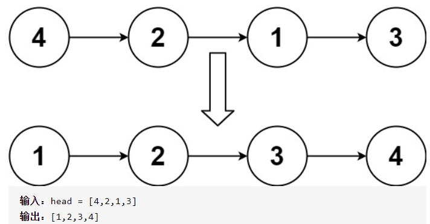

> 目的进阶问题要求达到 $O(n \log n)$) 的时间复杂度和 $O(1)$ 的空间复杂度，时间复杂度是 $O(n \log n)$ 的排序算法包括归并排序、堆排序和快速排序（快速排序的最差时间复杂度是 $O(n^2)$），其中最适合链表的排序算法是归并排序。
>
> 归并排序基于分治算法。最容易想到的实现方式是自顶向下的递归实现，考虑到递归调用的栈空间，自顶向下归并排序的空间复杂度是$ O(\log n)$。如果要达到$ O(1)$ 的空间复杂度，则需要使用自底向上的实现方式。

`归并排序`

> **归并排序**（Merge Sort）是建立在[归并](https://baike.baidu.com/item/归并/253741)操作上的一种有效，稳定的[排序算法](https://baike.baidu.com/item/排序算法/5399605)，该算法是采用[分治法](https://baike.baidu.com/item/分治法/2407337)（Divide and Conquer）的一个非常典型的应用。将已有序的子序列[合并](https://baike.baidu.com/item/合并/5615281)，得到完全有序的[序列](https://baike.baidu.com/item/序列/1302588)；即先使每个子序列有序，再使子序列段间有序。若将两个有序表合并成一个有序表，称为[二路归并](https://baike.baidu.com/item/二路归并/53201558)。
>
> 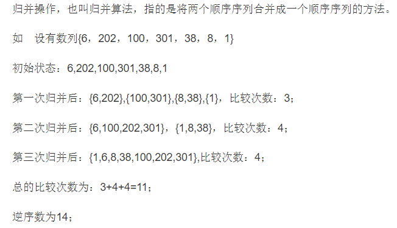

##### 方法一：自顶向下归并排序

> 对链表自顶向下归并排序的过程如下。
>
> 1. 找到链表的中点，以中点为分界，将链表拆分成两个子链表。寻找链表的中点可以使用==快慢指针==的做法，快==指针每次移动 2 步，慢指针每次移动 1 步，当快指针到达链表末尾时，慢指针指向的链表节点即为链表的中点==。
>
> 2. 对两个子链表分别排序。
>
> 3. 将两个排序后的子链表合并，得到完整的排序后的链表。可以使用「[21. 合并两个有序链表](https://leetcode-cn.com/problems/merge-two-sorted-lists/)的做法，将两个有序的子链表进行合并。
>
> 上述过程可以通过递归实现。递归的终止条件是链表的节点个数小于或等于 1，即当链表为空或者链表只包含1 个节点时，不需要对链表进行拆分和排序。
>
> ```java
> class Solution {
>     public ListNode sortList(ListNode head) {
>         return SortLink(head, null);
>     }
>     public ListNode SortLink(ListNode head, ListNode tail){
>         if (head==null)
>             return head;
>         if (head.next==tail){
>             head.next=null;
>             return head;
>         }
>         ListNode fast=head, slow=head;
>         while (fast!=tail){
>             fast = fast.next;
>             slow = slow.next;
>             if (fast!=tail)
>                 fast = fast.next;
>         }
>         ListNode mid = slow;
>         ListNode list1 = SortLink(head, mid);
>         ListNode list2 = SortLink(mid, tail);
>         ListNode sort = Merge(list1, list2);
>         return sort;
>     }
> 
>     private ListNode Merge(ListNode list1, ListNode list2) {
>         ListNode dummynode = new ListNode(0);
>         ListNode temp=dummynode, temp1 = list1, temp2=list2;
>         while (temp1!=null && temp2!=null){
>             if (temp1.val <= temp2.val){
>                 temp.next = temp1;
>                 temp1 = temp1.next;
>             }
>             else{
>                 temp.next = temp2;
>                 temp2 = temp2.next;
>             }
>             temp = temp.next;
>         }
>         if (temp1!=null){
>             temp.next = temp1;
>         }
>         if (temp2!=null){
>             temp.next = temp2;
>         }
>         return dummynode.next;
>     }
> ```

##### 方法二： 自底向上归并排序

> 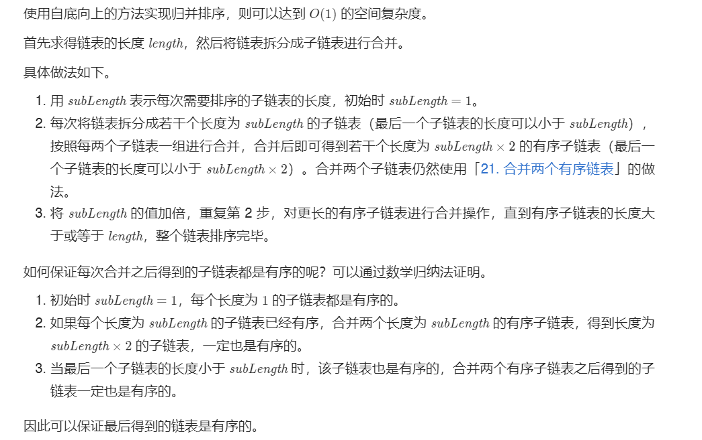
>
> ```java
> public ListNode sortList(ListNode head) {
>         int length = 0;
>         ListNode node = head; //找到链表长度
>         while (node!=null){
>             node = node.next;
>             length++;
>         }
>         //初始化
>         ListNode dummynode = new ListNode(0);
>         dummynode.next = head;
>         // 循环  子链表从1开始
>         for (int sublength=1;sublength<length;sublength<<=1){
>             ListNode prev = dummynode;
>             ListNode curr = dummynode.next;
> 
>             while (curr!=null){
>                 ListNode head1 = curr;
>                 for (int i=1;i<sublength&&curr!=null&&curr.next!=null;i++){
>                     curr = curr.next;
>                     //第一个链表
>                 }
>                 //第二个链表
>                 ListNode head2 = curr.next;
>                 curr.next = null;
>                 curr = head2;
>                 for (int i=1;i<sublength&&curr!=null&&curr.next!=null;i++){
>                     curr = curr.next;
>                 }
> 
>                 //如果不是因为到了链表结尾而终止，就把第二个链表断开
>                 ListNode next = null;
>                 if (curr!=null){
>                     next = curr.next;
>                     curr.next = null;
>                 }
> 
>                 //合并两个链表
>                 ListNode merged = Merge(head1, head2);
>                 prev.next = merged;
>                 while (prev.next!=null)
>                     prev = prev.next;
>                 
>                 curr = next;
>             }
>         }
>         return dummynode.next;
>     }
>     private ListNode Merge(ListNode list1, ListNode list2) {
>         ListNode dummynode = new ListNode(0);
>         ListNode temp=dummynode, temp1 = list1, temp2=list2;
>         while (temp1!=null && temp2!=null){
>             if (temp1.val <= temp2.val){
>                 temp.next = temp1;
>                 temp1 = temp1.next;
>             }
>             else{
>                 temp.next = temp2;
>                 temp2 = temp2.next;
>             }
>             temp = temp.next;
>         }
>         if (temp1!=null){
>             temp.next = temp1;
>         }
>         if (temp2!=null){
>             temp.next = temp2;
>         }
>         return dummynode.next;
>     }
> ```

#### [乘积最大子数组](https://leetcode-cn.com/problems/maximum-product-subarray/)

> 给你一个整数数组 `nums` ，请你找出数组中乘积最大的连续子数组（该子数组中至少包含一个数字），并返回该子数组所对应的乘积。

##### 方法：动态规划

> 我们可以这样进行状态设计，也就是以$ nums[i]$ 结尾的连续子数组的最大值。现在具体看下如何进行状态设计、推导状态转移方程，进而加以实现。因为数组中存在着负数，所以有可能导致乘积会从最大变为最小，同样的，最小也可能变为最大。\
>
> ==“由于存在负数，那么会导致最大的变最小的，最小的变最大的。因此还需要维护当前最小值==
>
> ```java
>     public int maxProduct(int[] nums) {
>         int length = nums.length;
>         if (length==0)
>             return 0;
>         if (length==1)
>             return nums[0];
>         
>         int Max=nums[0], Min=nums[0], ans=nums[0];
>         for (int i=1;i<length;i++){
>             int mx=Max, mn=Min;
>             Max = Math.max(mx*nums[i], Math.max(nums[i], mn*nums[i]));
>             Min = Math.min(mn*nums[i], Math.min(nums[i], mx*nums[i]));
>             ans = Math.max(Max, ans);
>         }
>         return ans;
>     }
> ```

#### [最小栈](https://leetcode-cn.com/problems/min-stack/)

> 设计一个支持 push ，pop ，top 操作，并能在常数时间内检索到最小元素的栈。
>
> - push(x) —— 将元素 x 推入栈中。
> - pop() —— 删除栈顶的元素。
> - top() —— 获取栈顶元素。
> - getMin() —— 检索栈中的最小元素。
>
> $$
> 输入：
> ["MinStack","push","push","push","getMin","pop","top","getMin"]\\
> [[],[-2],[0],[-3],[],[],[],[]]\\
> 
> 输出：\\
> [null,null,null,null,-3,null,0,-2]\\
> \\
> 解释：
> MinStack minStack = new MinStack();\\
> minStack.push(-2);\\
> minStack.push(0);\\
> minStack.push(-3);\\
> minStack.getMin();   --> 返回 -3.\\
> minStack.pop();\\
> minStack.top();      --> 返回 0.\\
> minStack.getMin();   --> 返回 -2.\\
> $$

##### 方法一 辅助栈

> 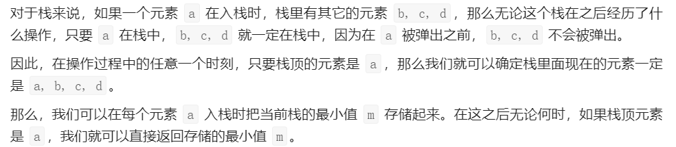
>
> 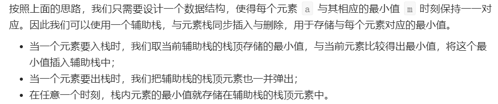
>
> ```java
>     Deque<Integer> xstack;
>     Deque<Integer> minstack;
>     public MinStack() {
>         xstack = new LinkedList<>();
>         minstack = new LinkedList<>();
>         minstack.push(Integer.MAX_VALUE);
>     }
> 
>     public void push(int val) {
>         xstack.push(val);
>         minstack.push(Math.min(val, minstack.peek()));
>     }
> 
>     public void pop() {
>         xstack.pop();
>         minstack.pop();
>     }
> 
>     public int top() {
>         return xstack.peek();
>     }
> 
>     public int getMin() {
>         return minstack.peek();
>     }
> ```

##### 方法二 链表

> 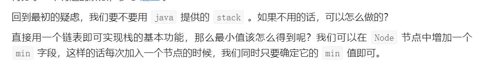
>
> ```java
> class MinStack {
> 
>     /** initialize your data structure here. */
>         class Node{
>             int value;
>             int min;
>             Node next;
>             Node(){}
>             Node(int _value, int _min){this.value=_value; this.min=_min;next=null;}
>     }
>     Node head;
> 
>     public MinStack() {
>         head = null;
>     }
> 
>     public void push(int val) {
>         if (head==null){
>             Node node = new Node(val, val);
>             head = node;
>         }
>         else {
>             Node node = new Node(val, Math.min(val, head.min));
>             node.next = head;
>             head = node;
>         }
>     }
> 
>     public void pop() {
>         if (head==null)
>             return;
>         else {
>             head = head.next;
>         }
>     }
> 
>     public int top() {
>         if (head==null)
>             return -1;
>         else return head.value;
>     }
> 
>     public int getMin() {
>         if (head==null)
>             return -1;
>         else return head.min;
>     }
> }
> ```

#### [相交链表](https://leetcode-cn.com/problems/intersection-of-two-linked-lists/)

> 编写一个程序，找到两个单链表相交的起始节点。
>
> 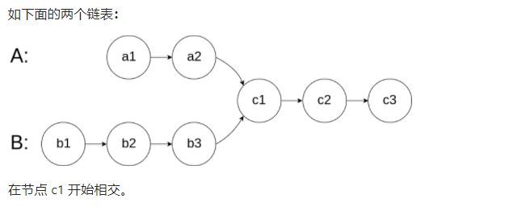

##### 方法一：暴力解决

> 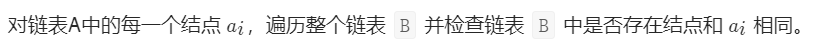

##### 方法二：哈希表

> 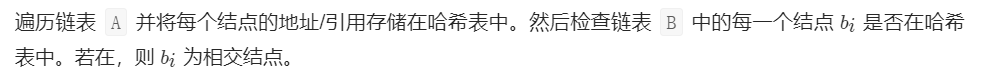

##### 方法三：双指针法

> 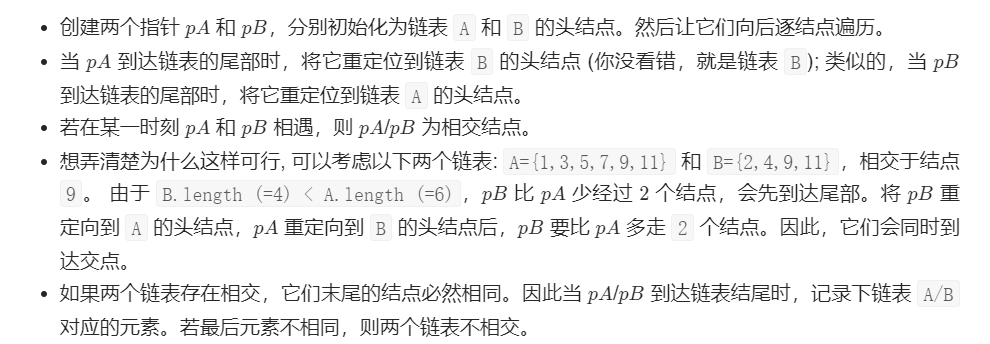

##### 方法四：判断长度

> 因为两个链表不一样长，那么第一次遍历，分别记录两个链表的长度。然后将长度作差，让更长的链表先走相差的那些步，然后两个链表一起走，然后相遇的第一个结点即为两个链表相交的交点。
>
> ```java
>     public ListNode getIntersectionNode(ListNode headA, ListNode headB) {
>         //判断哪个链表更长
>         ListNode A=headA, B=headB;
>         int lengthA=1, lengthB=1;
>         while (A.next!=null){
>             lengthA++;
>             A = A.next;
>         }
> 
>         while (B.next!=null){
>             lengthB++;
>             B = B.next;
>         }
> 
>         int abs = Math.abs(lengthA-lengthB);
>         ListNode nodeA=headA, nodeB=headB;
> 
>         if (lengthA >= lengthB){
>             for (int i=1;i<=abs;i++)
>                 nodeA = nodeA.next;
>         }
>         else {
>             for (int i=1;i<=abs;i++)
>                 nodeB = nodeB.next;
>             }
>         while (lengthA>0){
>             if (nodeA==nodeB)
>                 return nodeA;
>             nodeA = nodeA.next;
>             nodeB = nodeB.next;
>         }
>         return null;
>     }
> ```

#### [多数元素](https://leetcode-cn.com/problems/majority-element/)

> 给定一个大小为 n 的数组，找到其中的多数元素。多数元素是指在数组中出现次数 大于 ⌊ n/2 ⌋ 的元素。
>
> 你可以假设数组是非空的，并且给定的数组总是存在多数元素。
>

##### 方法一：存储每个元素出现的次数

> 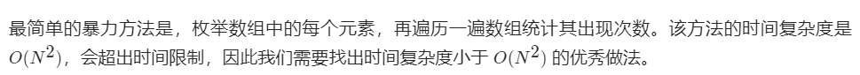

##### 方法二：哈希表

> 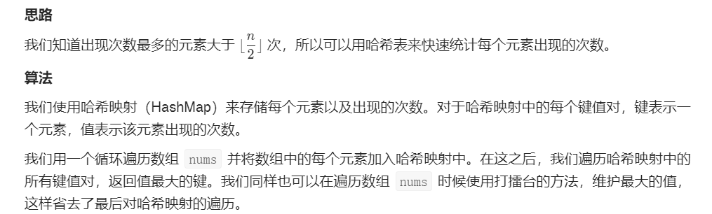
>
> ```java
> public int majorityElement(int[] nums) {
>     HashMap<Integer, Integer> map = new HashMap<>();
>     int n = nums.length;
>     for (int i = 0; i < nums.length; i++) {
>         int before = map.getOrDefault(nums[i], 0);
>         if (before == n / 2) { //超过半数的数字一定有且只有一个。所以在计数过程中如果出现了超过半数的数字，我们可以立刻返回
>             return nums[i];
>         }
>         map.put(nums[i], before + 1);
>     }
>     //随便返回一个
>     return -1;
> }
> ```

##### 方法四：排序

> 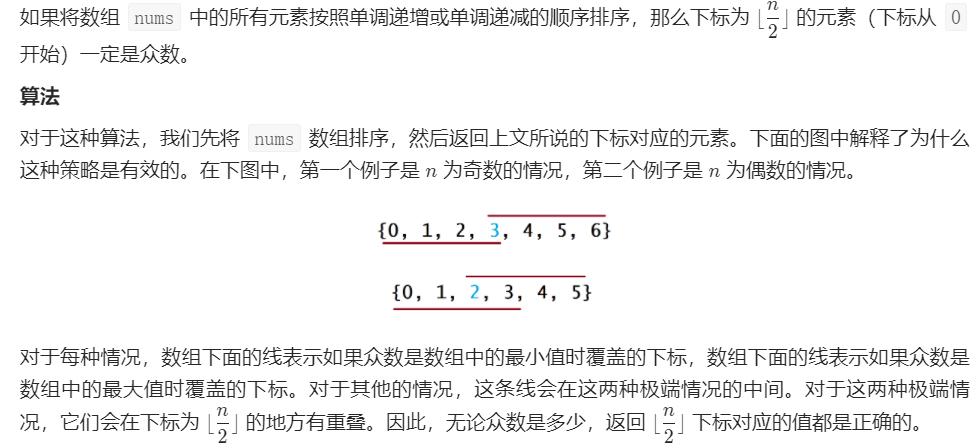
>
> ```java
> class Solution {
>     public int majorityElement(int[] nums) {
>         Arrays.sort(nums);
>         return nums[nums.length / 2];
>     }
> }
> ```

##### 解法五 摩尔投票法

> 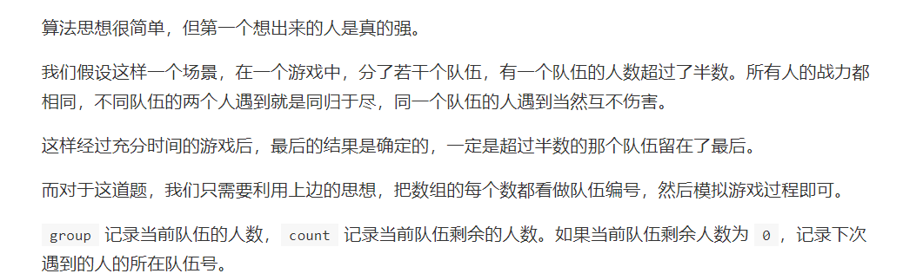
>
> ```java
>         int group = nums[0];
>         int count = 1;
>         for (int i=1;i<nums.length;i++){
>             if (count==0){
>                 group = nums[i];
>                 count=1;
>                 continue;
>             }
>             if (group == nums[i])
>                 count++;
>             else count--;
>         }
>         return group;
> ```
>

#### [打家劫舍](https://leetcode-cn.com/problems/house-robber/)

> 你是一个专业的小偷，计划偷窃沿街的房屋。每间房内都藏有一定的现金，影响你偷窃的唯一制约因素就是相邻的房屋装有相互连通的防盗系统，如果两间相邻的房屋在同一晚上被小偷闯入，系统会自动报警。
>
> 给定一个代表每个房屋存放金额的非负整数数组，计算你 不触动警报装置的情况下 ，一夜之内能够偷窃到的最高金额。
> $$
> 输入：[1,2,3,1]\\
> 输出：4\\
> 解释：偷窃 1 号房屋 (金额 = 1) ，然后偷窃 3 号房屋 (金额 = 3)。\\
>      偷窃到的最高金额 = 1 + 3 = 4 。
> $$

##### 方法：动态规划

> 下面是自己的思路：
>
> ```java
> public int rob(int[] nums) {
>         /*
>         动态规划
>          */
>         int length = nums.length;
>         int[] dp = new int[length];
>         if (length==1)
>             return nums[0];
>         if (length==2)
>             return Math.max(nums[0], nums[1]);
>         if (length==3)
>             return Math.max(nums[0] + nums[2], nums[1]);
>         dp[0] = nums[0];
>         dp[1] = nums[1];
>         dp[2] = dp[0] + nums[2];
>         for (int i=3;i<length;i++){
>             dp[i] = nums[i] + Math.max(dp[i-2], dp[i-3]);
>         }
>         return Math.max(dp[length-1], dp[length-2]);
>     }
>     public static void main(String[] args){
>         int[] nums = new int[]{2, 1, 1, 2};
>         test198 test = new test198();
>         System.out.println(test.rob(nums));
>     }
> ```

> 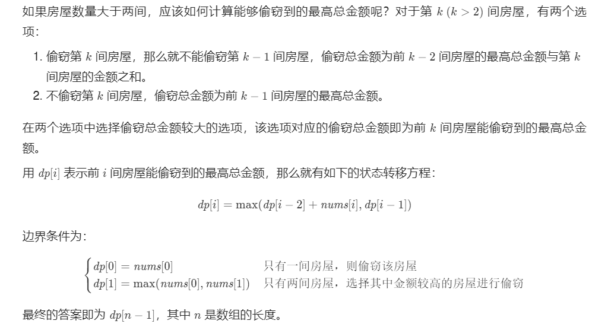
>
> ```java
>     public int rob(int[] nums) {
>         if (nums == null || nums.length == 0) {
>             return 0;
>         }
>         int length = nums.length;
>         if (length == 1) {
>             return nums[0];
>         }
>         int[] dp = new int[length];
>         dp[0] = nums[0];
>         dp[1] = Math.max(nums[0], nums[1]);
>         for (int i = 2; i < length; i++) {
>             dp[i] = Math.max(dp[i - 2] + nums[i], dp[i - 1]);
>         }
>         return dp[length - 1];
>     }
> ```

> 上述方法使用了数组存储结果。考虑到每间房屋的最高总金额只和该房屋的前两间房屋的最高总金额相关，因此可以使用滚动数组，在每个时刻只需要存储前两间房屋的最高总金额。
>
> ```java
>     public int rob(int[] nums) {
>         if (nums == null || nums.length == 0) {
>             return 0;
>         }
>         int length = nums.length;
>         if (length == 1) {
>             return nums[0];
>         }
>         int first = nums[0], second = Math.max(nums[0], nums[1]);
>         for (int i = 2; i < length; i++) {
>             int temp = second;
>             second = Math.max(first + nums[i], second);
>             first = temp;
>         }
>         return second;
>     }
> ```

#### [岛屿数量](https://leetcode-cn.com/problems/number-of-islands/)

##### 方法一：深度优先遍历

> 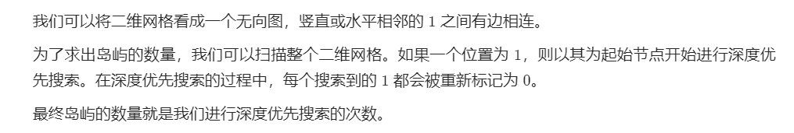
>
> ```java
> public int numIslands(char[][] grid) {
>         // 深度优先遍历
>         int row=grid.length, col=grid[0].length;
>         int count=0;
>         
>         for (int i=0;i<row;i++){
>             for (int j=0;j<col;j++){
>                 if (grid[i][j] == '1'){
>                     count++;
>                     dfs(grid, i, j);
>                 }
>             }
>         }
>         return count;
>     }
> 
>     private void dfs(char[][] grid, int i, int j) {
>         int row=grid.length, col=grid[0].length;
>         
>         if (i<0 || j<0 || i>=row || j>=col || grid[i][j]=='0')
>             return;
>         
>         grid[i][j] = '0';
>         dfs(grid, i+1, j);        
>         dfs(grid, i-1, j);        
>         dfs(grid, i, j+1);        
>         dfs(grid, i, j-1);        
>     }
> ```

##### 方法二：宽度优先遍历

> 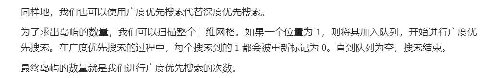
>
> ```java
> if (grid==null || grid.length==0)
>             return 0;
> 
>         int row=grid.length, col= grid[0].length;
>         int count=0;
> 
>         for (int i=0;i<row;i++){
>             for (int j=0;j<col;j++){
>                 if (grid[i][j] == '1'){
>                     count++;
>                     grid[i][j] = '0';
>                     Queue<Integer> neighbors = new LinkedList<>();
>                     neighbors.add(i*col+j);
>                     while (!neighbors.isEmpty()){
>                         int curr = neighbors.remove();
>                         int x = curr / col;
>                         int y = curr % col;
> 
>                         if ((x-1)>=0 && grid[x-1][y]=='1'){
>                             neighbors.add((x-1)*col+y);
>                             grid[x-1][y] = '0';
>                         }
>                         if ((x+1)<row && grid[x+1][y]=='1'){
>                             neighbors.add((x+1)*col+y);
>                             grid[x+1][y] = '0';
>                         }
>                         if ((y-1)>=0 && grid[x][y-1]=='1'){
>                             neighbors.add(x*col+y-1);
>                             grid[x][y-1] = '0';
>                         }
>                         if ((y+1)<col && grid[x][y+1]=='1'){
>                             neighbors.add(x*col+y+1);
>                             grid[x][y+1] = '0';
>                         }
>                     }
>                 }
>             }
>         }
>         return count;
> ```

##### 方法三：并查集

>  为了求出岛屿的数量，我们可以扫描整个二维网格。如果一个位置为 1，则将其与相邻四个方向上的 1 在并查集中进行合并。
>
> 最终岛屿的数量就是并查集中连通分量的数目。
>
> 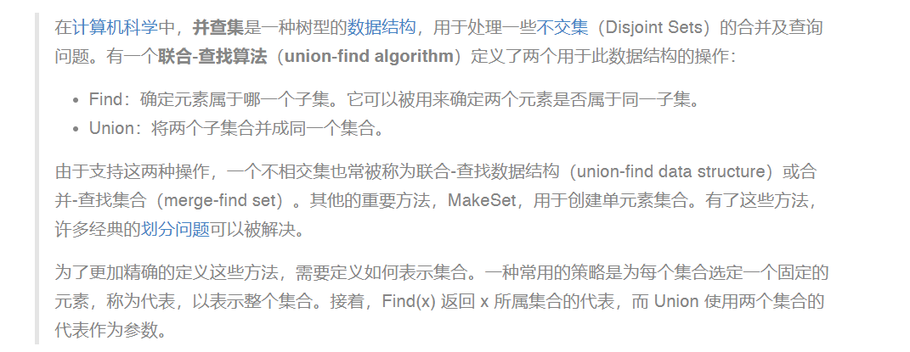
>
> ```java
> class Solution {
>     class UnionFind {
>         int count;
>         int[] parent;
>         int[] rank;
> 
>         public UnionFind(char[][] grid) {
>             count = 0;
>             int m = grid.length;
>             int n = grid[0].length;
>             parent = new int[m * n];
>             rank = new int[m * n];
>             for (int i = 0; i < m; ++i) {
>                 for (int j = 0; j < n; ++j) {
>                     if (grid[i][j] == '1') {
>                         parent[i * n + j] = i * n + j;
>                         ++count;
>                     }
>                     rank[i * n + j] = 0;
>                 }
>             }
>         }
> 
>         public int find(int i) {
>             if (parent[i] != i) parent[i] = find(parent[i]);
>             return parent[i];
>         }
> 
>         public void union(int x, int y) {
>             int rootx = find(x);
>             int rooty = find(y);
>             if (rootx != rooty) {
>                 if (rank[rootx] > rank[rooty]) {
>                     parent[rooty] = rootx;
>                 } else if (rank[rootx] < rank[rooty]) {
>                     parent[rootx] = rooty;
>                 } else {
>                     parent[rooty] = rootx;
>                     rank[rootx] += 1;
>                 }
>                 --count;
>             }
>         }
> 
>         public int getCount() {
>             return count;
>         }
>     }
> 
>     public int numIslands(char[][] grid) {
>         if (grid == null || grid.length == 0) {
>             return 0;
>         }
> 
>         int nr = grid.length;
>         int nc = grid[0].length;
>         int num_islands = 0;
>         UnionFind uf = new UnionFind(grid);
>         for (int r = 0; r < nr; ++r) {
>             for (int c = 0; c < nc; ++c) {
>                 if (grid[r][c] == '1') {
>                     grid[r][c] = '0';
>                     if (r - 1 >= 0 && grid[r-1][c] == '1') {
>                         uf.union(r * nc + c, (r-1) * nc + c);
>                     }
>                     if (r + 1 < nr && grid[r+1][c] == '1') {
>                         uf.union(r * nc + c, (r+1) * nc + c);
>                     }
>                     if (c - 1 >= 0 && grid[r][c-1] == '1') {
>                         uf.union(r * nc + c, r * nc + c - 1);
>                     }
>                     if (c + 1 < nc && grid[r][c+1] == '1') {
>                         uf.union(r * nc + c, r * nc + c + 1);
>                     }
>                 }
>             }
>         }
> 
>         return uf.getCount();
>     }
> }
> ```

#### [反转链表](https://leetcode-cn.com/problems/reverse-linked-list/)

> ```java
> public ListNode reverseList(ListNode head) {
>     ListNode prev = null;
>     ListNode curr = head;
>     while(curr!=null){
>         ListNode next = curr.next;
>         curr.next = prev;
>         prev = curr;
>         curr = next;
>     }
>     return prev;
> }
> ```
>

#### [课程表](https://leetcode-cn.com/problems/course-schedule/)

> 你这个学期必须选修` numCourses `门课程，记为` 0` 到` numCourses - 1` 。
>
> 在选修某些课程之前需要一些先修课程。 先修课程按数组` prerequisites `给出，其中` prerequisites[i] = [ai, bi] `，表示如果要学习课程` ai `则 必须 先学习课程`  bi` 。
>
> 例如，先修课程对 `[0, 1]` 表示：想要学习课程` 0` ，你需要先完成课程` 1` 。
> 请你判断是否可能完成所有课程的学习？如果可以，返回 `true` ；否则，返回` false` 。

> 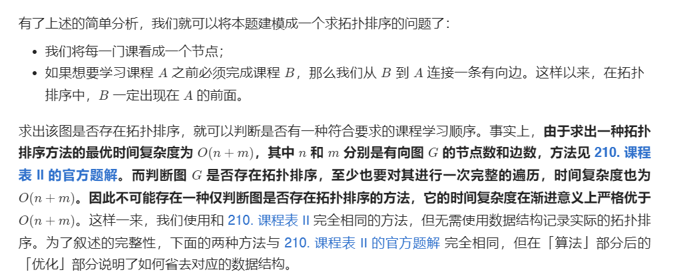

##### 方法一：深度优先遍历

> 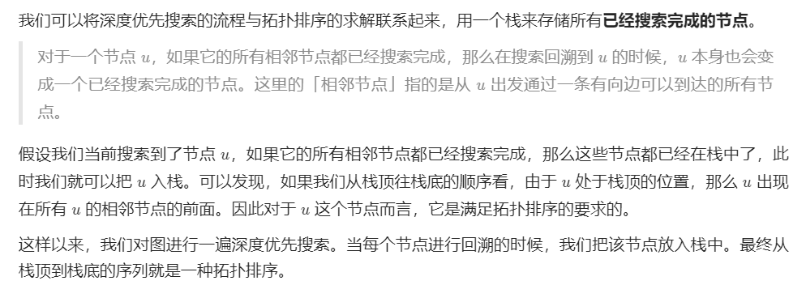
>
> 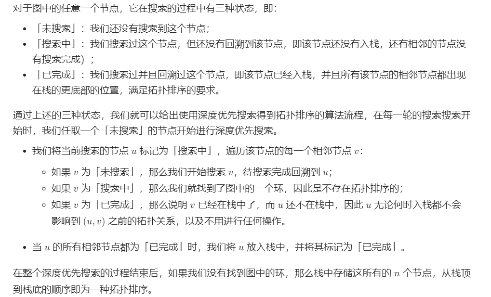

```java
class Solution {
    List<List<Integer>> edgs;
    int[] visited;
    boolean flag = true;
    public boolean canFinish(int numCourses, int[][] prerequisites) {
        // 深度优先遍历
        edgs = new ArrayList<List<Integer>>();
        visited = new int[numCourses];
        for (int i=0;i<numCourses;i++)
            edgs.add(new ArrayList<>());

        for (int[] info: prerequisites){
            edgs.get(info[1]).add(info[0]);
        }

        for (int i=0;i<numCourses && flag;i++)
            if (visited[i]==0)
                dfs(i);

        return flag;
    }

    public void dfs(int u){
        visited[u] = 1;
        for (int v:edgs.get(u)){
            if (visited[v] == 0){
                visited[v] = 1;
                dfs(v);
                if (!flag)
                    return;
            }
            if (visited[v] == 1){
                flag = false;
                return;
            }
        }
        visited[u] = 2;
    }
}
```

##### 方法二：广度优先遍历

> 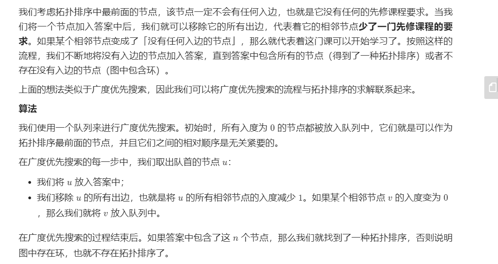
>
> ```java
> class Solution {
> 
>     List<List<Integer>> edges;
>     int[] indeg;
> 
>     public boolean canFinish(int numCourses, int[][] prerequisites) {
>         // 广度优先遍历
>         edges = new ArrayList<>();
>         indeg = new int[numCourses];
>         for (int i=0;i<numCourses;i++){
>             edges.add(new ArrayList<>());
>         }
> 
>         for (int[] info: prerequisites){
>             edges.get(info[1]).add(info[0]);
>             indeg[info[0]]++;
>         }
> 
>         Queue<Integer> queue = new LinkedList<>();
>         for (int i=0;i<numCourses;i++){
>             if (indeg[i]==0)
>                 queue.offer(i);
>             //Queue 中 add() 和 offer()都是用来向队列添加一个元素。
>             //在容量已满的情况下，add() 方法会抛出IllegalStateException异常，offer() 方法只会返回 false 。
>         }
> 
>         int visited = 0;
>         while (!queue.isEmpty()){
>             visited++;
>             int u = queue.poll();
>             //Queue 中 remove() 和 poll()都是用来从队列头部删除一个元素。
> 	   //在队列元素为空的情况下，remove() 方法会抛出NoSuchElementException异常，poll() 方法只会返回 null 。
>             for (int v:edges.get(u)){
>                 --indeg[v];
>                 if (indeg[v] == 0) {
>                     queue.offer(v);
>                 }
>             }
>         }
>         return visited == numCourses;
>     }
> }
> ```

#### [实现 Trie (前缀树)](https://leetcode-cn.com/problems/implement-trie-prefix-tree/)

> 实现一个 Trie (前缀树)，包含 `insert`, `search`, 和 `startsWith` 这三个操作。
> $$
> Trie trie = new Trie();\\
> 
> trie.insert("apple");\\
> trie.search("apple");   // 返回 true\\
> trie.search("app");     // 返回 false\\
> trie.startsWith("app"); // 返回 true\\
> trie.insert("app");   \\
> trie.search("app");     // 返回 true\\
> $$

***我是想着用个数组实现的，自己运行的时候没错，提交的时候一直有错误。***

> ```java
> class Trie {
> 
>     String[] tree;
>     int length;
>     /** Initialize your data structure here. */
>     public Trie() {
>         tree = new String[100];
>         length = 0;
>     }
> 
>     /** Inserts a word into the trie. */
>     public void insert(String word) {
>         for (int i=length-1;i>=0;i--)
>             tree[i+1] = tree[i];
>         tree[0] = word;
>         length++;
>     }
> 
>     /** Returns if the word is in the trie. */
>     public boolean search(String word) {
>         for (int i=0;i<length;i++)
>             if (tree[i] == word)
>                 return true;
>         return false;
>     }
> 
>     /** Returns if there is any word in the trie that starts with the given prefix. */
>     public boolean startsWith(String prefix) {
>         if (tree[0] == prefix)
>             return true;
>         return false;
>     }
> }
> 
> /**
>  * Your Trie object will be instantiated and called as such:
>  * Trie obj = new Trie();
>  * obj.insert(word);
>  * boolean param_2 = obj.search(word);
>  * boolean param_3 = obj.startsWith(prefix);
>  */
> ```

> ```java
> class TrieNode {
> 
>     // R links to node children
>     private TrieNode[] links;
> 
>     private final int R = 26;
> 
>     private boolean isEnd;
> 
>     public TrieNode() {
>         links = new TrieNode[R];
>     }
> 
>     public boolean containsKey(char ch) {
>         return links[ch -'a'] != null;
>     }
>     public TrieNode get(char ch) {
>         return links[ch -'a'];
>     }
>     public void put(char ch, TrieNode node) {
>         links[ch -'a'] = node;
>     }
>     public void setEnd() {
>         isEnd = true;
>     }
>     public boolean isEnd() {
>         return isEnd;
>     }
> }
> ```
>
> 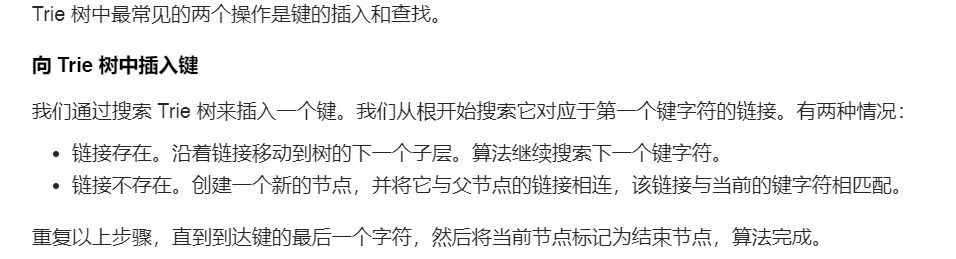
>
> ```java
> class Trie {
>     private TrieNode root;
> 
>     public Trie() {
>         root = new TrieNode();
>     }
> 
>     // Inserts a word into the trie.
>     public void insert(String word) {
>         TrieNode node = root;
>         for (int i = 0; i < word.length(); i++) {
>             char currentChar = word.charAt(i);
>             if (!node.containsKey(currentChar)) {
>                 node.put(currentChar, new TrieNode());
>             }
>             node = node.get(currentChar);
>         }
>         node.setEnd();
>     }
> }
> ```
>
> 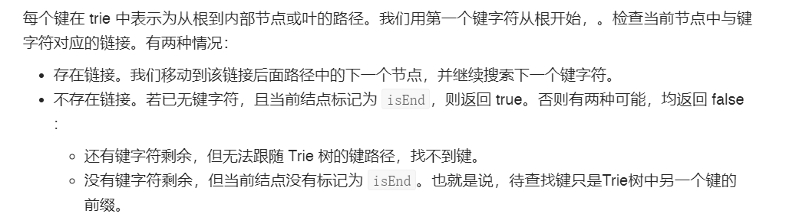
>
> ```java
> // search a prefix or whole key in trie and
> // returns the node where search ends
> private TrieNode searchPrefix(String word) {
>     TrieNode node = root;
>     for (int i = 0; i < word.length(); i++) {
>         char curLetter = word.charAt(i);
>         if (node.containsKey(curLetter)) {
>             node = node.get(curLetter);
>         } else {
>             return null;
>         }
>     }
>     return node;
> }
> 
> // Returns if the word is in the trie.
> public boolean search(String word) {
>     TrieNode node = searchPrefix(word);
>     return node != null && node.isEnd();
> }
> ```
>
> 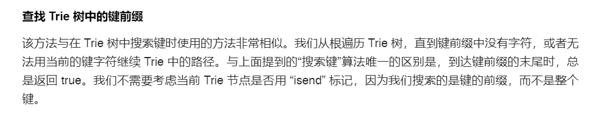
>
> ```java
> // Returns if there is any word in the trie
> // that starts with the given prefix.
> public boolean startsWith(String prefix) {
>     TrieNode node = searchPrefix(prefix);
>     return node != null;
> ```

#### [数组中的第K个最大元素](https://leetcode-cn.com/problems/kth-largest-element-in-an-array/)

> 在未排序的数组中找到第 **k** 个最大的元素。请注意，你需要找的是数组排序后的第 k 个最大的元素，而不是第 k 个不同的元素。
> $$
> 输入: [3,2,3,1,2,4,5,5,6] 和 k = 4 \\
> 输出: 4
> $$

##### 方法一：先排序

```java
        Arrays.sort(nums);
        return nums[nums.length-k];
```

##### 方法二：堆排序

> 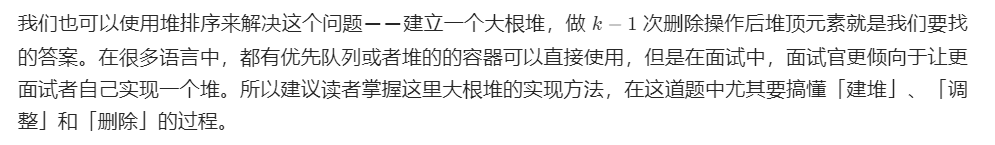
>
> ```java
> class Solution {
>     public int findKthLargest(int[] nums, int k) {
>         int heapSize = nums.length;
>         buildMaxHeap(nums, heapSize);
>         for (int i = nums.length - 1; i >= nums.length - k + 1; --i) {
>             swap(nums, 0, i);
>             --heapSize;
>             maxHeapify(nums, 0, heapSize);
>         }
>         return nums[0];
>     }
> 
>     public void buildMaxHeap(int[] a, int heapSize) {
>         for (int i = heapSize / 2; i >= 0; --i) {
>             maxHeapify(a, i, heapSize);
>         } 
>     }
> 
>     public void maxHeapify(int[] a, int i, int heapSize) {
>         int l = i * 2 + 1, r = i * 2 + 2, largest = i;
>         if (l < heapSize && a[l] > a[largest]) {
>             largest = l;
>         } 
>         if (r < heapSize && a[r] > a[largest]) {
>             largest = r;
>         }
>         if (largest != i) {
>             swap(a, i, largest);
>             maxHeapify(a, largest, heapSize);
>         }
>     }
> 
>     public void swap(int[] a, int i, int j) {
>         int temp = a[i];
>         a[i] = a[j];
>         a[j] = temp;
>     }
> }
> ```

#### [最大正方形](https://leetcode-cn.com/problems/maximal-square/)

> 在一个由 `'0'` 和 `'1'` 组成的二维矩阵内，找到只包含 `'1'` 的最大正方形，并返回其面积。
>
> 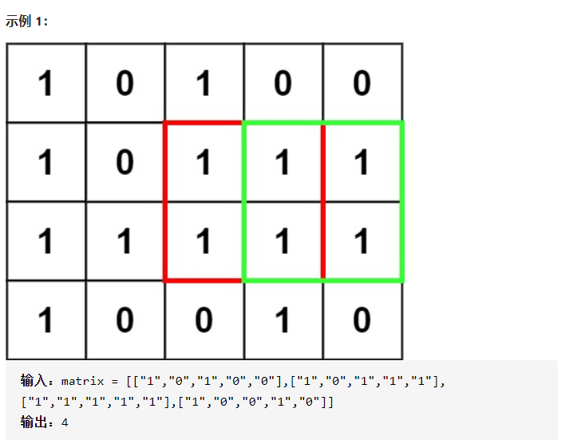

##### 方法一：暴力破解

> 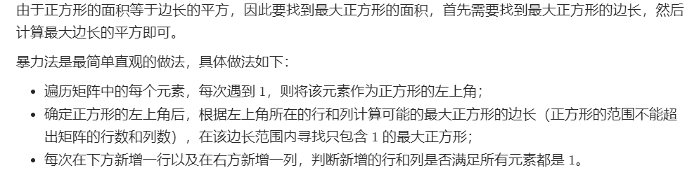

##### 方法二：动态规划

> 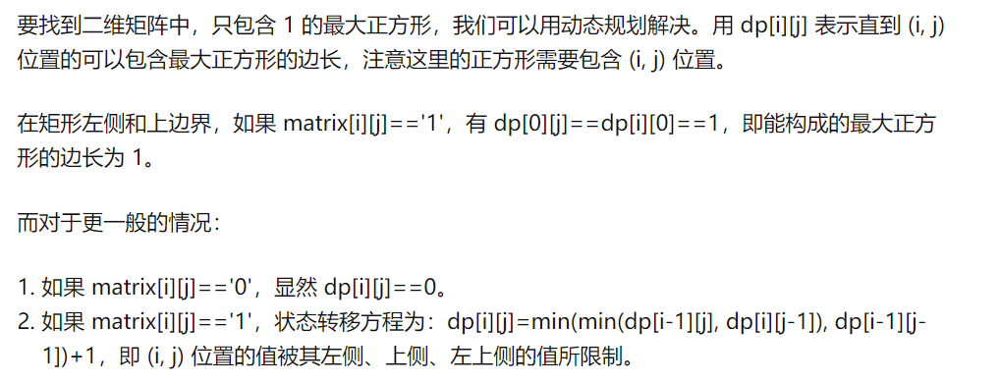
>
> ```java
>  public int maximalSquare(char[][] matrix) {
>         int max = 0;
>         int row = matrix.length, col = matrix[0].length;
>         int[][] dp = new int[row][col];
>         for (int i=0;i<row;i++){
>             dp[i][0] = matrix[i][0] - '0';
>             max = Math.max(max, dp[i][0]);
>         }
>         for (int j=0;j<col;j++){
>             dp[0][j] = matrix[0][j] - '0';
>             max = Math.max(max, dp[0][j]);
>         }
> 
>         for (int i=1;i<row;i++){
>             for (int j=1;j<col;j++){
>                 if (matrix[i][j] == '0')
>                     dp[i][j] = 0;
>                 else dp[i][j] = Math.min(dp[i-1][j-1], Math.min(dp[i-1][j], dp[i][j-1])) + 1;
>                 
>                 max = Math.max(max, dp[i][j]);
>             }
>         }
>         return max * max;
>     }
> ```

#### [翻转二叉树](https://leetcode-cn.com/problems/invert-binary-tree/)

> 翻转一棵二叉树。
>
> 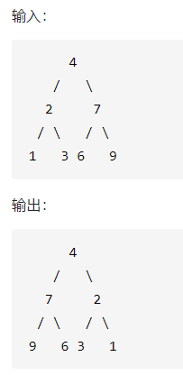

##### 递归

> 这是一道很经典的二叉树问题。显然，我们从根节点开始，递归地对树进行遍历，并从叶子结点先开始翻转。如果当前遍历到的节点 $\textit{root}$的左右两棵子树都已经翻转，那么我们只需要交换两棵子树的位置，即可完成以 $\textit{root}$为根节点的整棵子树的翻转。
>
> ```java
>     public TreeNode invertTree(TreeNode root) {
>         if (root == null) {
>             return null;
>         }
>         TreeNode left = invertTree(root.left);
>         TreeNode right = invertTree(root.right);
>         root.left = right;
>         root.right = left;
>         return root;
>     }
> ```

#### [回文链表](https://leetcode-cn.com/problems/palindrome-linked-list/)

##### 方法一：链表的值存入数组

> 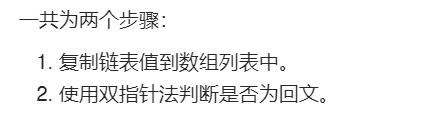
>
> ```java
> class Solution {
>     public boolean isPalindrome(ListNode head) {
>         List<Integer> vals = new ArrayList<Integer>();
> 
>         // 将链表的值复制到数组中
>         ListNode currentNode = head;
>         while (currentNode != null) {
>             vals.add(currentNode.val);
>             currentNode = currentNode.next;
>         }
> 
>         // 使用双指针判断是否回文
>         int front = 0;
>         int back = vals.size() - 1;
>         while (front < back) {
>             if (!vals.get(front).equals(vals.get(back))) {
>                 return false;
>             }
>             front++;
>             back--;
>         }
>         return true;
>     }
> }
> ```

##### 方法二：递归

> 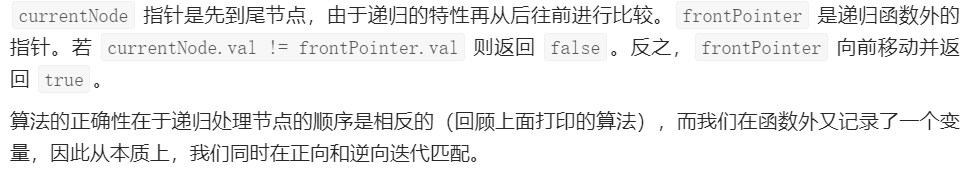

> ```java
> class Solution {
>     private ListNode frontPointer;
> 
>     private boolean recursivelyCheck(ListNode currentNode) {
>         if (currentNode != null) {
>             if (!recursivelyCheck(currentNode.next)) {
>                 return false;
>             }
>             if (currentNode.val != frontPointer.val) {
>                 return false;
>             }
>             frontPointer = frontPointer.next;
>         }
>         return true;
>     }
> 
>     public boolean isPalindrome(ListNode head) {
>         frontPointer = head;
>         return recursivelyCheck(head);
>     }
> }
> ```

##### 方法三：快慢指针

***这道题目自己最开始的想法是将整个链表反转，再跟之前的链表比较。但是发现如果整个链表反转的话，head也是反转了的，是无法比较的。没有想到有什么便捷的方法可以复制出一份链表。***

> 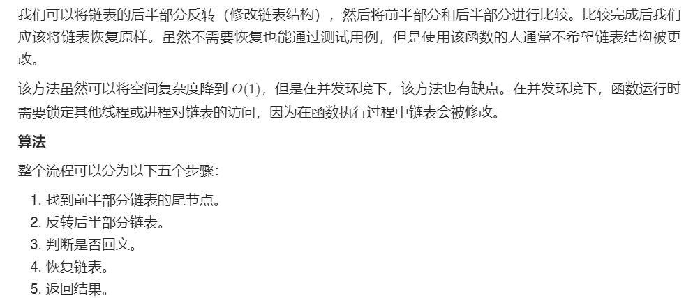
>
> ```java
> public boolean isPalindrome(ListNode head) {
>         if (head == null)
>             return true;
>         ListNode fast = head, slow = head;
>         while (fast.next!=null){
>             fast = fast.next;
>             slow = slow.next;
>             if (fast.next!=null)
>                 fast = fast.next;
>         }
>         ListNode curr = slow.next;
>         ListNode begin = head;
>         ListNode end = reverseList(curr);
>         while (begin!=null && end!=null){
>             if (begin.val != end.val)
>                 return false;
>             begin = begin.next;
>             end = end.next;
>         }
>         return true;
>     }
> 
>     public ListNode reverseList(ListNode head) {
>         ListNode prev = null;
>         ListNode curr = head;
>         while (curr!=null){
>             ListNode next = curr.next;
>             curr.next = prev;
>             prev = curr;
>             curr = next;
>         }
>         return prev;
>     }
> ```

#### [ 二叉树的最近公共祖先](https://leetcode-cn.com/problems/lowest-common-ancestor-of-a-binary-tree/)

> 给定一个二叉树, 找到该树中两个指定节点的最近公共祖先。
>
> 最近公共祖先的定义为：“对于有根树 T 的两个节点 p、q，最近公共祖先表示为一个节点 x，满足 x 是 p、q 的祖先且 x 的深度尽可能大（一个节点也可以是它自己的祖先）。”
>
> 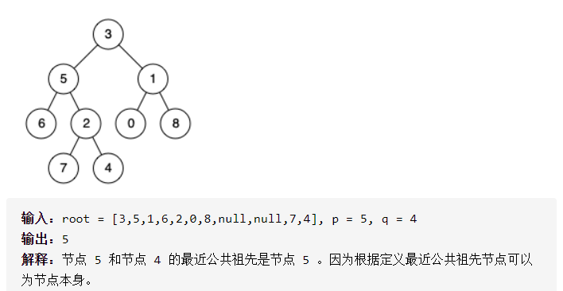

##### 方法一：递归

> 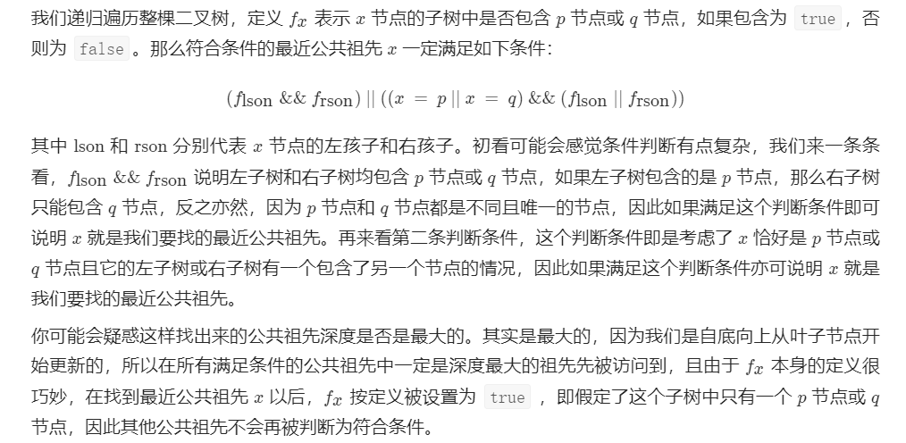
>
> ```java
>     TreeNode ans = null;
>     public TreeNode lowestCommonAncestor(TreeNode root, TreeNode p, TreeNode q) {
>         boolean flag = dfs(root, p, q);
>         return ans;
>     }
> 
>     private boolean dfs(TreeNode root, TreeNode p, TreeNode q) {
>         if (root == null)
>             return false;
>         boolean lson = dfs(root.left, p, q);
>         boolean rson = dfs(root.right, p, q);
> 
>         if ((lson && rson) || ((root.val==p.val)||(root.val == q.val)) && (lson||rson))
>             ans = root;
>         return (lson || rson || (root.val == p.val || root.val == q.val));
>     }
> ```

##### 方法二：存储父节点

> 用哈希表存储所有节点的父节点。然后我们就可以利用节点的父节点信息从 p 结点开始不断往上跳，并记录已经访问过的节点，再从 q 节点开始不断往上跳，如果碰到已经访问过的节点，那么这个节点就是我们要找的最近公共祖先。
>
> - 遍历二叉树，存储所有节点的父节点。
> - 从节点p开始往上跳，查找结点p的父节点。同时记录已经查找过的节点。
> - 从节点q往上跳，并且判断节点q的父节点有没有被查找过。若被查找过，则该节点就是最近的公共节点。
>
> ```java
>     Map<Integer, TreeNode> parent = new HashMap<>();
>     Set<Integer> visited = new HashSet<>();
> 
>     public TreeNode lowestCommonAncestor(TreeNode root, TreeNode p, TreeNode q) {
>         if (p.val == q.val)
>             return p;
>         dfs(root);
>         while (p!=null){
>             visited.add(p.val);
>             p = parent.get(p.val);
>         }
>         while (q!=null){
>             if (visited.contains(q.val))
>                 return q;
>             q = parent.get(q.val);
>         }
>         return null;
>     }
> 
>     private void dfs(TreeNode root) {
>         if (root.left!=null){
>             parent.put(root.left.val, root);
>             dfs(root.left);
>         }
>         if (root.right!=null){
>             parent.put(root.right.val, root);
>             dfs(root.right);
>         }
>     }
> ```

#### [除自身以外数组的乘积](https://leetcode-cn.com/problems/product-of-array-except-self/)

> 给你一个长度为 n 的整数数组$ nums$，其中$ n > 1$，返回输出数组 $output$ ，其中$ output[i] $等于 $nums $中除$ nums[i] $之外其余各元素的乘积。
>
> 说明: 请不要使用除法，且在 $O(n) $时间复杂度内完成此题。
>
> 进阶：
> 你可以在常数空间复杂度内完成这个题目吗？（ 出于对空间复杂度分析的目的，输出数组不被视为额外空间。）

##### 方法一：左右乘积列表

> 利用索引左侧所有数字的乘积和右侧所有数字的乘积（即前缀与后缀）相乘得到答案。
>
> 对于给定索引$i$，我们将使用它左边所有数字的乘积乘以右边所有数字的乘积。
>
> 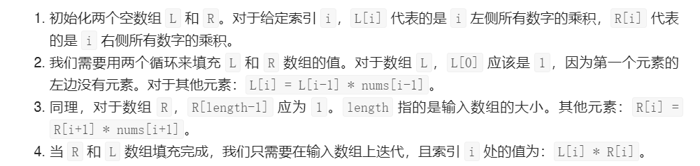
>
> ```java
> class Solution {
>     public int[] productExceptSelf(int[] nums) {
>         int[] begin = new int[nums.length];
>         int[] end = new  int[nums.length];
>         int[] result = new int[nums.length];
>         
>         for (int i=0;i< nums.length;i++){
>             begin[i] = 1;
>             end[i] = 1;
>         }
>         
>         for (int i=1,j=nums.length-2;i<=nums.length-1 && j>=0;i++,j--){
>             begin[i] = begin[i-1] * nums[i-1];
>             end[j] = end[j+1] * nums[j+1];
>         }
>         
>         for (int i=0;i<nums.length;i++)
>             result[i] = begin[i] * end[i];
>         
>         return result;
>     }
> }
> ```

##### 方法二：空间复杂度 O(1)*O*(1) 的方法

> 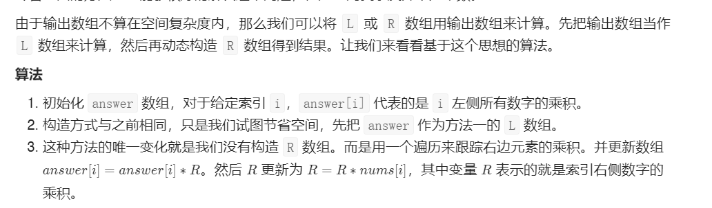
>
> ```java
> class Solution {
>     public int[] productExceptSelf(int[] nums) {
>         int length = nums.length;
>         int[] ans = new int[length];
> 
>         ans[0] = 1;
>         for (int i=1;i<length;i++)
>             ans[i] = ans[i-1] * nums[i-1];
> 
>         int R = 1;
>         for (int i=length-1;i>=0;i--){
>             ans[i] = ans[i] * R;
>             R = R * nums[i];
>         }
>         return ans;
>     }
> }
> ```